# 商城可视化编辑器产品需求文档

# 1. 需求背景

---

# 2. 需求分析

---

# 3. 系统流程图

---

# 4. 详细需求

## 4.1. 商城运营后台系统

### 4.1.1. 可视化编辑器模块

#### 4.1.1.1. 编辑器主界面

##### 1. 功能概述

- **功能描述**：可视化编辑器主界面采用四栏布局，提供所见即所得的页面编辑能力，运营人员可通过拖拽组件、配置属性的方式快速搭建商城页面。
- **业务描述**：用于支撑运营人员快速创建和编辑商城模板，降低页面开发成本，提升运营效率。
- **使用角色**：运营人员、模板设计师。
- **触发条件**：从运营工作台点击「编辑」按钮进入编辑器。

##### 2. 界面设计

###### 2.1 页面原型

（待补充）

###### 2.2 输出项说明

| 字段名称 | 字段标识 | 数据类型 | 数据来源 | 格式说明 |
|----------|----------|----------|----------|----------|
| 模板名称 | template_name | string | 用户输入 | 文本，最多50字符 |
| 当前页面ID | current_page_id | string | 系统生成 | 格式：page-时间戳 |
| 选中楼层ID | selected_floor_id | string | 系统生成 | 格式：floor-类型-时间戳 |

##### 3. 业务逻辑

###### 3.1 流程图

**编辑器初始化流程**

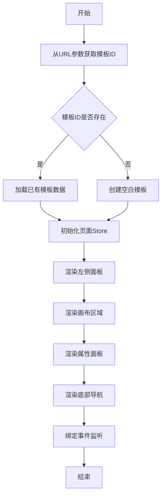

###### 3.2 业务规则

| 规则编号 | 规则名称 | 适用场景 | 规则描述 | 错误提示 |
|----------|----------|----------|----------|----------|
| RULE-EDITOR-001 | 四栏布局比例 | 界面渲染 | 左侧面板320px，画布弹性宽度，页面操作区180px，属性面板340px | - |
| RULE-EDITOR-002 | 左侧面板Tab切换 | 面板切换 | 页面Tab和组件Tab互斥，同时仅显示一个 | - |

###### 3.3 状态机设计

**面板Tab状态**

| 状态值 | 状态名称 | 状态说明 |
|--------|----------|----------|
| pages | 页面面板 | 显示页面管理面板 |
| components | 组件面板 | 显示组件库面板 |

**页面组状态**

| 状态值 | 状态名称 | 状态说明 |
|--------|----------|----------|
| main | 主页面组 | 显示主页面列表 |
| sub | 子页面组 | 显示子页面列表 |

##### 4. 交互设计

###### 4.1 输入项说明

| 字段名称 | 字段标识 | 字段类型 | 必填 | 数据类型 | 长度限制 | 校验规则 | 取值范围 | 来源 | 提示文案 | 备注 |
|----------|----------|----------|------|----------|----------|----------|----------|------|----------|------|
| 面板Tab选择 | panel_tab | Tab点击 | 否 | string | - | - | pages/components | 用户点击 | - | 默认页面面板 |
| 页面组选择 | page_group | Tab点击 | 否 | string | - | - | main/sub | 用户点击 | - | 默认主页面组 |

###### 4.2 交互说明

1. **界面布局**：编辑器采用四栏布局，从左到右依次为：左侧面板（320px）、画布区域（弹性宽度）、页面布局操作区（180px）、属性配置面板（340px）。
2. **左侧面板切换**：点击「页面」或「组件」Tab切换面板内容，主页面/子页面组通过二级Tab切换。
3. **返回工作台**：点击返回按钮，关闭编辑器窗口或跳转回运营工作台。

###### 4.3 错误提示文案

无

##### 5. 数据设计

###### 5.1 数据流转说明

| 字段/数据 | 来源 | 获取方式 | 说明 |
|-----------|------|----------|------|
| 模板数据 | 运营工作台 | URL参数传递模板ID | 包含所有页面和组件配置 |
| 组件默认配置 | 系统内置 | 从components数组获取 | 每个组件类型的默认属性值 |

###### 5.2 数据权限设计

| 角色 | 数据范围 | 功能权限点 |
|------|----------|------------|
| 运营人员 | 所有模板 | 创建、编辑、删除、发布模板 |
| 模板设计师 | 所有模板 | 创建、编辑模板 |

---

#### 4.1.1.2. 主页面管理面板

##### 1. 功能概述

- **功能描述**：主页面管理面板用于管理模板中的所有主页面，支持创建、切换、删除主页面，每个页面类型的主页面仅允许创建一个。
- **业务描述**：主页面可配置到底部导航，是商城的核心页面入口。
- **使用角色**：运营人员、模板设计师。
- **触发条件**：点击左侧面板「页面」Tab，默认显示主页面组。

##### 2. 界面设计

###### 2.1 页面原型

（待补充）

###### 2.2 输出项说明

| 字段名称 | 字段标识 | 数据类型 | 数据来源 | 格式说明 |
|----------|----------|----------|----------|----------|
| 页面ID | page_id | string | 系统生成 | 唯一标识，格式：page-时间戳 |
| 页面名称 | page_name | string | 用户输入 | 文本，最多30字符 |
| 页面类型 | page_category | string | 用户选择 | home/category/activity/mine/product-detail/cart |
| 页面缩略图 | page_preview | html | 系统生成 | 手机壳样式的缩略预览 |
| 页面角标 | page_badge | string | 系统生成 | 根据页面类型显示不同颜色角标 |

##### 3. 业务逻辑

###### 3.1 流程图

**新增主页面流程**

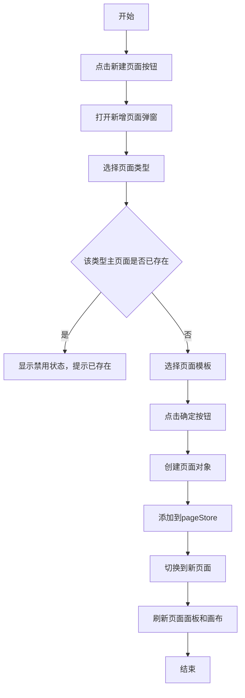

**页面切换流程**

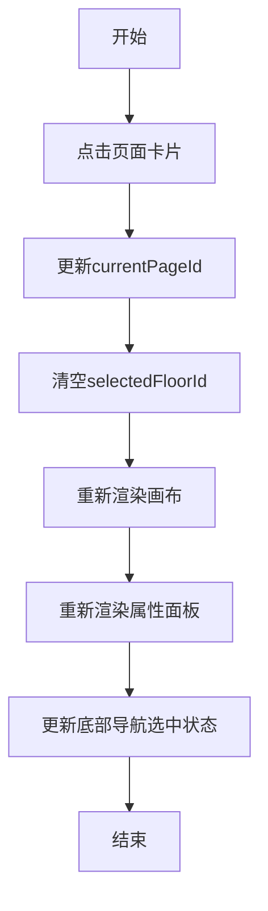

###### 3.2 业务规则

| 规则编号 | 规则名称 | 适用场景 | 规则描述 | 错误提示 |
|----------|----------|----------|----------|----------|
| RULE-PAGE-001 | 主页面类型唯一 | 创建主页面 | 每种页面类型的主页面仅允许存在一个 | 该类型主页面已存在 |
| RULE-PAGE-002 | 默认页面不可删除 | 删除页面 | 系统自动创建的默认页面不可删除 | 默认页面不可删除 |

###### 3.3 状态机设计

**页面类型状态**

| 状态值 | 状态名称 | 状态说明 | UI差异 |
|--------|----------|----------|--------|
| home | 首页 | 商城主页 | 绿色角标 |
| category | 分类页 | 商品分类展示 | 蓝色角标 |
| activity | 活动页 | 营销活动页面 | 紫色角标 |
| mine | 我的页面 | 会员中心 | 橙色角标 |
| product-detail | 商品详情页 | 商品详情展示 | 紫色角标 |
| cart | 购物车页 | 购物车 | 黄色角标 |

##### 4. 交互设计

###### 4.1 输入项说明

| 字段名称 | 字段标识 | 字段类型 | 必填 | 数据类型 | 长度限制 | 校验规则 | 取值范围 | 来源 | 提示文案 | 备注 |
|----------|----------|----------|------|----------|----------|----------|----------|------|----------|------|
| 页面类型 | page_type_card | 卡片选择 | 是 | string | - | 必选且未存在 | home/category/activity/mine/product-detail/cart | 用户点击 | 选择页面类型 | 已存在类型显示禁用 |
| 页面模板 | template_card | 卡片选择 | 是 | string | - | 必选 | 根据页面类型动态展示 | 用户点击 | 选择页面模板 | 默认选中第一个 |

###### 4.2 交互说明

1. **页面列表展示**：以手机壳缩略图卡片形式展示所有主页面，卡片显示页面名称、角标、缩略预览。
2. **新增主页面**：点击「新建页面」按钮，打开新增页面弹窗，选择页面类型和模板。
3. **删除页面**：点击页面卡片右上角的删除按钮（默认页面不显示删除按钮）。
4. **页面切换**：点击页面卡片，切换到该页面进行编辑。

###### 4.3 错误提示文案

**业务异常提示**

| 错误码 | 错误场景 | 提示文案 |
|--------|----------|----------|
| PAGE-001 | 重复创建主页面 | 该类型主页面已存在，每个页面类型仅允许创建一个主页面 |

##### 5. 数据设计

###### 5.1 数据流转说明

| 字段/数据 | 来源 | 获取方式 | 说明 |
|-----------|------|----------|------|
| 已有主页面类型 | pageStore | 过滤pageType为main的页面 | 用于校验是否可创建新主页面 |
| 页面模板配置 | PAGE_TYPE_CONFIG | 系统内置配置 | 定义每种页面类型可选的模板 |

---

#### 4.1.1.3. 子页面管理面板

##### 1. 功能概述

- **功能描述**：子页面管理面板用于管理模板中的所有子页面，子页面不区分类型，可创建任意数量。
- **业务描述**：子页面用于承载更多内容，不出现在底部导航中。
- **使用角色**：运营人员、模板设计师。
- **触发条件**：点击左侧面板「页面」Tab，切换到「子页面」组。

##### 2. 界面设计

###### 2.1 页面原型

（待补充）

###### 2.2 输出项说明

| 字段名称 | 字段标识 | 数据类型 | 数据来源 | 格式说明 |
|----------|----------|----------|----------|----------|
| 页面ID | page_id | string | 系统生成 | 唯一标识，格式：page-时间戳 |
| 页面名称 | page_name | string | 用户输入 | 文本，最多30字符 |

##### 3. 业务逻辑

###### 3.1 流程图

**新增子页面流程**

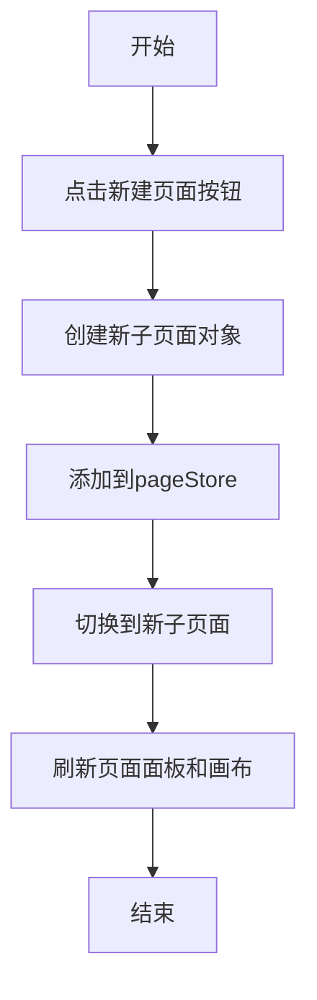

###### 3.2 业务规则

| 规则编号 | 规则名称 | 适用场景 | 规则描述 | 错误提示 |
|----------|----------|----------|----------|----------|
| RULE-SUBPAGE-001 | 子页面无类型限制 | 创建子页面 | 子页面不区分类型，可创建任意数量 | - |

##### 4. 交互设计

###### 4.1 输入项说明

| 字段名称 | 字段标识 | 字段类型 | 必填 | 数据类型 | 长度限制 | 校验规则 | 取值范围 | 来源 | 提示文案 | 备注 |
|----------|----------|----------|------|----------|----------|----------|----------|------|----------|------|
| 页面名称 | page_name_input | 文本输入 | 是 | string | 1-30 | 非空校验 | - | 用户输入 | 请输入页面名称 | - |

###### 4.2 交互说明

1. **子页面列表展示**：以列表形式展示所有子页面。
2. **新增子页面**：点击「新建页面」按钮，直接创建空白子页面。
3. **删除子页面**：点击删除按钮删除子页面。

---

#### 4.1.1.4. 组件库面板

##### 1. 功能概述

- **功能描述**：组件库面板展示所有可用的页面组件，用户点击组件即可将其添加到当前页面中。
- **业务描述**：提供16个预置组件，分为「商品」和「页面装修」两大分类，支撑商城页面的多样化搭建需求。
- **使用角色**：运营人员、模板设计师。
- **触发条件**：点击左侧面板「组件」Tab。

##### 2. 界面设计

###### 2.1 页面原型

（待补充）

###### 2.2 输出项说明

| 字段名称 | 字段标识 | 数据类型 | 数据来源 | 格式说明 |
|----------|----------|----------|----------|----------|
| 组件类型 | component_type | string | 系统定义 | 组件唯一标识 |
| 组件名称 | component_name | string | 系统定义 | 显示名称 |
| 组件描述 | component_desc | string | 系统定义 | 组件功能说明 |
| 组件分类 | component_category | string | 系统定义 | 商品/页面装修 |

##### 3. 业务逻辑

###### 3.1 流程图

**组件添加流程**

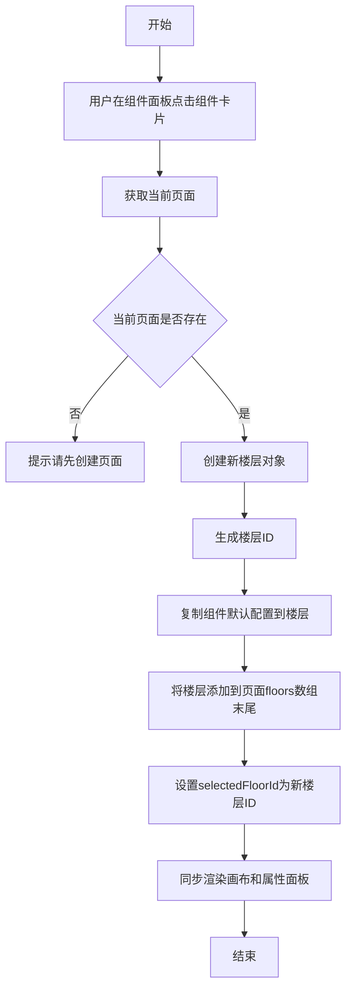

###### 3.2 业务规则

| 规则编号 | 规则名称 | 适用场景 | 规则描述 | 错误提示 |
|----------|----------|----------|----------|----------|
| RULE-COMP-001 | 组件添加前提 | 添加组件 | 必须存在当前页面才能添加组件 | 请先创建页面 |

##### 4. 交互设计

###### 4.1 输入项说明

| 字段名称 | 字段标识 | 字段类型 | 必填 | 数据类型 | 长度限制 | 校验规则 | 取值范围 | 来源 | 提示文案 | 备注 |
|----------|----------|----------|------|----------|----------|----------|----------|------|----------|------|
| 组件选择 | component_select | 卡片点击 | 是 | string | - | - | 系统预置组件列表 | 用户点击 | - | 点击即添加 |

###### 4.2 交互说明

1. **组件分类Tab**：顶部显示「商品」和「页面装修」两个分类Tab。
2. **组件列表展示**：组件以卡片形式展示，每个卡片显示组件名称、描述和预览缩略图。
3. **添加组件**：点击组件卡片，组件自动添加到当前页面底部并选中。

###### 4.3 错误提示文案

**业务异常提示**

| 错误码 | 错误场景 | 提示文案 |
|--------|----------|----------|
| COMP-001 | 无页面时添加组件 | 请先创建或选择一个页面 |

---

#### 4.1.1.5. 商品列表配置面板

##### 1. 功能概述

- **功能描述**：商品列表配置面板用于配置商品列表组件的显示样式、数据来源和商品属性。
- **业务描述**：商品列表是商城核心组件，用于展示商品信息，支持6种列表样式。
- **使用角色**：运营人员、模板设计师。
- **触发条件**：在画布中选中商品列表组件。

##### 2. 界面设计

###### 2.1 页面原型

（待补充）

###### 2.2 输出项说明

| 字段名称 | 字段标识 | 数据类型 | 数据来源 | 格式说明 |
|----------|----------|----------|----------|----------|
| 列表样式 | list_style | string | 用户选择 | large-single/small-double等 |
| 背景颜色 | bg_color | string | 用户选择 | HEX颜色值 |
| 显示商品名称 | show_spu_name | boolean | 用户选择 | true/false |
| 显示价格 | show_price | boolean | 用户选择 | true/false |

##### 3. 业务逻辑

###### 3.1 流程图

**配置项修改流程**

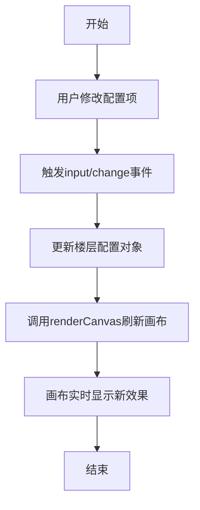

###### 3.2 业务规则

| 规则编号 | 规则名称 | 适用场景 | 规则描述 | 错误提示 |
|----------|----------|----------|----------|----------|
| RULE-GOODSLIST-001 | 页面边距范围 | 配置页面边距 | 页面边距范围0-30px | - |
| RULE-GOODSLIST-002 | 商品间距范围 | 配置商品间距 | 商品间距范围0-20px | - |

##### 4. 交互设计

###### 4.1 输入项说明

| 字段名称 | 字段标识 | 字段类型 | 必填 | 数据类型 | 长度限制 | 校验规则 | 取值范围 | 来源 | 提示文案 | 备注 |
|----------|----------|----------|------|----------|----------|----------|----------|------|----------|------|
| 列表样式 | list_style | 下拉选择 | 是 | string | - | - | large-single/small-double/detail-list/small-triple/one-large-two-small/horizontal-scroll | 用户选择 | 选择列表样式 | 默认大图单列 |
| 背景颜色 | bg_color | 颜色选择器 | 否 | string | - | HEX格式 | 颜色值 | 用户选择 | 选择背景颜色 | 默认#ffffff |
| 显示商品名称 | show_spu_name | 下拉选择 | 否 | boolean | - | - | true/false | 用户选择 | 显示/隐藏 | 默认显示 |
| 显示规格值 | show_sku_spec | 下拉选择 | 否 | boolean | - | - | true/false | 用户选择 | 显示/隐藏 | 默认显示 |
| 显示价格 | show_price | 下拉选择 | 否 | boolean | - | - | true/false | 用户选择 | 显示/隐藏 | 默认显示 |
| 显示标签 | show_tag | 下拉选择 | 否 | boolean | - | - | true/false | 用户选择 | 显示/隐藏 | 默认隐藏 |
| 购物车样式 | cart_style | 下拉选择 | 否 | string | - | - | style1/style2/style3 | 用户选择 | 选择购物车样式 | 默认样式1 |
| 角标类型 | corner_tag | 下拉选择 | 否 | string | - | - | none/new/hot/sale/group/seckill/custom | 用户选择 | 选择角标类型 | 默认无 |
| 自定义角标文字 | custom_corner_tag | 文本输入 | 否 | string | 1-10 | - | - | 用户输入 | 输入角标文字 | 角标为自定义时显示 |
| 价格显示类型 | price_display | 下拉选择 | 否 | string | - | - | price/points/price-points | 用户选择 | 价格/积分/价格+积分 | 默认价格 |
| 显示划线价 | show_original_price | 下拉选择 | 否 | boolean | - | - | true/false | 用户选择 | 显示/隐藏 | 默认隐藏 |
| 组件边角样式 | corner_style | 下拉选择 | 否 | string | - | - | rounded/square | 用户选择 | 圆角/直角 | 默认圆角 |
| 页面边距 | page_padding | 数字输入 | 否 | number | 0-30 | 范围校验 | 0-30 | 用户输入 | 页面边距(px) | 默认0 |
| 商品间距 | goods_padding | 数字输入 | 否 | number | 0-20 | 范围校验 | 0-20 | 用户输入 | 商品间距(px) | 默认10 |
| 商品卡片倒角 | goods_corner | 下拉选择 | 否 | string | - | - | rounded/square | 用户选择 | 圆角/直角 | 默认圆角 |

###### 4.2 交互说明

1. **配置数据来源**：点击「配置数据来源」按钮，打开商品数据来源弹窗。
2. **实时预览**：修改配置项后，画布实时更新预览效果。

---

#### 4.1.1.6. 商品数据来源弹窗

##### 1. 功能概述

- **功能描述**：商品数据来源弹窗用于设置商品列表、商品分组组件的数据来源，支持品牌、标签、分类、单品、API对接五种数据来源方式。
- **业务描述**：实现商品数据的动态绑定，让组件展示真实或模拟的商品数据。
- **使用角色**：运营人员、模板设计师。
- **触发条件**：在商品列表或商品分组组件的属性面板中点击「配置数据来源」按钮。

##### 2. 界面设计

###### 2.1 页面原型

（待补充）

###### 2.2 输出项说明

| 字段名称 | 字段标识 | 数据类型 | 数据来源 | 格式说明 |
|----------|----------|----------|----------|----------|
| 数据来源类型 | source_type | string | 用户选择 | brand/tag/category/product/api |
| 已选项目ID列表 | selected_items | array | 用户选择 | 品牌/标签/分类/商品的ID数组 |
| 排序方式 | sort_type | string | 用户选择 | comprehensive/sales等 |
| API链接 | api_url | string | 用户输入 | API接口地址 |

##### 3. 业务逻辑

###### 3.1 流程图

**配置数据来源流程**

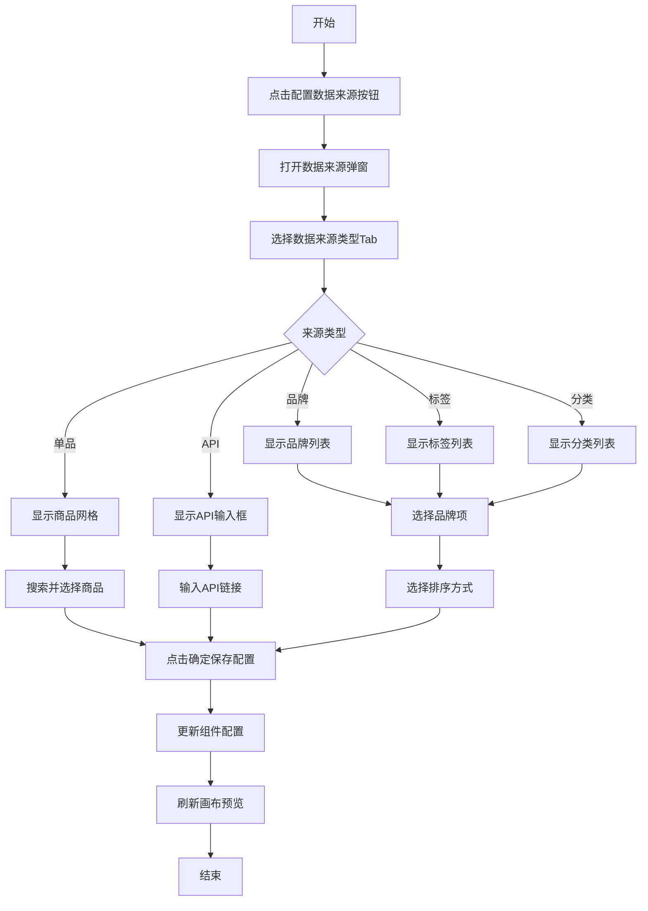

###### 3.2 业务规则

| 规则编号 | 规则名称 | 适用场景 | 规则描述 | 错误提示 |
|----------|----------|----------|----------|----------|
| RULE-SOURCE-001 | API链接格式 | API模式 | API链接需为有效的URL格式 | 请输入有效的API链接 |
| RULE-SOURCE-002 | 单品搜索 | 单品模式 | 支持按商品名称搜索过滤 | - |
| RULE-SOURCE-003 | 分页加载 | 单品模式 | 单品模式商品列表支持分页加载，每页16条 | - |

###### 3.3 状态机设计

**数据来源类型状态**

| 状态值 | 状态名称 | 状态说明 | UI差异 |
|--------|----------|----------|--------|
| brand | 品牌模式 | 按品牌筛选商品 | 显示品牌列表 |
| tag | 标签模式 | 按标签筛选商品 | 显示标签列表 |
| category | 分类模式 | 按分类筛选商品 | 显示分类列表 |
| product | 单品模式 | 手动选择具体商品 | 显示商品网格+搜索框+分页 |
| api | API模式 | 通过API获取商品 | 显示API输入框+获取按钮 |

##### 4. 交互设计

###### 4.1 输入项说明

| 字段名称 | 字段标识 | 字段类型 | 必填 | 数据类型 | 长度限制 | 校验规则 | 取值范围 | 来源 | 提示文案 | 备注 |
|----------|----------|----------|------|----------|----------|----------|----------|------|----------|------|
| 数据来源类型 | source_type_tab | Tab切换 | 是 | string | - | - | brand/tag/category/product/api | 用户点击 | 选择数据来源类型 | - |
| 排序方式 | sort_type | 下拉选择 | 否 | string | - | - | comprehensive/sales/price-asc/price-desc/comments/goodRate/newest | 用户选择 | 选择排序方式 | 默认综合排序 |
| 搜索关键词 | search_keyword | 文本输入 | 否 | string | - | - | - | 用户输入 | 搜索商品名称 | 仅单品模式 |
| API链接 | api_url | 文本输入 | 是 | string | - | URL格式 | - | 用户输入 | 输入API链接 | 仅API模式 |

###### 4.2 交互说明

1. **Tab切换**：点击顶部Tab切换数据来源类型，切换后清空已选项。
2. **多选列表**：品牌/标签/分类模式下，显示可多选的列表，点击项目切换选中状态。
3. **商品预览**：选中数据来源后，右侧显示筛选后的商品预览列表。
4. **单品搜索**：单品模式下支持输入关键词搜索商品。
5. **分页导航**：单品模式下支持分页浏览商品。

###### 4.3 错误提示文案

**业务异常提示**

| 错误码 | 错误场景 | 提示文案 |
|--------|----------|----------|
| SOURCE-001 | API链接为空 | 请输入API链接 |
| SOURCE-002 | API链接格式错误 | 请输入有效的API链接 |

---

#### 4.1.1.7. 商品分组配置面板

##### 1. 功能概述

- **功能描述**：商品分组配置面板用于配置商品分组组件的菜单样式、列表样式和分组管理。
- **业务描述**：商品分组组件支持顶部横向菜单切换，展示不同分组的商品列表。
- **使用角色**：运营人员、模板设计师。
- **触发条件**：在画布中选中商品分组组件。

##### 2. 界面设计

###### 2.1 页面原型

（待补充）

###### 2.2 输出项说明

| 字段名称 | 字段标识 | 数据类型 | 数据来源 | 格式说明 |
|----------|----------|----------|----------|----------|
| 菜单背景颜色 | menu_bg_color | string | 用户选择 | HEX颜色值 |
| 菜单样式 | menu_style | string | 用户选择 | rounded/square |
| 列表样式 | list_style | string | 用户选择 | 列表样式标识 |

##### 3. 业务逻辑

###### 3.1 流程图

**分组Tab切换流程**

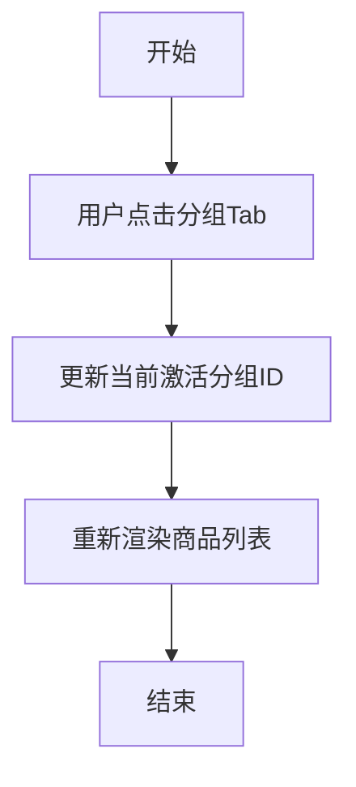

###### 3.2 业务规则

| 规则编号 | 规则名称 | 适用场景 | 规则描述 | 错误提示 |
|----------|----------|----------|----------|----------|
| RULE-GOODSGROUP-001 | 分组数量 | 添加分组 | 分组数量无上限 | - |

##### 4. 交互设计

###### 4.1 输入项说明

| 字段名称 | 字段标识 | 字段类型 | 必填 | 数据类型 | 长度限制 | 校验规则 | 取值范围 | 来源 | 提示文案 | 备注 |
|----------|----------|----------|------|----------|----------|----------|----------|------|----------|------|
| 菜单背景颜色 | menu_bg_color | 颜色选择器 | 否 | string | - | HEX格式 | 颜色值 | 用户选择 | 选择背景颜色 | 默认#ffffff |
| 菜单样式 | menu_style | 下拉选择 | 否 | string | - | - | rounded/square | 用户选择 | 圆角/直角 | 默认圆角 |
| 显示分组名称 | show_group_name | 下拉选择 | 否 | boolean | - | - | true/false | 用户选择 | 显示/隐藏 | 默认显示 |
| 列表样式 | list_style | 下拉选择 | 是 | string | - | - | large-single/small-double/detail-list/small-triple/one-large-two-small/horizontal-scroll | 用户选择 | 选择列表样式 | 默认小图两列 |
| 商品样式 | goods_style | 下拉选择 | 否 | string | - | - | no-border-white/card-shadow/border-white/no-border-transparent/promotion/waterfall | 用户选择 | 商品卡片样式 | 默认卡片投影 |
| 购买按钮样式 | cart_style | 下拉选择 | 否 | string | - | - | style1/style2/style3 | 用户选择 | 购物车样式 | 默认样式1 |
| 显示描述 | show_desc | 下拉选择 | 否 | boolean | - | - | true/false | 用户选择 | 显示/隐藏 | 默认显示 |
| 显示原价 | show_original_price | 下拉选择 | 否 | boolean | - | - | true/false | 用户选择 | 显示/隐藏 | 默认隐藏 |
| 显示价格 | show_price | 下拉选择 | 否 | boolean | - | - | true/false | 用户选择 | 显示/隐藏 | 默认显示 |
| 显示销量 | show_sales | 下拉选择 | 否 | boolean | - | - | true/false | 用户选择 | 显示/隐藏 | 默认显示 |
| 文本样式 | text_style | 下拉选择 | 否 | string | - | - | bold/normal | 用户选择 | 加粗/常规 | 默认常规 |
| 商品倒角 | goods_corner | 下拉选择 | 否 | string | - | - | rounded/square | 用户选择 | 圆角/直角 | 默认圆角 |
| 页面边距 | page_padding | 数字输入 | 否 | number | 0-30 | 范围校验 | 0-30 | 用户输入 | 页面边距(px) | 默认0 |
| 商品间距 | goods_padding | 数字输入 | 否 | number | 0-20 | 范围校验 | 0-20 | 用户输入 | 商品间距(px) | 默认10 |
| 换一换功能 | enable_refresh | 下拉选择 | 否 | boolean | - | - | true/false | 用户选择 | 开启/关闭 | 默认关闭 |

###### 4.2 交互说明

1. **分组管理**：在配置面板中显示分组Tab列表，点击Tab切换当前编辑的分组。
2. **配置数据来源**：点击「配置数据来源」按钮，打开商品数据来源弹窗为当前分组配置数据。

---

#### 4.1.1.8. 轮播图配置面板

##### 1. 功能概述

- **功能描述**：轮播图配置面板用于配置轮播图组件的图片管理、轮播设置和样式设置。
- **业务描述**：轮播图用于展示多张Banner图片，通常用于首页或活动页面。
- **使用角色**：运营人员、模板设计师。
- **触发条件**：在画布中选中轮播图组件。

##### 2. 界面设计

###### 2.1 页面原型

（待补充）

###### 2.2 输出项说明

| 字段名称 | 字段标识 | 数据类型 | 数据来源 | 格式说明 |
|----------|----------|----------|----------|----------|
| 轮播高度 | height | number | 用户输入 | 像素值 |
| 自动播放 | autoplay | boolean | 用户选择 | true/false |
| 间隔时间 | interval | number | 用户输入 | 毫秒数 |

##### 3. 业务逻辑

###### 3.1 流程图

**图片管理流程**

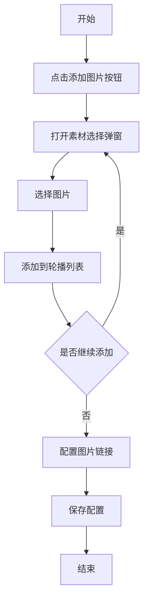

###### 3.2 业务规则

| 规则编号 | 规则名称 | 适用场景 | 规则描述 | 错误提示 |
|----------|----------|----------|----------|----------|
| RULE-CAROUSEL-001 | 图片数量 | 添加图片 | 轮播图数量无上限 | - |

##### 4. 交互设计

###### 4.1 输入项说明

| 字段名称 | 字段标识 | 字段类型 | 必填 | 数据类型 | 长度限制 | 校验规则 | 取值范围 | 来源 | 提示文案 | 备注 |
|----------|----------|----------|------|----------|----------|----------|----------|------|----------|------|
| 轮播高度 | height | 数字输入 | 是 | number | 100-500 | 范围校验 | 100-500 | 用户输入 | 图片高度(px) | 默认180 |
| 图片边角 | image_corner | 下拉选择 | 否 | string | - | - | rounded/square | 用户选择 | 圆角/直角 | 默认圆角 |
| 自动播放 | autoplay | 下拉选择 | 否 | boolean | - | - | true/false | 用户选择 | 开启/关闭 | 默认开启 |
| 间隔时间 | interval | 数字输入 | 否 | number | 1000-10000 | 范围校验 | 1000-10000 | 用户输入 | 间隔时间(ms) | 默认3000 |
| 圆点样式 | dot_style | 下拉选择 | 否 | string | - | - | round/bar | 用户选择 | 圆形/长条形 | 默认圆形 |
| 圆点位置 | dot_position | 下拉选择 | 否 | string | - | - | bottom/inside | 用户选择 | 底部/内嵌 | 默认底部 |
| 背景颜色 | bg_color | 颜色选择器 | 否 | string | - | HEX格式 | 颜色值 | 用户选择 | 背景颜色 | 默认#ffffff |
| 页面边距 | page_padding | 数字输入 | 否 | number | 0-30 | 范围校验 | 0-30 | 用户输入 | 页面边距(px) | 默认0 |
| 容器边角 | corner_style | 下拉选择 | 否 | string | - | - | rounded/square | 用户选择 | 圆角/直角 | 默认圆角 |

###### 4.2 交互说明

1. **图片管理**：在配置面板中显示轮播图片列表，支持添加、删除、拖拽排序。
2. **图片配置**：每张图片可配置跳转链接、延伸高度、延伸模式。
3. **选择图片**：点击图片区域打开素材选择弹窗。

---

#### 4.1.1.9. 新增页面弹窗

##### 1. 功能概述

- **功能描述**：新增页面弹窗采用两步选择流程，第一步选择页面类型，第二步选择页面模板，用于创建新的主页面。
- **业务描述**：通过标准化的页面创建流程，引导用户快速创建符合业务需求的页面。
- **使用角色**：运营人员、模板设计师。
- **触发条件**：在页面管理面板点击「新建页面」按钮（主页面组）。

##### 2. 界面设计

###### 2.1 页面原型

（待补充）

###### 2.2 输出项说明

| 字段名称 | 字段标识 | 数据类型 | 数据来源 | 格式说明 |
|----------|----------|----------|----------|----------|
| 页面类型 | page_type | string | 用户选择 | home/category/activity/mine/product-detail/cart |
| 页面模板 | page_template | string | 用户选择 | 模板ID |
| 模板预览图 | template_preview | html | 系统生成 | 手机比例的模板预览缩略图 |

##### 3. 业务逻辑

###### 3.1 流程图

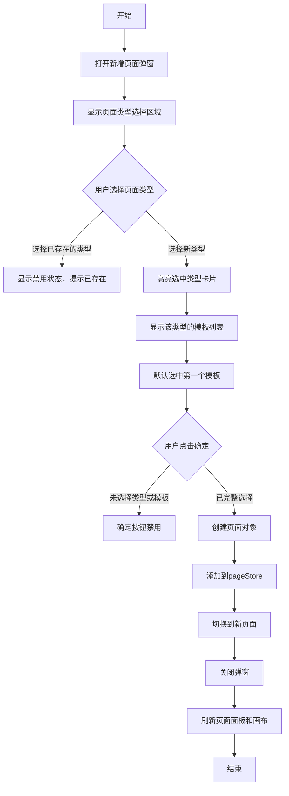

###### 3.2 业务规则

| 规则编号 | 规则名称 | 适用场景 | 规则描述 | 错误提示 |
|----------|----------|----------|----------|----------|
| RULE-ADDPAGE-001 | 类型唯一性校验 | 选择页面类型 | 已存在主页面的类型显示禁用状态，不可选择 | 该类型主页面已存在 |
| RULE-ADDPAGE-002 | 确定按钮状态 | 点击确定 | 必须同时选择页面类型和模板才能点击确定 | - |
| RULE-ADDPAGE-003 | 模板默认选中 | 显示模板列表 | 默认选中第一个模板 | - |

##### 4. 交互设计

###### 4.1 输入项说明

| 字段名称 | 字段标识 | 字段类型 | 必填 | 数据类型 | 长度限制 | 校验规则 | 取值范围 | 来源 | 提示文案 | 备注 |
|----------|----------|----------|------|----------|----------|----------|----------|------|----------|------|
| 页面类型 | page_type_card | 卡片选择 | 是 | string | - | 必选且未存在 | home/category/activity/mine/product-detail/cart | 用户点击 | 选择页面类型 | 已存在类型显示禁用 |
| 页面模板 | template_card | 卡片选择 | 是 | string | - | 必选 | 根据页面类型动态展示 | 用户点击 | 选择页面模板 | 默认选中第一个 |

###### 4.2 交互说明

1. **两步流程**：弹窗分为左右两部分，左侧选择页面类型，右侧选择页面模板。
2. **类型禁用**：已存在主页面的类型卡片显示灰色禁用状态，hover时提示「该类型主页面已存在」。
3. **模板预览**：每个模板卡片显示手机比例的预览缩略图和模板名称、描述。
4. **确定按钮**：完整选择后确定按钮可点击，否则禁用。

###### 4.3 错误提示文案

**业务异常提示**

| 错误码 | 错误场景 | 提示文案 |
|--------|----------|----------|
| ADDPAGE-001 | 选择已存在的页面类型 | 该类型主页面已存在，每个页面类型仅允许创建一个主页面 |

---

#### 4.1.1.10. 素材选择弹窗

##### 1. 功能概述

- **功能描述**：素材选择弹窗用于选择图片素材，支持从素材库选择或上传新图片。
- **业务描述**：打通素材库模块，实现图片素材的统一管理和复用。
- **使用角色**：运营人员、模板设计师。
- **触发条件**：在组件属性面板中点击图片上传区域。

##### 2. 界面设计

###### 2.1 页面原型

（待补充）

###### 2.2 输出项说明

| 字段名称 | 字段标识 | 数据类型 | 数据来源 | 格式说明 |
|----------|----------|----------|----------|----------|
| 素材分类 | material_category | string | 用户选择 | 分类ID |
| 素材列表 | material_list | array | 系统/API | 素材对象数组 |
| 选中素材 | selected_material | object | 用户选择 | 选中的素材对象 |

##### 3. 业务逻辑

###### 3.1 流程图

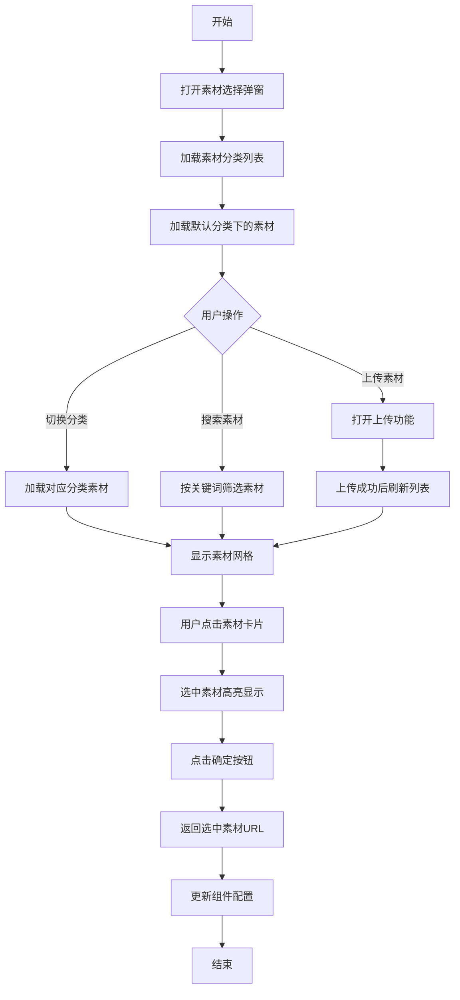

###### 3.2 业务规则

| 规则编号 | 规则名称 | 适用场景 | 规则描述 | 错误提示 |
|----------|----------|----------|----------|----------|
| RULE-MATERIAL-001 | 图片格式限制 | 上传素材 | 仅支持JPG、JPEG、PNG、GIF、WEBP格式 | 只能上传JPG、JPEG、PNG、GIF、WEBP格式的文件 |
| RULE-MATERIAL-002 | 图片大小限制 | 上传素材 | 图片大小不超过3MB | 文件大小不能超过3MB |

###### 3.3 状态机设计

**素材选中状态**

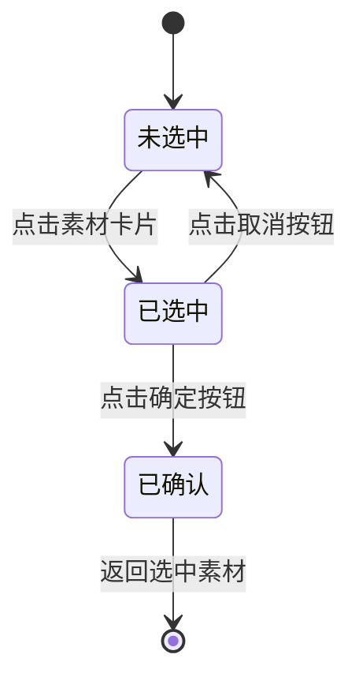

##### 4. 交互设计

###### 4.1 输入项说明

| 字段名称 | 字段标识 | 字段类型 | 必填 | 数据类型 | 长度限制 | 校验规则 | 取值范围 | 来源 | 提示文案 | 备注 |
|----------|----------|----------|------|----------|----------|----------|----------|------|----------|------|
| 分类选择 | category_select | 树形选择 | 否 | string | - | - | 素材库分类列表 | 用户点击 | 选择素材分类 | - |
| 素材选择 | material_select | 卡片点击 | 是 | string | - | - | 当前分类下的素材 | 用户点击 | 选择素材 | - |

###### 4.2 交互说明

1. **分类树**：左侧显示素材库分类树，点击分类加载对应素材。
2. **素材网格**：右侧以网格形式显示素材缩略图。
3. **单选模式**：点击素材卡片选中，再次点击确定按钮完成选择。
4. **上传入口**：提供上传按钮，支持本地图片上传。

###### 4.3 错误提示文案

**表单校验提示**

| 字段 | 校验规则 | 提示文案 |
|------|----------|----------|
| 图片格式 | 格式校验 | 只能上传JPG、JPEG、PNG、GIF、WEBP格式的文件 |
| 图片大小 | 大小校验 | 文件大小不能超过3MB |

---

#### 4.1.1.11. 底部导航配置

##### 1. 功能概述

- **功能描述**：底部导航配置用于设置商城底部Tab栏的样式和导航项，支持1-5个Tab项配置。
- **业务描述**：底部导航是商城的核心入口，用于在首页、分类页、购物车、我的页面等主要页面间切换。
- **使用角色**：运营人员、模板设计师。
- **触发条件**：点击画布中的底部导航区域或页面布局列表中的「底部导航」。

##### 2. 界面设计

###### 2.1 页面原型

（待补充）

###### 2.2 输出项说明

| 字段名称 | 字段标识 | 数据类型 | 数据来源 | 格式说明 |
|----------|----------|----------|----------|----------|
| Tab栏样式配置 | tabbar_config | object | 用户配置 | 包含颜色、字号、高度等样式设置 |
| Tab项列表 | tab_items | array | 用户配置 | 包含名称、图标、目标页面的Tab项数组 |

##### 3. 业务逻辑

###### 3.1 流程图

**Tab项添加流程**

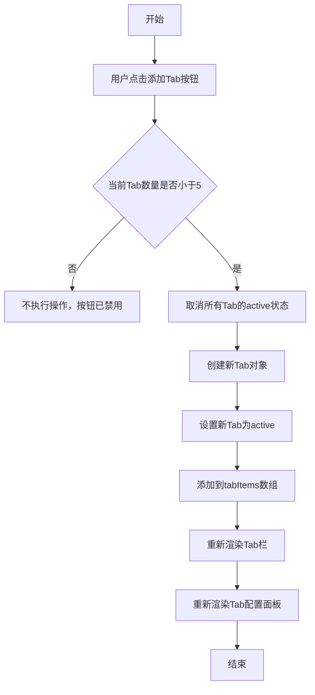

**Tab项删除流程**

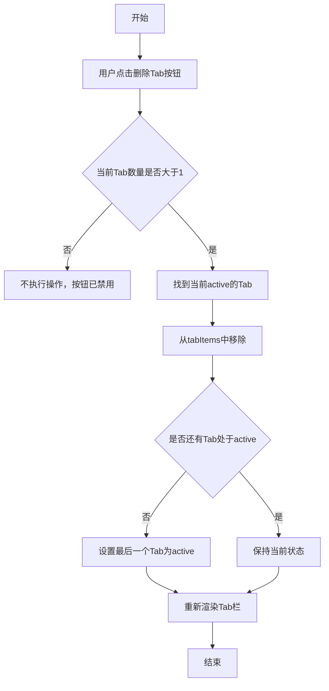

###### 3.2 业务规则

| 规则编号 | 规则名称 | 适用场景 | 规则描述 | 错误提示 |
|----------|----------|----------|----------|----------|
| RULE-TABBAR-001 | Tab数量下限 | 删除Tab | Tab数量最少1个，不可继续删除 | - |
| RULE-TABBAR-002 | Tab数量上限 | 添加Tab | Tab数量最多5个，不可继续添加 | - |

###### 3.3 状态机设计

**Tab选中状态**

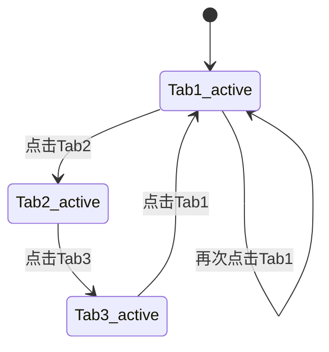

##### 4. 交互设计

###### 4.1 输入项说明

**Tab栏样式配置**

| 字段名称 | 字段标识 | 字段类型 | 必填 | 数据类型 | 长度限制 | 校验规则 | 取值范围 | 来源 | 提示文案 | 备注 |
|----------|----------|----------|------|----------|----------|----------|----------|------|----------|------|
| 默认颜色 | default_color | 颜色选择器 | 否 | string | - | HEX格式 | 颜色值 | 用户选择 | Tab文字默认颜色 | 默认#999999 |
| 选中颜色 | active_color | 颜色选择器 | 否 | string | - | HEX格式 | 颜色值 | 用户选择 | Tab文字选中颜色 | 默认#1677ff |
| 字号 | font_size | 数字输入 | 否 | number | 10-16 | 范围校验 | 10-16 | 用户输入 | Tab文字字号 | 默认12 |
| 背景颜色 | bg_color | 颜色选择器 | 否 | string | - | HEX格式 | 颜色值 | 用户选择 | Tab栏背景颜色 | 默认#ffffff |
| 高度 | height | 数字输入 | 否 | number | 48-64 | 范围校验 | 48-64 | 用户输入 | Tab栏高度 | 默认56 |
| 显示文字 | show_text | 开关 | 否 | boolean | - | - | true/false | 用户切换 | 是否显示Tab文字 | 默认开启 |

**Tab项配置**

| 字段名称 | 字段标识 | 字段类型 | 必填 | 数据类型 | 长度限制 | 校验规则 | 取值范围 | 来源 | 提示文案 | 备注 |
|----------|----------|----------|------|----------|----------|----------|----------|------|----------|------|
| Tab名称 | tab_name | 文本输入 | 是 | string | 1-5 | 长度校验 | - | 用户输入 | 输入Tab名称 | - |
| 目标页面 | target_page | 下拉选择 | 是 | string | - | - | 主页面列表 | 用户选择 | 选择跳转页面 | - |
| 默认图标 | default_icon | 图片上传 | 否 | string | - | - | 图片URL | 用户上传/选择 | 默认状态图标 | - |
| 选中图标 | active_icon | 图片上传 | 否 | string | - | - | 图片URL | 用户上传/选择 | 选中状态图标 | - |

###### 4.2 交互说明

1. **Tab栏样式配置**：在属性面板中统一配置Tab栏的样式，修改后实时预览。
2. **Tab项列表**：显示所有Tab项卡片，点击选中后可编辑该项的详细配置。
3. **添加/删除Tab**：通过配置面板底部的按钮添加或删除Tab项。
4. **图标上传**：点击图标区域打开素材选择弹窗，选择或上传图标图片。

###### 4.3 错误提示文案

**表单校验提示**

| 字段 | 校验规则 | 提示文案 |
|------|----------|----------|
| Tab名称 | 必填 | 请输入Tab名称 |
| Tab名称 | 长度限制 | Tab名称不能超过5个字符 |

---

# 5. 非功能需求

## 5.1. 性能需求

| 指标名称 | 指标要求 |
|----------|----------|
| 页面加载时间 | 首屏加载 ≤ 3秒 |
| 操作响应时间 | 配置项修改后画布刷新 ≤ 500ms |
| 组件添加响应 | 点击组件到画布渲染完成 ≤ 300ms |
| 支持组件数量 | 单页面支持最多50个组件 |

## 5.2. 兼容性需求

| 类型 | 要求 |
|------|------|
| 浏览器 | Chrome 80+、Firefox 75+、Safari 13+、Edge 80+ |
| 分辨率 | 最低支持1366×768，推荐1920×1080 |
| 显示比例 | 支持100%、125%、150%系统缩放 |

## 5.3. 安全需求

| 安全项 | 要求 |
|--------|------|
| 数据存储 | 模板数据存储在浏览器localStorage，敏感操作需用户确认 |
| XSS防护 | 富文本组件内容需进行XSS过滤 |
| 文件上传 | 校验文件类型和大小，限制为图片格式 |

---

# 6. 附录

## 6.1. 术语表

| 术语 | 说明 |
|------|------|
| 楼层 | 页面中的组件单元，每个组件占据一个楼层位置 |
| 主页面 | 可配置到底部导航的页面类型，如首页、分类页 |
| 子页面 | 不出现在底部导航的辅助页面，用于承载更多内容 |
| 组件 | 构成页面的基本单元，如商品列表、轮播图、标题等 |
| 画布 | 编辑器中实时预览页面效果的区域 |
| Tab栏 | 底部导航栏，用于在主页面间切换 |

## 6.2. 相关文档

| 文档名称 | 文档路径 |
|----------|----------|
| 功能大纲 | docs/功能大纲-可视化编辑器-草案.md |
| 组件配置项文档 | docs/组件&配置项V1.4-20260401.md |
| PRD规范模板 | .claude/skills/prd-auto-generator/references/prd-template-specification.md |

---

# 7. 版本记录

| 版本号 | 修改日期 | 修改人 | 修改内容 |
|--------|----------|--------|----------|
| V1.0 | 2026-04-04 | Claude | 基于功能大纲生成初稿 |