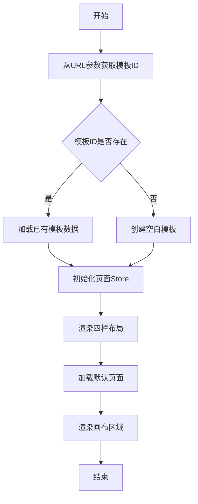
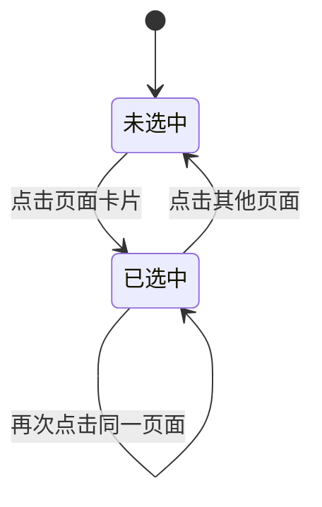
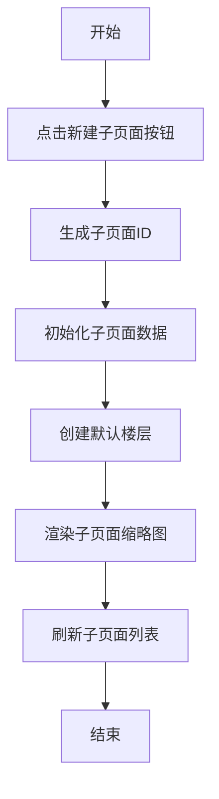
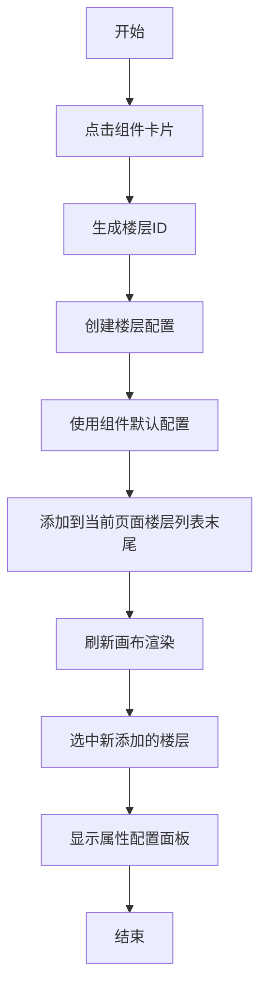
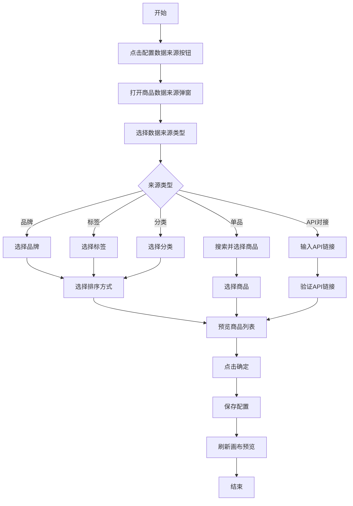
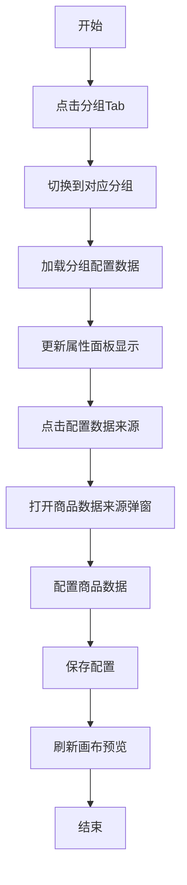
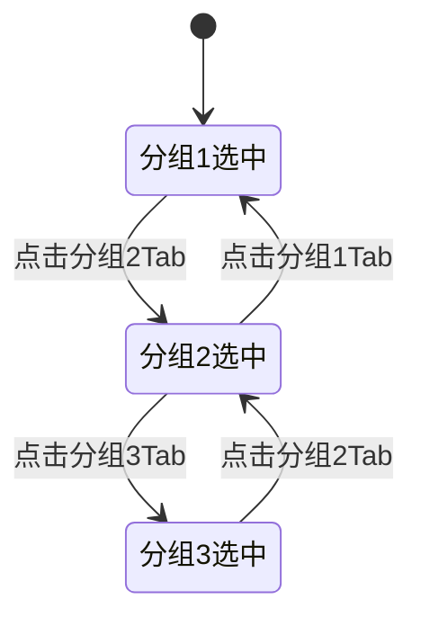
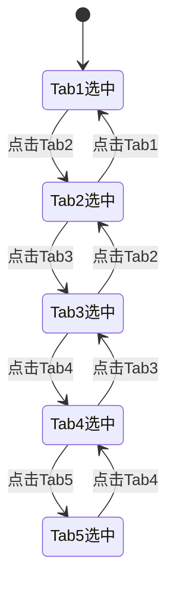
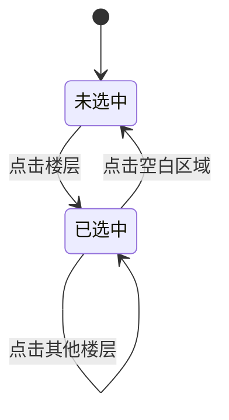

# 可视化编辑器产品需求文档

# 1. 需求背景

---

# 2. 需求分析

---

# 3. 系统流程图

---

# 4. 详细需求

## 4.1. 商城运营后台系统

### 4.1.1. 可视化编辑器模块

#### 4.1.1.1. 编辑器主界面

##### 1. 功能概述

- **功能描述**：可视化编辑器主界面采用四栏布局，提供所见即所得的页面编辑能力，支持页面管理、组件拖拽、属性配置等功能。
- **业务描述**：用于支撑运营人员快速创建和编辑商城模板，降低页面装修的技术门槛，提升运营效率。
- **使用角色**：运营人员、模板设计师。
- **触发条件**：从运营工作台点击「编辑」按钮进入编辑器。

##### 2. 界面设计

###### 2.1 页面原型

（待补充）

###### 2.2 输出项说明

| 字段名称 | 字段标识 | 数据类型 | 数据来源 | 格式说明 |
|----------|----------|----------|----------|----------|
| 模板名称 | template_name | string | 用户输入 | 文本，最多50字符 |
| 模板ID | template_id | string | 系统生成 | UUID格式 |
| 模板状态 | template_status | number | 系统生成 | 0草稿/1已发布 |

##### 3. 业务逻辑

###### 3.1 流程图

**编辑器初始化流程**



###### 3.2 业务规则

| 规则编号 | 规则名称 | 适用场景 | 规则描述 | 错误提示 |
|----------|----------|----------|----------|----------|
| RULE-EDITOR-001 | 四栏布局比例 | 界面渲染 | 左侧面板320px，画布弹性，页面操作区180px，属性面板340px | - |
| RULE-EDITOR-002 | 返回确认 | 返回操作 | 有未保存修改时提示用户确认 | 当前有未保存的修改，是否保存后离开？ |

###### 3.3 状态机设计

（无状态流转，无需状态机设计）

##### 4. 交互设计

###### 4.1 输入项说明

| 字段名称 | 字段标识 | 字段类型 | 必填 | 数据类型 | 长度限制 | 校验规则 | 取值范围 | 来源 | 提示文案 | 备注 |
|----------|----------|----------|------|----------|----------|----------|----------|------|----------|------|
| 面板Tab选择 | panel_tab | Tab点击 | 否 | string | - | - | pages/components | 用户点击 | - | 默认页面面板 |

###### 4.2 交互说明

1. 点击「页面」或「组件」Tab切换左侧面板内容。
2. 点击返回按钮，关闭编辑器窗口或跳转回运营工作台。
3. 画布区域支持鼠标滚轮缩放预览。
4. 属性面板根据选中组件动态显示配置项。

###### 4.3 错误提示文案

**表单校验提示**

| 校验字段 | 校验场景 | 提示文案 |
|----------|----------|----------|
| - | - | - |

**业务异常提示**

| 异常场景 | 错误码 | 提示文案 |
|----------|--------|----------|
| 模板加载失败 | EDITOR-001 | 模板加载失败，请重试 |

##### 5. 数据设计

###### 5.1 数据流转说明

**数据来源**

| 字段/数据 | 来源 | 获取方式 | 说明 |
|-----------|------|----------|------|
| 模板数据 | 运营工作台 | URL参数传递模板ID | 包含所有页面和组件配置 |

**数据去向**

| 数据 | 目标系统/模块 | 同步时机 | 说明 |
|------|---------------|----------|----------|
| 模板数据 | 运营工作台 | 保存/发布时 | 同步到模板列表 |

###### 5.2 数据权限设计

**角色数据范围**

| 角色 | 数据范围 | 说明 |
|------|----------|----------|
| 运营人员 | 所有模板 | 创建、编辑、删除、发布模板 |
| 模板设计师 | 所有模板 | 创建、编辑模板 |

**功能权限点**

| 权限标识 | 权限名称 |
|----------|----------|
| template:create | 新建模板 |
| template:edit | 编辑模板 |
| template:delete | 删除模板 |
| template:publish | 发布模板 |

##### 6. 扩展功能

###### 6.1 批量操作规则

（不适用）

###### 6.2 操作日志要求

| 操作类型 | 记录内容 | 保留时长 |
|----------|----------|----------|
| 创建 | 操作人、时间、模板名称 | 3年 |
| 编辑 | 操作人、时间、变更内容 | 3年 |
| 发布 | 操作人、时间、模板版本 | 3年 |

---

#### 4.1.1.2. 主页面管理

##### 1. 功能概述

- **功能描述**：主页面管理提供主页面的列表展示、新建、切换、编辑、删除功能，支持多种页面类型选择和模板预览。
- **业务描述**：帮助运营人员管理商城的主要页面，包括首页、分类页、活动页、我的页面、商品详情页、购物车页等。
- **使用角色**：运营人员、模板设计师。
- **触发条件**：在左侧面板点击「页面」Tab查看主页面列表。

##### 2. 界面设计

###### 2.1 页面原型

（待补充）

###### 2.2 输出项说明

| 字段名称 | 字段标识 | 数据类型 | 数据来源 | 格式说明 |
|----------|----------|----------|----------|----------|
| 页面名称 | page_name | string | 用户输入 | 文本，最多30字符 |
| 页面类型 | page_type | string | 用户选择 | home/category/activity/mine/product-detail/cart |
| 页面ID | page_id | string | 系统生成 | UUID格式 |
| 缩略图 | thumbnail | string | 系统生成 | 图片URL |

##### 3. 业务逻辑

###### 3.1 流程图

**新建主页面流程**

```mermaid
flowchart TD
    A[开始] --> B[点击新建页面按钮]
    B --> C[打开新建页面弹窗]
    C --> D[选择页面类型]
    D --> E{页面类型是否已存在}
    E -->|是| F[提示"该类型主页面已存在"]
    F --> D
    E -->|否| G[选择页面模板]
    G --> H[展示模板预览图]
    H --> I[点击确认创建]
    I --> J[生成页面ID]
    J --> K[初始化页面数据]
    K --> L[渲染页面缩略图]
    L --> M[刷新页面列表]
    M --> N[结束]
```

**删除主页面流程**

```mermaid
flowchart TD
    A[开始] --> B[点击删除按钮]
    B --> C{是否为默认页面}
    C -->|是| D[提示"默认页面不可删除"]
    D --> E[结束]
    C -->|否| F[弹出确认弹窗]
    F --> G{用户确认}
    G -->|否| E
    G -->|是| H[删除页面数据]
    H --> I[刷新页面列表]
    I --> E
```

###### 3.2 业务规则

| 规则编号 | 规则名称 | 适用场景 | 规则描述 | 错误提示 |
|----------|----------|----------|----------|----------|
| RULE-PAGE-001 | 页面类型唯一性 | 新建主页面 | 每种页面类型的主页面仅允许创建一个 | 该类型主页面已存在 |
| RULE-PAGE-002 | 默认页面保护 | 删除页面 | 系统创建的默认页面不可删除 | 默认页面不可删除 |
| RULE-PAGE-003 | 页面名称长度 | 编辑页面名称 | 页面名称最多30个字符 | 页面名称不能超过30个字符 |

###### 3.3 状态机设计

**页面选中状态**



##### 4. 交互设计

###### 4.1 输入项说明

| 字段名称 | 字段标识 | 字段类型 | 必填 | 数据类型 | 长度限制 | 校验规则 | 取值范围 | 来源 | 提示文案 | 备注 |
|----------|----------|----------|------|----------|----------|----------|----------|------|----------|------|
| 页面类型 | page_type | 下拉选择 | 是 | string | - | 不能为空 | home/category/activity/mine/product-detail/cart | 用户选择 | 请选择页面类型 | 已存在类型禁用 |
| 页面模板 | template | 点击选择 | 是 | string | - | 不能为空 | 根据页面类型动态展示 | 用户选择 | 请选择页面模板 | - |

**页面类型配置表**

| 页面类型 | 类型标识 | 可选模板 |
|----------|----------|----------|
| 首页 | home | 标准首页模板 |
| 分类页 | category | 三级分类、二级分类、二级+商品列表、横向Tab、直接列表、列表样式二 |
| 活动页 | activity | 标准活动页模板 |
| 我的页面 | mine | 电商模板、积分模板 |
| 商品详情页 | product-detail | 标准详情页模板 |
| 购物车页 | cart | 标准购物车模板 |

###### 4.2 交互说明

**主页面列表操作**
1. **切换页面**：点击页面卡片切换到对应页面，画布区域更新显示。
2. **编辑名称**：点击页面名称区域进入编辑状态，失焦或回车保存。
3. **删除页面**：点击删除图标，确认后删除页面。
4. **新建页面**：点击新建按钮，弹出新建页面弹窗。

**新建页面弹窗操作**
1. 选择页面类型（已存在类型显示为禁用状态）。
2. 选择页面模板，右侧展示模板预览图。
3. 点击确认创建页面。

###### 4.3 错误提示文案

**表单校验提示**

| 校验字段 | 校验场景 | 提示文案 |
|----------|----------|----------|
| 页面类型 | 未选择 | 请选择页面类型 |
| 页面模板 | 未选择 | 请选择页面模板 |
| 页面名称 | 为空 | 请输入页面名称 |
| 页面名称 | 超长 | 页面名称不能超过30个字符 |

**业务异常提示**

| 异常场景 | 错误码 | 提示文案 |
|----------|--------|----------|
| 类型已存在 | PAGE-001 | 该类型主页面已存在 |
| 默认页面删除 | PAGE-002 | 默认页面不可删除 |

##### 5. 数据设计

###### 5.1 数据流转说明

**数据来源**

| 字段/数据 | 来源 | 获取方式 | 说明 |
|-----------|------|----------|------|
| 页面类型配置 | 系统配置 | 静态定义 | PAGE_TYPE_CONFIG |
| 模板预览图 | 系统配置 | 静态定义 | 根据页面类型和模板名称生成 |

**数据去向**

| 数据 | 目标系统/模块 | 同步时机 | 说明 |
|------|---------------|----------|------|
| 页面数据 | pageStore | 创建/编辑/删除时 | 全局页面状态管理 |

###### 5.2 数据权限设计

（与编辑器主界面相同）

##### 6. 扩展功能

###### 6.1 批量操作规则

（不适用）

###### 6.2 操作日志要求

| 操作类型 | 记录内容 | 保留时长 |
|----------|----------|----------|
| 创建页面 | 操作人、时间、页面类型、模板名称 | 3年 |
| 删除页面 | 操作人、时间、页面名称 | 3年 |
| 编辑名称 | 操作人、时间、旧名称、新名称 | 3年 |

---

#### 4.1.1.3. 子页面管理

##### 1. 功能概述

- **功能描述**：子页面管理提供子页面的列表展示、新建、切换、编辑、删除功能。
- **业务描述**：帮助运营人员管理商城的子页面，用于承载活动详情、专题页面等内容。
- **使用角色**：运营人员、模板设计师。
- **触发条件**：在左侧面板点击「子页面」Tab查看子页面列表。

##### 2. 界面设计

###### 2.1 页面原型

（待补充）

###### 2.2 输出项说明

| 字段名称 | 字段标识 | 数据类型 | 数据来源 | 格式说明 |
|----------|----------|----------|----------|----------|
| 子页面名称 | subpage_name | string | 用户输入 | 文本，最多30字符 |
| 子页面ID | subpage_id | string | 系统生成 | UUID格式 |
| 缩略图 | thumbnail | string | 系统生成 | 图片URL |

##### 3. 业务逻辑

###### 3.1 流程图

**新建子页面流程**



###### 3.2 业务规则

| 规则编号 | 规则名称 | 适用场景 | 规则描述 | 错误提示 |
|----------|----------|----------|----------|----------|
| RULE-SUBPAGE-001 | 子页面名称长度 | 编辑子页面名称 | 子页面名称最多30个字符 | 子页面名称不能超过30个字符 |

###### 3.3 状态机设计

（与主页面管理相同）

##### 4. 交互设计

###### 4.1 输入项说明

| 字段名称 | 字段标识 | 字段类型 | 必填 | 数据类型 | 长度限制 | 校验规则 | 取值范围 | 来源 | 提示文案 | 备注 |
|----------|----------|----------|------|----------|----------|----------|----------|------|----------|------|
| 子页面名称 | subpage_name | 文本输入 | 是 | string | 1-30 | 不能为空 | - | 用户输入 | 请输入子页面名称 | - |

###### 4.2 交互说明

1. **切换子页面**：点击子页面卡片切换到对应子页面。
2. **编辑名称**：点击子页面名称区域进入编辑状态。
3. **删除子页面**：点击删除图标，确认后删除子页面。
4. **新建子页面**：点击新建按钮创建空白子页面。

###### 4.3 错误提示文案

**表单校验提示**

| 校验字段 | 校验场景 | 提示文案 |
|----------|----------|----------|
| 子页面名称 | 为空 | 请输入子页面名称 |
| 子页面名称 | 超长 | 子页面名称不能超过30个字符 |

**业务异常提示**

| 异常场景 | 错误码 | 提示文案 |
|----------|--------|----------|
| - | - | - |

##### 5. 数据设计

###### 5.1 数据流转说明

**数据来源**

| 字段/数据 | 来源 | 获取方式 | 说明 |
|-----------|------|----------|------|
| - | - | - | - |

**数据去向**

| 数据 | 目标系统/模块 | 同步时机 | 说明 |
|------|---------------|----------|----------|
| 子页面数据 | pageStore | 创建/编辑/删除时 | 全局页面状态管理 |

###### 5.2 数据权限设计

（与编辑器主界面相同）

##### 6. 扩展功能

###### 6.1 批量操作规则

（不适用）

###### 6.2 操作日志要求

| 操作类型 | 记录内容 | 保留时长 |
|----------|----------|----------|
| 创建子页面 | 操作人、时间、子页面名称 | 3年 |
| 删除子页面 | 操作人、时间、子页面名称 | 3年 |

---

#### 4.1.1.4. 组件库面板

##### 1. 功能概述

- **功能描述**：组件库面板展示可用的组件列表，支持组件分类Tab切换和组件点击添加到页面。
- **业务描述**：帮助运营人员快速查找和使用各类页面组件，提升页面搭建效率。
- **使用角色**：运营人员、模板设计师。
- **触发条件**：在左侧面板点击「组件」Tab查看组件库。

##### 2. 界面设计

###### 2.1 页面原型

（待补充）

###### 2.2 输出项说明

| 字段名称 | 字段标识 | 数据类型 | 数据来源 | 格式说明 |
|----------|----------|----------|----------|----------|
| 组件名称 | component_name | string | 系统配置 | 组件显示名称 |
| 组件标识 | component_type | string | 系统配置 | 组件唯一标识 |
| 组件分类 | component_category | string | 系统配置 | 商品/页面装修 |

##### 3. 业务逻辑

###### 3.1 流程图

**添加组件到页面流程**



###### 3.2 业务规则

| 规则编号 | 规则名称 | 适用场景 | 规则描述 | 错误提示 |
|----------|----------|----------|----------|----------|
| RULE-COMP-001 | 组件添加位置 | 添加组件 | 新组件添加到当前页面楼层列表末尾 | - |

###### 3.3 状态机设计

（无状态流转，无需状态机设计）

##### 4. 交互设计

###### 4.1 输入项说明

| 字段名称 | 字段标识 | 字段类型 | 必填 | 数据类型 | 长度限制 | 校验规则 | 取值范围 | 来源 | 提示文案 | 备注 |
|----------|----------|----------|------|----------|----------|----------|----------|------|----------|------|
| 分类Tab | category_tab | Tab点击 | 否 | string | - | - | goods/decorate | 用户点击 | - | 默认商品组件 |

###### 4.2 交互说明

1. **切换分类**：点击「商品」或「页面装修」Tab切换组件分类。
2. **添加组件**：点击组件卡片，组件添加到当前页面画布中。
3. **查看组件说明**：鼠标悬停组件卡片显示组件描述信息。

**商品组件列表**

| 组件名称 | 组件标识 |
|----------|----------|
| 商品列表 | goods-list |
| 商品分组 | goods-group |

**页面装修组件列表**

| 组件名称 | 组件标识 |
|----------|----------|
| 搜索框 | search-bar |
| 富文本域 | rich-text |
| 标题 | title |
| 大背景图 | big-bg-image |
| 文本 | text |
| 关联链接 | link |
| 轮播图 | carousel |
| 图文导航 | icon-nav |
| 悬浮组件 | float-button |
| 电梯导航 | elevator-nav |
| 个性化推荐 | personal-recommend |
| 自定义组件 | custom-component |
| 辅助线 | divider |
| 公告 | notice |

###### 4.3 错误提示文案

**表单校验提示**

| 校验字段 | 校验场景 | 提示文案 |
|----------|----------|----------|
| - | - | - |

**业务异常提示**

| 异常场景 | 错误码 | 提示文案 |
|----------|--------|----------|
| - | - | - |

##### 5. 数据设计

###### 5.1 数据流转说明

**数据来源**

| 字段/数据 | 来源 | 获取方式 | 说明 |
|-----------|------|----------|------|
| 组件配置 | 系统配置 | 静态定义 | components数组 |

**数据去向**

| 数据 | 目标系统/模块 | 同步时机 | 说明 |
|------|---------------|----------|----------|
| 组件配置 | 当前页面楼层 | 添加组件时 | 复制默认配置到楼层 |

###### 5.2 数据权限设计

（与编辑器主界面相同）

##### 6. 扩展功能

###### 6.1 批量操作规则

（不适用）

###### 6.2 操作日志要求

（不适用）

---

#### 4.1.1.5. 商品列表配置面板

##### 1. 功能概述

- **功能描述**：商品列表配置面板用于配置商品列表组件的显示样式、数据来源和商品属性，支持6种列表样式选择。
- **业务描述**：商品列表是商城核心组件，用于展示商品信息，帮助用户快速浏览和选购商品。
- **使用角色**：运营人员、模板设计师。
- **触发条件**：在画布中选中商品列表组件。

##### 2. 界面设计

###### 2.1 页面原型

（待补充）

###### 2.2 输出项说明

| 字段名称 | 字段标识 | 数据类型 | 数据来源 | 格式说明 |
|----------|----------|----------|----------|----------|
| 列表样式 | list_style | string | 用户选择 | large-single/small-double/detail-list/small-triple/one-large-two-small/horizontal-scroll |
| 背景颜色 | bg_color | string | 用户选择 | 颜色值 |
| 购物车样式 | cart_style | number | 用户选择 | 1/2/3 |

##### 3. 业务逻辑

###### 3.1 流程图

**配置商品数据来源流程**



###### 3.2 业务规则

| 规则编号 | 规则名称 | 适用场景 | 规则描述 | 错误提示 |
|----------|----------|----------|----------|----------|
| RULE-GOODS-LIST-001 | 页面边距范围 | 配置页面边距 | 页面边距范围0-30px | 页面边距范围为0-30px |
| RULE-GOODS-LIST-002 | 商品间距范围 | 配置商品间距 | 商品间距范围0-20px | 商品间距范围为0-20px |
| RULE-GOODS-LIST-003 | 自定义角标 | 配置角标 | 角标类型为"自定义"时显示自定义角标文字输入框 | - |

###### 3.3 状态机设计

（无状态流转，无需状态机设计）

##### 4. 交互设计

###### 4.1 输入项说明

| 字段名称 | 字段标识 | 字段类型 | 必填 | 数据类型 | 长度限制 | 校验规则 | 取值范围 | 来源 | 提示文案 | 备注 |
|----------|----------|----------|------|----------|----------|----------|----------|------|----------|------|
| 列表样式 | list_style | 下拉选择 | 是 | string | - | - | 大图单列/小图两列/详细列表/小图三列/一大两小/横向滑动 | 用户选择 | 请选择列表样式 | - |
| 背景颜色 | bg_color | 颜色选择器 | 否 | string | - | - | 颜色值 | 用户选择 | - | 默认白色 |
| 显示商品名称 | show_name | 下拉选择 | 否 | string | - | - | 显示/隐藏 | 用户选择 | - | 默认显示 |
| 显示规格值 | show_spec | 下拉选择 | 否 | string | - | - | 显示/隐藏 | 用户选择 | - | 默认隐藏 |
| 显示价格 | show_price | 下拉选择 | 否 | string | - | - | 显示/隐藏 | 用户选择 | - | 默认显示 |
| 显示标签 | show_tag | 下拉选择 | 否 | string | - | - | 显示/隐藏 | 用户选择 | - | 默认隐藏 |
| 购物车样式 | cart_style | 下拉选择 | 否 | number | - | - | 样式1/样式2/样式3 | 用户选择 | - | 默认样式1 |
| 角标类型 | badge_type | 下拉选择 | 否 | string | - | - | 无/新品/爆款/特价/拼团/秒杀/自定义 | 用户选择 | - | 默认无 |
| 自定义角标文字 | badge_text | 文本输入 | 否 | string | 1-4 | 角标为自定义时必填 | - | 用户输入 | 请输入角标文字 | 最多4字符 |
| 价格显示类型 | price_type | 下拉选择 | 否 | string | - | - | 价格/积分/价格+积分 | 用户选择 | - | 默认价格 |
| 显示划线价 | show_original_price | 下拉选择 | 否 | string | - | - | 显示/隐藏 | 用户选择 | - | 默认隐藏 |
| 组件边角样式 | component_corner | 下拉选择 | 否 | string | - | - | 圆角/直角 | 用户选择 | - | 默认圆角 |
| 页面边距 | page_margin | 数字输入 | 否 | number | 0-30 | 范围校验 | 0-30 | 用户输入 | 0-30px | 默认10 |
| 商品间距 | goods_margin | 数字输入 | 否 | number | 0-20 | 范围校验 | 0-20 | 用户输入 | 0-20px | 默认10 |
| 商品卡片倒角 | card_corner | 下拉选择 | 否 | string | - | - | 圆角/直角 | 用户选择 | - | 默认圆角 |

###### 4.2 交互说明

1. **修改配置**：在属性面板中修改配置项，画布实时预览效果。
2. **配置数据来源**：点击「配置数据来源」按钮，打开商品数据来源弹窗。
3. **选择列表样式**：下拉选择列表样式，画布实时更新显示效果。

**商品数据来源弹窗交互**
1. 切换数据来源类型Tab（品牌/标签/分类/单品/API对接）。
2. 根据类型选择对应数据，支持多选（品牌/标签/分类）。
3. 选择排序方式（综合/销量/价格升序/价格降序/评论数/好评率/最新）。
4. 查看商品预览列表。
5. 点击确定保存配置。

###### 4.3 错误提示文案

**表单校验提示**

| 校验字段 | 校验场景 | 提示文案 |
|----------|----------|----------|
| 页面边距 | 超出范围 | 页面边距范围为0-30px |
| 商品间距 | 超出范围 | 商品间距范围为0-20px |
| 自定义角标文字 | 角标为自定义时为空 | 请输入角标文字 |
| 自定义角标文字 | 超长 | 角标文字最多4个字符 |

**业务异常提示**

| 异常场景 | 错误码 | 提示文案 |
|----------|--------|----------|
| 商品数据为空 | GOODS-001 | 暂无符合条件的商品 |

##### 5. 数据设计

###### 5.1 数据流转说明

**数据来源**

| 字段/数据 | 来源 | 获取方式 | 说明 |
|-----------|------|----------|------|
| 商品数据 | 商品中心 | API查询 | 根据数据来源条件筛选 |
| 分类列表 | 分类管理 | API查询 | 商品分类树 |
| 品牌列表 | 品牌管理 | API查询 | 品牌列表 |
| 标签列表 | 标签管理 | API查询 | 商品标签列表 |

**数据去向**

| 数据 | 目标系统/模块 | 同步时机 | 说明 |
|------|---------------|----------|----------|
| 组件配置 | 当前楼层 | 配置修改时 | 更新楼层配置数据 |

###### 5.2 数据权限设计

（与编辑器主界面相同）

##### 6. 扩展功能

###### 6.1 批量操作规则

（不适用）

###### 6.2 操作日志要求

（不适用）

---

#### 4.1.1.6. 商品分组配置面板

##### 1. 功能概述

- **功能描述**：商品分组配置面板用于配置商品分组组件的显示样式、分组Tab和商品数据来源，支持分组Tab切换展示不同商品。
- **业务描述**：商品分组组件通过Tab分类展示商品，帮助用户快速定位目标商品类别。
- **使用角色**：运营人员、模板设计师。
- **触发条件**：在画布中选中商品分组组件。

##### 2. 界面设计

###### 2.1 页面原型

（待补充）

###### 2.2 输出项说明

| 字段名称 | 字段标识 | 数据类型 | 数据来源 | 格式说明 |
|----------|----------|----------|----------|----------|
| 菜单背景颜色 | menu_bg_color | string | 用户选择 | 颜色值 |
| 菜单样式 | menu_style | string | 用户选择 | round/square |
| 列表样式 | list_style | string | 用户选择 | 大图单列/小图两列等 |

##### 3. 业务逻辑

###### 3.1 流程图

**分组Tab管理流程**



###### 3.2 业务规则

| 规则编号 | 规则名称 | 适用场景 | 规则描述 | 错误提示 |
|----------|----------|----------|----------|----------|
| RULE-GOODS-GROUP-001 | 页面边距范围 | 配置页面边距 | 页面边距范围0-30px | 页面边距范围为0-30px |
| RULE-GOODS-GROUP-002 | 商品间距范围 | 配置商品间距 | 商品间距范围0-20px | 商品间距范围为0-20px |

###### 3.3 状态机设计

**分组Tab选中状态**



##### 4. 交互设计

###### 4.1 输入项说明

| 字段名称 | 字段标识 | 字段类型 | 必填 | 数据类型 | 长度限制 | 校验规则 | 取值范围 | 来源 | 提示文案 | 备注 |
|----------|----------|----------|------|----------|----------|----------|----------|------|----------|------|
| 菜单背景颜色 | menu_bg_color | 颜色选择器 | 否 | string | - | - | 颜色值 | 用户选择 | - | 默认白色 |
| 菜单样式 | menu_style | 下拉选择 | 否 | string | - | - | 圆角/直角 | 用户选择 | - | 默认圆角 |
| 显示分组名称 | show_group_name | 下拉选择 | 否 | string | - | - | 显示/隐藏 | 用户选择 | - | 默认显示 |
| 列表样式 | list_style | 下拉选择 | 是 | string | - | - | 大图单列/小图两列/详细列表/小图三列/一大两小/横向滑动 | 用户选择 | 请选择列表样式 | - |
| 商品样式 | goods_style | 下拉选择 | 否 | string | - | - | 无边白底/卡片投影/描边白底/无边透明/促销/瀑布流 | 用户选择 | - | 默认无边白底 |
| 购买按钮样式 | buy_btn_style | 下拉选择 | 否 | number | - | - | 样式1/样式2/样式3 | 用户选择 | - | 默认样式1 |
| 显示描述 | show_desc | 下拉选择 | 否 | string | - | - | 显示/隐藏 | 用户选择 | - | 默认隐藏 |
| 显示原价 | show_original_price | 下拉选择 | 否 | string | - | - | 显示/隐藏 | 用户选择 | - | 默认隐藏 |
| 显示价格 | show_price | 下拉选择 | 否 | string | - | - | 显示/隐藏 | 用户选择 | - | 默认显示 |
| 显示销量 | show_sales | 下拉选择 | 否 | string | - | - | 显示/隐藏 | 用户选择 | - | 默认隐藏 |
| 文本样式 | text_style | 下拉选择 | 否 | string | - | - | 加粗/常规 | 用户选择 | - | 默认常规 |
| 商品倒角 | goods_corner | 下拉选择 | 否 | string | - | - | 圆角/直角 | 用户选择 | - | 默认圆角 |
| 页面边距 | page_margin | 数字输入 | 否 | number | 0-30 | 范围校验 | 0-30 | 用户输入 | 0-30px | 默认10 |
| 商品间距 | goods_margin | 数字输入 | 否 | number | 0-20 | 范围校验 | 0-20 | 用户输入 | 0-20px | 默认10 |
| 换一换功能 | refresh_btn | 下拉选择 | 否 | string | - | - | 开启/关闭 | 用户选择 | - | 默认关闭 |

###### 4.2 交互说明

1. **切换分组Tab**：点击分组Tab切换到对应分组，属性面板显示该分组的配置。
2. **配置数据来源**：点击「配置数据来源」按钮，打开商品数据来源弹窗。
3. **修改配置**：在属性面板中修改配置项，画布实时预览效果。

###### 4.3 错误提示文案

**表单校验提示**

| 校验字段 | 校验场景 | 提示文案 |
|----------|----------|----------|
| 页面边距 | 超出范围 | 页面边距范围为0-30px |
| 商品间距 | 超出范围 | 商品间距范围为0-20px |

**业务异常提示**

| 异常场景 | 错误码 | 提示文案 |
|----------|--------|----------|
| 商品数据为空 | GOODS-001 | 暂无符合条件的商品 |

##### 5. 数据设计

###### 5.1 数据流转说明

**数据来源**

| 字段/数据 | 来源 | 获取方式 | 说明 |
|-----------|------|----------|------|
| 商品数据 | 商品中心 | API查询 | 根据数据来源条件筛选 |

**数据去向**

| 数据 | 目标系统/模块 | 同步时机 | 说明 |
|------|---------------|----------|----------|
| 组件配置 | 当前楼层 | 配置修改时 | 更新楼层配置数据 |

###### 5.2 数据权限设计

（与编辑器主界面相同）

##### 6. 扩展功能

###### 6.1 批量操作规则

（不适用）

###### 6.2 操作日志要求

（不适用）

---

#### 4.1.1.10. 底部导航配置面板

##### 1. 功能概述

- **功能描述**：底部导航配置面板用于配置底部Tab栏的样式和Tab项管理，支持最多5个Tab项配置。
- **业务描述**：底部导航是商城APP的核心导航入口，帮助用户快速切换主要页面。
- **使用角色**：运营人员、模板设计师。
- **触发条件**：在页面操作区点击底部导航配置。

##### 2. 界面设计

###### 2.1 页面原型

（待补充）

###### 2.2 输出项说明

| 字段名称 | 字段标识 | 数据类型 | 数据来源 | 格式说明 |
|----------|----------|----------|----------|----------|
| 默认颜色 | default_color | string | 用户选择 | Tab未选中时颜色 |
| 选中颜色 | active_color | string | 用户选择 | Tab选中时颜色 |
| 背景颜色 | bg_color | string | 用户选择 | Tab栏背景色 |

##### 3. 业务逻辑

###### 3.1 流程图

**添加Tab项流程**

```mermaid
flowchart TD
    A[开始] --> B[点击添加Tab按钮]
    B --> C{当前Tab数量}
    C -->|大于等于5| D[提示"最多添加5个Tab"]
    D --> E[结束]
    C -->|小于5| F[创建新Tab项]
    F --> G[配置Tab名称]
    G --> H[选择目标页面]
    H --> I[上传默认图标]
    I --> J[上传选中图标]
    J --> K[刷新底部导航预览]
    K --> E
```

**删除Tab项流程**

```mermaid
flowchart TD
    A[开始] --> B[点击删除Tab按钮]
    B --> C{当前Tab数量}
    C -->|小于等于1| D[提示"至少保留1个Tab"]
    D --> E[结束]
    C -->|大于1| F[确认删除]
    F --> G[删除Tab项]
    G --> H[刷新底部导航预览]
    H --> E
```

###### 3.2 业务规则

| 规则编号 | 规则名称 | 适用场景 | 规则描述 | 错误提示 |
|----------|----------|----------|----------|----------|
| RULE-TABBAR-001 | Tab数量限制 | 添加/删除Tab | Tab数量范围：1-5个 | 最多添加5个Tab / 至少保留1个Tab |

###### 3.3 状态机设计

**Tab选中状态**



##### 4. 交互设计

###### 4.1 输入项说明

| 字段名称 | 字段标识 | 字段类型 | 必填 | 数据类型 | 长度限制 | 校验规则 | 取值范围 | 来源 | 提示文案 | 备注 |
|----------|----------|----------|------|----------|----------|----------|----------|------|----------|------|
| 默认颜色 | default_color | 颜色选择器 | 否 | string | - | - | 颜色值 | 用户选择 | - | 默认#999999 |
| 选中颜色 | active_color | 颜色选择器 | 否 | string | - | - | 颜色值 | 用户选择 | - | 默认#FF4444 |
| 字号 | font_size | 数字输入 | 否 | number | 10-16 | - | 10-16 | 用户输入 | 10-16px | 默认10 |
| 背景颜色 | bg_color | 颜色选择器 | 否 | string | - | - | 颜色值 | 用户选择 | - | 默认白色 |
| 高度 | height | 数字输入 | 否 | number | 40-60 | - | 40-60 | 用户输入 | 40-60px | 默认50 |
| 边框颜色 | border_color | 颜色选择器 | 否 | string | - | - | 颜色值 | 用户选择 | - | 默认#EEEEEE |
| 图标间距 | icon_text_gap | 数字输入 | 否 | number | 2-10 | - | 2-10 | 用户输入 | 2-10px | 默认4 |
| 显示文字 | show_text | 开关 | 否 | boolean | - | - | true/false | 用户选择 | - | 默认开启 |

**Tab项配置**

| 字段名称 | 字段标识 | 字段类型 | 必填 | 数据类型 | 长度限制 | 校验规则 | 取值范围 | 来源 | 提示文案 | 备注 |
|----------|----------|----------|------|----------|----------|----------|----------|------|----------|------|
| Tab名称 | tab_name | 文本输入 | 是 | string | 1-4 | - | - | 用户输入 | 请输入Tab名称 | 最多4字符 |
| 目标页面 | target_page | 下拉选择 | 是 | string | - | - | 页面列表 | 用户选择 | 请选择目标页面 | - |
| 默认图标 | default_icon | 图片上传 | 是 | string | - | - | 图片URL | 用户上传 | 请上传默认图标 | - |
| 选中图标 | active_icon | 图片上传 | 是 | string | - | - | 图片URL | 用户上传 | 请上传选中图标 | - |

###### 4.2 交互说明

1. **添加Tab**：点击添加按钮创建新Tab项。
2. **删除Tab**：点击Tab项的删除按钮移除（至少保留1个）。
3. **配置Tab**：为每个Tab配置名称、目标页面、图标。
4. **预览效果**：画布底部实时预览Tab栏效果。

###### 4.3 错误提示文案

**表单校验提示**

| 校验字段 | 校验场景 | 提示文案 |
|----------|----------|----------|
| Tab名称 | 为空 | 请输入Tab名称 |
| Tab名称 | 超长 | Tab名称最多4个字符 |
| 目标页面 | 未选择 | 请选择目标页面 |
| 默认图标 | 未上传 | 请上传默认图标 |
| 选中图标 | 未上传 | 请上传选中图标 |

**业务异常提示**

| 异常场景 | 错误码 | 提示文案 |
|----------|--------|----------|
| Tab数量超限 | TABBAR-001 | 最多添加5个Tab |
| Tab数量不足 | TABBAR-002 | 至少保留1个Tab |

##### 5. 数据设计

###### 5.1 数据流转说明

**数据来源**

| 字段/数据 | 来源 | 获取方式 | 说明 |
|-----------|------|----------|------|
| 图标素材 | 素材库 | 图片上传 | Tab图标URL |
| 页面列表 | 页面管理 | pageStore | 可选目标页面 |

**数据去向**

| 数据 | 目标系统/模块 | 同步时机 | 说明 |
|------|---------------|----------|----------|
| Tab栏配置 | 全局配置 | 配置修改时 | 更新tabbarConfig |

###### 5.2 数据权限设计

（与编辑器主界面相同）

##### 6. 扩展功能

###### 6.1 批量操作规则

（不适用）

###### 6.2 操作日志要求

| 操作类型 | 记录内容 | 保留时长 |
|----------|----------|----------|
| 添加Tab | 操作人、时间、Tab名称 | 3年 |
| 删除Tab | 操作人、时间、Tab名称 | 3年 |
| 修改样式 | 操作人、时间、变更内容 | 3年 |

---

#### 4.1.1.11. 楼层操作区

##### 1. 功能概述

- **功能描述**：楼层操作区提供楼层列表展示、选中、上移、下移、复制、删除功能。
- **业务描述**：帮助运营人员管理页面楼层结构，调整楼层顺序和内容。
- **使用角色**：运营人员、模板设计师。
- **触发条件**：在页面操作区查看当前页面的楼层列表。

##### 2. 界面设计

###### 2.1 页面原型

（待补充）

###### 2.2 输出项说明

| 字段名称 | 字段标识 | 数据类型 | 数据来源 | 格式说明 |
|----------|----------|----------|----------|----------|
| 楼层ID | floor_id | string | 系统生成 | UUID格式 |
| 楼层名称 | floor_name | string | 系统生成 | 组件名称 |
| 楼层索引 | floor_index | number | 系统生成 | 楼层位置索引 |

##### 3. 业务逻辑

###### 3.1 流程图

**楼层操作流程**

```mermaid
flowchart TD
    A[开始] --> B{操作类型}
    B -->|上移| C{是否为首个楼层}
    C -->|是| D[提示"首楼层不可上移"]
    C -->|否| E[交换楼层位置]
    B -->|下移| F{是否为末尾楼层}
    F -->|是| G[提示"尾楼层不可下移"]
    F -->|否| E
    B -->|复制| H[复制楼层配置]
    H --> I[插入到当前楼层下方]
    B -->|删除| J[确认删除]
    J --> K[移除楼层]
    D --> L[结束]
    G --> L
    E --> M[刷新画布和楼层列表]
    I --> M
    K --> M
    M --> L
```

###### 3.2 业务规则

| 规则编号 | 规则名称 | 适用场景 | 规则描述 | 错误提示 |
|----------|----------|----------|----------|----------|
| RULE-FLOOR-001 | 楼层操作前提 | 楼层操作 | 必须先选中楼层才能进行操作 | 请先选中楼层 |
| RULE-FLOOR-002 | 首楼层限制 | 楼层上移 | 第一个楼层不可上移 | 首楼层不可上移 |
| RULE-FLOOR-003 | 尾楼层限制 | 楼层下移 | 最后一个楼层不可下移 | 尾楼层不可下移 |

###### 3.3 状态机设计

**楼层选中状态**



##### 4. 交互设计

###### 4.1 输入项说明

| 字段名称 | 字段标识 | 字段类型 | 必填 | 数据类型 | 长度限制 | 校验规则 | 取值范围 | 来源 | 提示文案 | 备注 |
|----------|----------|----------|------|----------|----------|----------|----------|------|----------|------|
| 选中楼层 | selected_floor | 点击选择 | 否 | string | - | - | 楼层ID列表 | 用户点击 | - | - |

###### 4.2 交互说明

1. **选中楼层**：点击楼层列表项选中对应楼层，画布高亮显示。
2. **上移楼层**：点击上移按钮，楼层向上移动一位。
3. **下移楼层**：点击下移按钮，楼层向下移动一位。
4. **复制楼层**：点击复制按钮，复制当前楼层并插入到下方。
5. **删除楼层**：点击删除按钮，确认后删除楼层。

###### 4.3 错误提示文案

**表单校验提示**

| 校验字段 | 校验场景 | 提示文案 |
|----------|----------|----------|
| - | - | - |

**业务异常提示**

| 异常场景 | 错误码 | 提示文案 |
|----------|--------|----------|
| 未选中楼层 | FLOOR-001 | 请先选中楼层 |
| 首楼层上移 | FLOOR-002 | 首楼层不可上移 |
| 尾楼层下移 | FLOOR-003 | 尾楼层不可下移 |

##### 5. 数据设计

###### 5.1 数据流转说明

**数据来源**

| 字段/数据 | 来源 | 获取方式 | 说明 |
|-----------|------|----------|------|
| 楼层列表 | 当前页面 | pageStore | 当前页面的所有楼层配置 |

**数据去向**

| 数据 | 目标系统/模块 | 同步时机 | 说明 |
|------|---------------|----------|----------|
| 楼层顺序 | 当前页面 | 移动操作时 | 更新楼层列表顺序 |
| 楼层配置 | 当前页面 | 复制/删除时 | 更新楼层列表 |

###### 5.2 数据权限设计

（与编辑器主界面相同）

##### 6. 扩展功能

###### 6.1 批量操作规则

（不适用）

###### 6.2 操作日志要求

| 操作类型 | 记录内容 | 保留时长 |
|----------|----------|----------|
| 上移楼层 | 操作人、时间、楼层名称 | 3年 |
| 下移楼层 | 操作人、时间、楼层名称 | 3年 |
| 复制楼层 | 操作人、时间、楼层名称 | 3年 |
| 删除楼层 | 操作人、时间、楼层名称 | 3年 |

---

#### 4.1.1.12. 富文本配置面板

##### 1. 功能概述

- **功能描述**：富文本配置面板用于配置富文本组件的内容和样式，支持富文本编辑器进行排版、插入图片/链接/表格等操作。
- **业务描述**：富文本组件用于展示自定义格式的内容，如商品详情、活动说明、公告等。
- **使用角色**：运营人员、模板设计师。
- **触发条件**：在画布中选中富文本组件。

##### 2. 界面设计

###### 2.1 页面原型

（待补充）

###### 2.2 输出项说明

| 字段名称 | 字段标识 | 数据类型 | 数据来源 | 格式说明 |
|----------|----------|----------|----------|----------|
| 富文本内容 | content | string | 用户输入 | HTML格式内容 |
| 背景颜色 | bg_color | string | 用户选择 | 颜色值 |
| 背景图片 | bg_image | string | 用户上传 | 图片URL |

##### 3. 业务逻辑

###### 3.1 流程图

（无复杂流程，无需绘制流程图）

###### 3.2 业务规则

| 规则编号 | 规则名称 | 适用场景 | 规则描述 | 错误提示 |
|----------|----------|----------|----------|----------|
| RULE-RICHTEXT-001 | 内边距范围 | 配置内边距 | 内边距范围0-50px | 内边距范围为0-50px |
| RULE-RICHTEXT-002 | 最大宽度范围 | 配置最大宽度 | 最大宽度范围0-750px，0表示不限制 | 最大宽度范围为0-750px |

###### 3.3 状态机设计

（无状态流转，无需状态机设计）

##### 4. 交互设计

###### 4.1 输入项说明

| 字段名称 | 字段标识 | 字段类型 | 必填 | 数据类型 | 长度限制 | 校验规则 | 取值范围 | 来源 | 提示文案 | 备注 |
|----------|----------|----------|------|----------|----------|----------|----------|------|----------|------|
| 富文本内容 | content | 富文本编辑器 | 是 | string | - | - | - | 用户输入 | 请输入内容 | 支持排版、图片、链接、表格 |
| 背景颜色 | bg_color | 颜色选择器 | 否 | string | - | - | 颜色值 | 用户选择 | - | 默认透明 |
| 背景图片 | bg_image | 图片上传 | 否 | string | - | - | 图片URL | 用户上传 | - | - |
| 文字颜色 | text_color | 颜色选择器 | 否 | string | - | - | 颜色值 | 用户选择 | - | 默认黑色 |
| 上边距 | padding_top | 数字输入 | 否 | number | 0-50 | - | 0-50 | 用户输入 | 0-50px | 默认10 |
| 下边距 | padding_bottom | 数字输入 | 否 | number | 0-50 | - | 0-50 | 用户输入 | 0-50px | 默认10 |
| 左边距 | padding_left | 数字输入 | 否 | number | 0-50 | - | 0-50 | 用户输入 | 0-50px | 默认10 |
| 右边距 | padding_right | 数字输入 | 否 | number | 0-50 | - | 0-50 | 用户输入 | 0-50px | 默认10 |
| 最大宽度 | max_width | 数字输入 | 否 | number | 0-750 | - | 0-750 | 用户输入 | 0-750px，0表示不限制 | 默认0 |
| 边角样式 | corner_style | 下拉选择 | 否 | string | - | - | 圆角/直角 | 用户选择 | - | 默认圆角 |

###### 4.2 交互说明

1. **编辑内容**：在富文本编辑器中输入和编辑内容，支持加粗、斜体、下划线、字号、颜色等格式。
2. **插入图片**：点击插入图片按钮，打开素材选择弹窗选择图片。
3. **插入链接**：点击插入链接按钮，配置跳转链接。
4. **插入表格**：点击插入表格按钮，创建表格。
5. **设置背景**：选择背景颜色或上传背景图片。
6. **调整边距**：分别设置上、下、左、右边距。

###### 4.3 错误提示文案

**表单校验提示**

| 校验字段 | 校验场景 | 提示文案 |
|----------|----------|----------|
| 富文本内容 | 为空 | 请输入内容 |
| 内边距 | 超出范围 | 内边距范围为0-50px |
| 最大宽度 | 超出范围 | 最大宽度范围为0-750px |

**业务异常提示**

| 异常场景 | 错误码 | 提示文案 |
|----------|--------|----------|
| - | - | - |

##### 5. 数据设计

###### 5.1 数据流转说明

**数据来源**

| 字段/数据 | 来源 | 获取方式 | 说明 |
|-----------|------|----------|------|
| 图片素材 | 素材库 | 素材选择弹窗 | 富文本中插入的图片 |

**数据去向**

| 数据 | 目标系统/模块 | 同步时机 | 说明 |
|------|---------------|----------|----------|
| 组件配置 | 当前楼层 | 配置修改时 | 更新楼层配置数据 |

###### 5.2 数据权限设计

（与编辑器主界面相同）

##### 6. 扩展功能

###### 6.1 批量操作规则

（不适用）

###### 6.2 操作日志要求

（不适用）

---

#### 4.1.1.13. 标题配置面板

##### 1. 功能概述

- **功能描述**：标题配置面板用于配置标题组件的内容和样式，支持主标题、副标题、对齐方式、字号、颜色等配置。
- **业务描述**：标题组件用于页面的标题展示，如楼层标题、模块标题等。
- **使用角色**：运营人员、模板设计师。
- **触发条件**：在画布中选中标题组件。

##### 2. 界面设计

###### 2.1 页面原型

（待补充）

###### 2.2 输出项说明

| 字段名称 | 字段标识 | 数据类型 | 数据来源 | 格式说明 |
|----------|----------|----------|----------|----------|
| 标题内容 | title | string | 用户输入 | 标题文字 |
| 副标题 | subtitle | string | 用户输入 | 副标题/描述文字 |
| 对齐方式 | align | string | 用户选择 | left/center/right |

##### 3. 业务逻辑

###### 3.1 流程图

（无复杂流程，无需绘制流程图）

###### 3.2 业务规则

| 规则编号 | 规则名称 | 适用场景 | 规则描述 | 错误提示 |
|----------|----------|----------|----------|----------|
| RULE-TITLE-001 | 标题内容长度 | 输入标题 | 标题内容最多50个字符 | 标题内容不能超过50个字符 |
| RULE-TITLE-002 | 副标题长度 | 输入副标题 | 副标题最多100个字符 | 副标题不能超过100个字符 |
| RULE-TITLE-003 | 内边距范围 | 配置内边距 | 内边距范围0-30px | 内边距范围为0-30px |

###### 3.3 状态机设计

（无状态流转，无需状态机设计）

##### 4. 交互设计

###### 4.1 输入项说明

| 字段名称 | 字段标识 | 字段类型 | 必填 | 数据类型 | 长度限制 | 校验规则 | 取值范围 | 来源 | 提示文案 | 备注 |
|----------|----------|----------|------|----------|----------|----------|----------|------|----------|------|
| 标题内容 | title | 文本输入 | 是 | string | 1-50 | 不能为空 | - | 用户输入 | 请输入标题 | - |
| 副标题 | subtitle | 文本输入 | 否 | string | 0-100 | - | - | 用户输入 | 请输入副标题 | - |
| 对齐方式 | align | 下拉选择 | 否 | string | - | - | 左对齐/居中/右对齐 | 用户选择 | - | 默认左对齐 |
| 标题字号 | title_font_size | 下拉选择 | 否 | number | - | - | 12/14/16/18/20/22/24/28/32 | 用户选择 | - | 默认18 |
| 标题颜色 | title_color | 颜色选择器 | 否 | string | - | - | 颜色值 | 用户选择 | - | 默认黑色 |
| 标题粗细 | title_font_weight | 下拉选择 | 否 | string | - | - | 加粗/常规 | 用户选择 | - | 默认加粗 |
| 副标题字号 | subtitle_font_size | 下拉选择 | 否 | number | - | - | 12/14/16 | 用户选择 | - | 默认12 |
| 副标题颜色 | subtitle_color | 颜色选择器 | 否 | string | - | - | 颜色值 | 用户选择 | - | 默认灰色 |
| 背景颜色 | bg_color | 颜色选择器 | 否 | string | - | - | 颜色值 | 用户选择 | - | 默认透明 |
| 上边距 | padding_top | 数字输入 | 否 | number | 0-30 | - | 0-30 | 用户输入 | 0-30px | 默认10 |
| 下边距 | padding_bottom | 数字输入 | 否 | number | 0-30 | - | 0-30 | 用户输入 | 0-30px | 默认10 |
| 左边距 | padding_left | 数字输入 | 否 | number | 0-30 | - | 0-30 | 用户输入 | 0-30px | 默认10 |
| 右边距 | padding_right | 数字输入 | 否 | number | 0-30 | - | 0-30 | 用户输入 | 0-30px | 默认10 |
| 边角样式 | corner_style | 下拉选择 | 否 | string | - | - | 圆角/直角 | 用户选择 | - | 默认圆角 |

###### 4.2 交互说明

1. **输入标题**：在标题输入框中输入标题文字。
2. **输入副标题**：在副标题输入框中输入描述文字。
3. **设置对齐**：选择左对齐、居中或右对齐。
4. **设置字号**：分别设置标题和副标题的字号大小。
5. **设置颜色**：分别设置标题和副标题的颜色。
6. **设置粗细**：选择标题字体加粗或常规。

###### 4.3 错误提示文案

**表单校验提示**

| 校验字段 | 校验场景 | 提示文案 |
|----------|----------|----------|
| 标题内容 | 为空 | 请输入标题 |
| 标题内容 | 超长 | 标题内容不能超过50个字符 |
| 副标题 | 超长 | 副标题不能超过100个字符 |

**业务异常提示**

| 异常场景 | 错误码 | 提示文案 |
|----------|--------|----------|
| - | - | - |

##### 5. 数据设计

###### 5.1 数据流转说明

**数据来源**

| 字段/数据 | 来源 | 获取方式 | 说明 |
|-----------|------|----------|------|
| - | - | - | - |

**数据去向**

| 数据 | 目标系统/模块 | 同步时机 | 说明 |
|------|---------------|----------|----------|
| 组件配置 | 当前楼层 | 配置修改时 | 更新楼层配置数据 |

###### 5.2 数据权限设计

（与编辑器主界面相同）

##### 6. 扩展功能

###### 6.1 批量操作规则

（不适用）

###### 6.2 操作日志要求

（不适用）

---

# 5. 非功能需求

## 5.1. 性能需求

| 指标名称 | 指标要求 |
|----------|----------|
| 页面加载时间 | 首屏加载 ≤ 3秒 |
| 组件渲染时间 | 组件添加到画布 ≤ 500ms |
| 配置修改响应 | 属性修改到画布更新 ≤ 200ms |
| 画布缩放响应 | 缩放操作响应 ≤ 100ms |
| 模板保存时间 | 保存模板 ≤ 2秒 |

## 5.2. 兼容性需求

| 类型 | 要求 |
|------|------|
| 浏览器 | Chrome 80+、Firefox 75+、Safari 13+、Edge 80+ |
| 分辨率 | 最低支持1366×768，推荐1920×1080 |
| 移动端预览 | 支持iOS 12+、Android 8+ WebView |

## 5.3. 安全需求

| 安全项 | 要求 |
|--------|------|
| 数据存储 | 模板数据存储在浏览器localStorage，支持云端同步 |
| XSS防护 | 富文本组件内容需进行XSS过滤 |
| 权限控制 | 基于角色的访问控制，防止越权操作 |
| 数据隔离 | 租户数据相互隔离，防止数据泄露 |

---

# 6. 附录

## 6.1. 术语表

| 术语 | 说明 |
|------|------|
| 楼层 | 页面中的组件单元，每个组件在页面中作为一个楼层展示 |
| 主页面 | 商城的主要页面类型，如首页、分类页、活动页等 |
| 子页面 | 独立于主页面的页面，用于活动详情、专题等内容 |
| 组件 | 页面构建的基本单元，如商品列表、轮播图、搜索框等 |
| 配置面板 | 右侧属性面板，用于配置选中组件的属性 |
| 画布 | 中间预览区域，模拟手机端页面效果 |
| Tab栏 | 底部导航栏，用于切换主要页面 |

## 6.2. 相关文档

| 文档名称 | 文档路径 |
|----------|----------|
| 功能大纲 | docs/功能大纲-可视化编辑器-草案.md |
| 需求文档规范 | references/prd-template-specification.md |

---

# 7. 版本记录

| 版本号 | 修改日期 | 修改人 | 修改内容 |
|--------|----------|--------|----------|
| V1.0 | 2026-03-20 | 产品经理 | 初稿创建 |
| V2.0 | 2026-04-04 | 产品经理 | 完整重构：1.按照三级层次结构规范重新编写；2.补充所有主要组件配置面板；3.补充业务规则和流程图；4.补充状态机设计 |