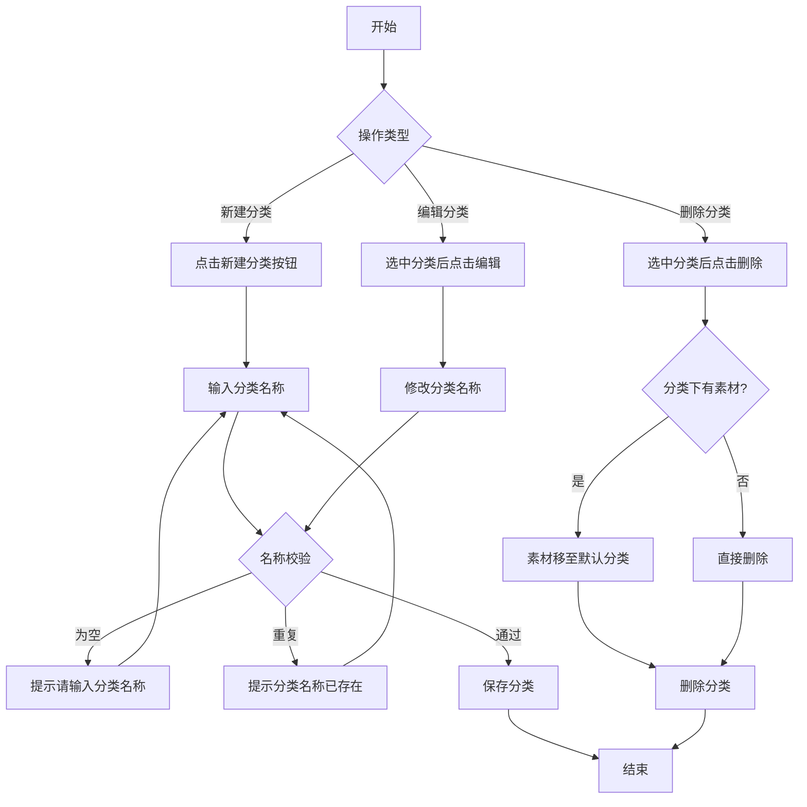
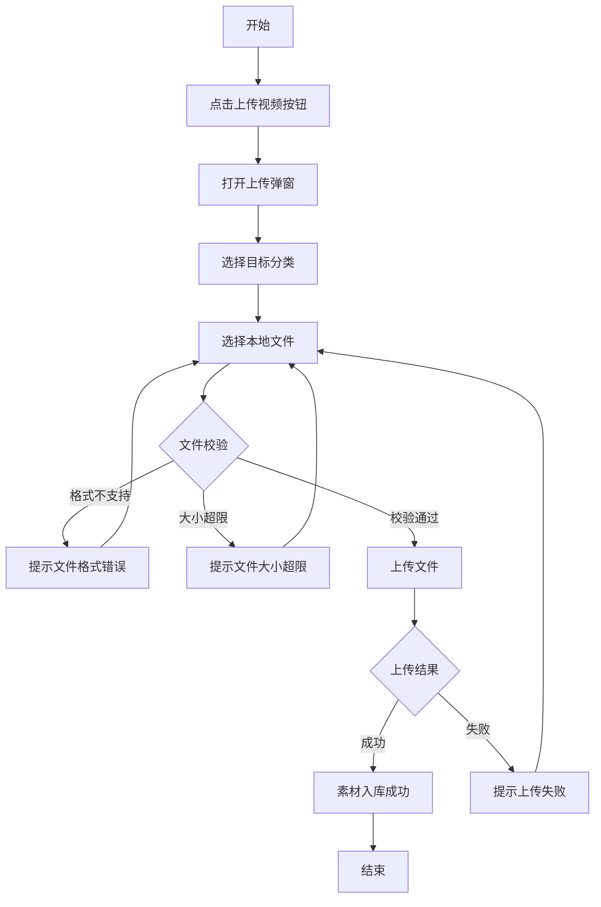
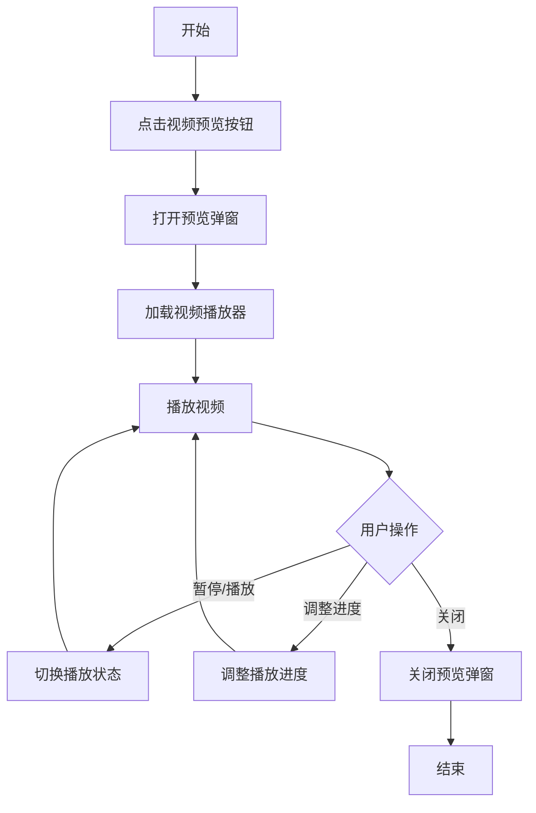
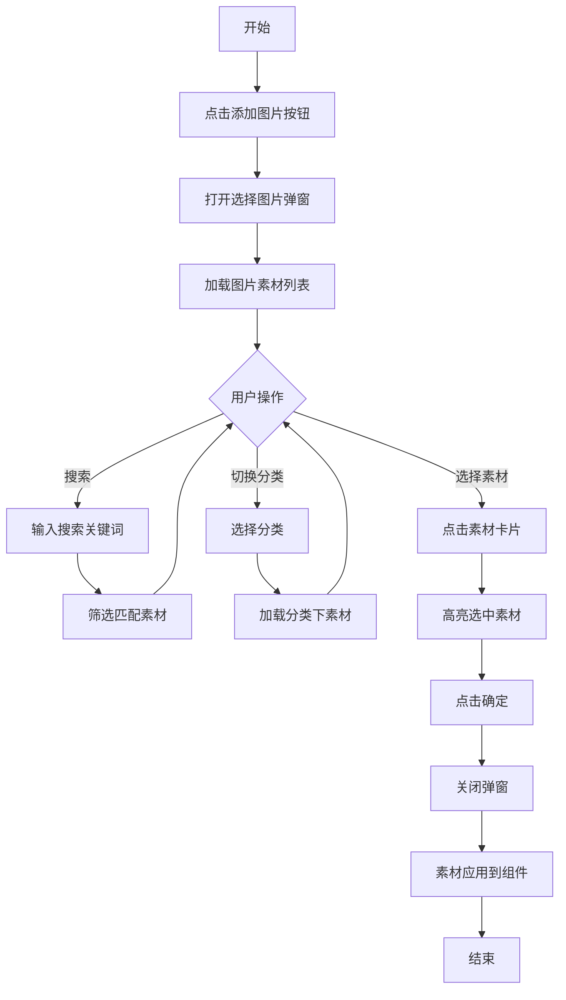
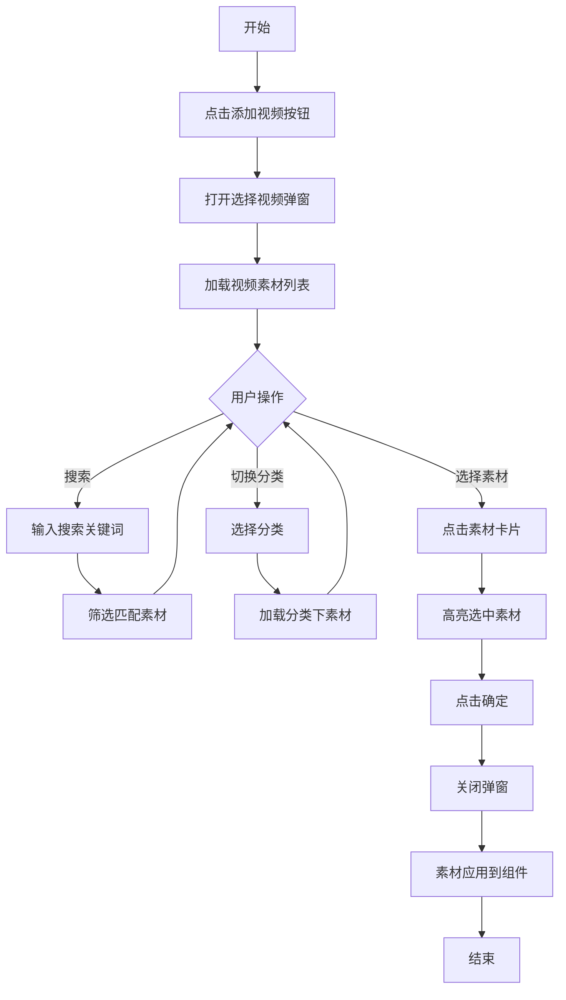

# 商城运营后台产品需求文档

---

# 1. 需求背景

---

# 2. 需求分析

## 2.1. 历史需求

## 2.2. 招标要求

## 2.3. 竞品分析

### 2.3.1. 驿宝通

### 2.3.2. 壹坊

### 2.3.3. 京东

### 2.3.4. 淘宝

---

# 3. 系统流程图

## 3.1. 总体功能蓝图流程图

## 3.2. 总体功能现状流程图

---

# 4. 详细需求

## 4.1. 商城运营后台系统

### 4.1.1. 素材库模块

#### 4.1.1.1. 图片库页面

##### 1. 功能概述

- **功能描述**：提供图片素材的集中管理能力，支持图片的上传、预览、删除、移动、复制等操作，以及分类管理和搜索筛选功能。
- **业务描述**：运营人员可在图片库中统一管理商品图片、营销素材等图片资源，为后续的商品发布、活动配置等业务场景提供素材支撑。
- **使用角色**：商城运营人员、品牌商家。
- **触发条件**：用户登录商城运营后台，点击素材库菜单下的"图片库"选项卡。

##### 2. 流程图

###### 2.1 上传图片流程

```mermaid
flowchart TD
    A[开始] --> B[点击上传图片按钮]
    B --> C[打开上传弹窗]
    C --> D[选择目标分类]
    D --> E[选择本地文件]
    E --> F{文件校验}
    F -->|格式不支持| G[提示文件格式错误]
    F -->|大小超限| H[提示文件大小超限]
    F -->|校验通过| I[上传文件]
    I --> J{上传结果}
    J -->|成功| K[素材入库成功]
    J -->|失败| L[提示上传失败]
    G --> E
    H --> E
    K --> M[结束]
    L --> E
```

###### 2.2 分类管理流程

##### 3. 页面原型

（待补充）

##### 4. 输入项说明

| 字段名称 | 字段标识 | 字段类型 | 必填 | 数据类型 | 长度限制 | 校验规则 | 取值范围 | 来源 | 提示文案 | 备注 |
|----------|----------|----------|------|----------|----------|----------|----------|------|----------|------|
| 分类名称 | category_name | 文本输入 | 是 | String | 1-20 | 不能为空，不能包含特殊字符 | - | 用户输入 | 请输入分类名称 | 分类名称在同级不可重复 |
| 素材名称 | material_name | 文本输入 | 是 | String | 1-100 | 不能为空，不能包含特殊字符 | - | 用户输入/系统生成 | 请输入素材名称 | 支持编辑修改 |
| 素材文件 | material_file | 文件上传 | 是 | File | - | 格式限制、大小限制 | 见业务规则 | 用户上传 | 请选择要上传的文件 | 支持批量上传 |
| 搜索关键词 | search_keyword | 文本输入 | 否 | String | 1-50 | - | - | 用户输入 | 搜索素材名称 | 支持模糊搜索 |

##### 5. 输出项说明

| 字段名称 | 字段标识 | 数据类型 | 数据来源 | 格式说明 |
|----------|----------|----------|----------|----------|
| 素材ID | material_id | String | 系统生成 | 唯一标识 |
| 素材名称 | material_name | String | 用户输入/系统生成 | 文本格式 |
| 素材URL | material_url | String | 文件服务返回 | 完整URL地址 |
| 缩略图URL | thumbnail_url | String | 文件服务返回 | 完整URL地址 |
| 文件大小 | file_size | Number | 系统计算 | 字节数，展示时转换为KB/MB |
| 图片尺寸 | dimensions | String | 系统计算 | 宽x高，如"800x600" |
| 所属分类 | category_id | String | 用户选择 | 分类ID |
| 创建时间 | created_at | String | 系统生成 | 格式：YYYY-MM-DD HH:mm:ss |
| 更新时间 | updated_at | String | 系统生成 | 格式：YYYY-MM-DD HH:mm:ss |

##### 6. 业务规则

| 规则编号 | 规则名称 | 适用场景 | 规则描述 | 错误提示 |
|----------|----------|----------|----------|----------|
| BR-IMG-001 | 图片格式限制 | 上传图片 | 支持JPG、JPEG、PNG、GIF格式 | 仅支持JPG、JPEG、PNG、GIF格式的图片 |
| BR-IMG-002 | 图片大小限制 | 上传图片 | 单张图片不超过10MB | 图片大小不能超过10MB |
| BR-IMG-003 | 分类层级限制 | 分类管理 | 仅支持二级分类层级，不可创建三级及以上分类 | 分类层级最多支持二级 |
| BR-IMG-004 | 默认分类不可删除 | 分类管理 | 系统默认分类不可删除 | 默认分类不可删除 |
| BR-IMG-005 | 分类下有素材时删除 | 分类管理 | 删除分类时，该分类下的素材自动移至默认分类 | - |
| BR-IMG-006 | 分类名称长度限制 | 分类管理 | 分类名称长度1-20个字符 | 分类名称长度为1-20个字符 |
| BR-IMG-007 | 批量上传数量限制 | 上传图片 | 单次批量上传不超过50张 | 单次最多上传50张图片 |
| BR-IMG-008 | 素材名称长度限制 | 编辑素材 | 素材名称长度1-100个字符 | 素材名称长度为1-100个字符 |

##### 7. 交互说明

###### 7.1 页面初始化
1. 用户进入素材库页面，默认显示图片库选项卡
2. 系统加载分类树，默认选中"默认分类"
3. 系统加载默认分类下的图片素材列表

###### 7.2 切换选项卡
1. 用户点击"图片库"或"视频库"选项卡
2. 系统切换显示对应类型的素材
3. 清空当前选中状态，重置分页

###### 7.3 分类操作
1. 用户点击分类树中的分类节点，右侧显示该分类下的素材
2. 用户点击"新建分类"按钮，弹出新建分类弹窗
3. 用户右键点击分类节点，显示编辑、删除操作菜单
4. 用户点击编辑，弹出编辑分类弹窗
5. 用户点击删除，弹出删除确认弹窗

###### 7.4 上传素材
1. 用户点击"上传图片"按钮，打开上传弹窗
2. 用户选择目标分类（默认为当前选中分类）
3. 用户点击上传区域或拖拽文件进行上传
4. 系统校验文件格式和大小
5. 校验通过后上传文件，显示上传进度
6. 上传成功后关闭弹窗，刷新素材列表

###### 7.5 素材操作
1. 用户点击素材卡片，选中该素材（支持多选）
2. 用户点击素材预览图标，打开预览弹窗
3. 用户点击复制链接图标，复制素材URL到剪贴板
4. 用户点击删除图标，弹出删除确认弹窗
5. 用户选中多个素材后，点击"移动"按钮，打开移动弹窗
6. 用户选中多个素材后，点击"删除"按钮，批量删除

###### 7.6 搜索筛选
1. 用户在搜索框输入关键词
2. 系统实时筛选当前分类下匹配的素材（按名称模糊匹配）

###### 7.7 分页操作
1. 用户点击分页器切换页码
2. 用户选择每页显示条数（10/20/50/100）
3. 系统刷新显示对应页的素材

##### 8. 数据流转说明

###### 数据来源

| 字段/数据 | 来源 | 获取方式 | 说明 |
|-----------|------|----------|------|
| 分类树数据 | 分类管理模块 | API查询 | 获取当前用户的图片分类树 |
| 素材列表数据 | 素材管理模块 | API查询 | 根据分类ID和类型查询素材 |
| 文件上传 | 文件服务 | API上传 | 上传文件至对象存储服务 |

###### 数据去向

| 数据 | 目标系统/模块 | 同步时机 | 说明 |
|------|---------------|----------|------|
| 图片素材URL | 页面装修模块 | 配置时选择 | 用于页面装修时选择图片 |
| 图片素材URL | 商品管理模块 | 编辑商品时选择 | 用于商品图片配置 |

##### 9. 错误提示文案

###### 表单校验提示

| 校验字段 | 校验场景 | 提示文案 |
|----------|----------|----------|
| 分类名称 | 为空 | 请输入分类名称 |
| 分类名称 | 超长 | 分类名称长度为1-20个字符 |
| 分类名称 | 重复 | 该分类名称已存在 |
| 素材名称 | 为空 | 请输入素材名称 |
| 素材名称 | 超长 | 素材名称长度为1-100个字符 |
| 素材文件 | 格式不支持 | 仅支持JPG、JPEG、PNG、GIF格式的图片 |
| 素材文件 | 大小超限 | 图片大小不能超过10MB |

###### 业务异常提示

| 异常场景 | 错误码 | 提示文案 |
|----------|--------|----------|
| 上传失败 | MAT001 | 上传失败，请重试 |
| 删除失败 | MAT002 | 删除失败，请重试 |
| 分类不存在 | CAT001 | 分类不存在或已被删除 |
| 无操作权限 | AUTH001 | 您没有权限执行此操作 |

##### 10. 数据权限设计

###### 角色数据范围

| 角色 | 数据范围 | 说明 |
|------|----------|------|
| 平台运营 | 全部数据 | 查看和管理所有租户的素材 |
| 商家运营 | 本租户数据 | 仅查看和管理本商家的素材 |

###### 功能权限点

| 权限标识 | 权限名称 |
|----------|----------|
| material:image:view | 查看图片库 |
| material:image:upload | 上传图片 |
| material:image:edit | 编辑图片信息 |
| material:image:delete | 删除图片 |
| material:category:add | 新增分类 |
| material:category:edit | 编辑分类 |
| material:category:delete | 删除分类 |

##### 11. 模块依赖关系

###### 依赖的其他模块

| 模块名称 | 依赖场景 | 依赖数据 | 是否强依赖 |
|----------|----------|----------|------------|
| 文件服务 | 上传图片 | 图片存储、URL生成 | 是 |
| 用户服务 | 权限校验 | 用户角色、权限信息 | 是 |

###### 被依赖场景

| 调用模块 | 调用场景 | 提供数据 |
|----------|----------|----------|
| 页面装修模块 | 选择图片素材 | 图片素材列表、素材URL |
| 商品管理模块 | 配置商品图片 | 图片素材列表、素材URL |

##### 12. 批量操作规则

| 操作名称 | 单次上限 | 前置条件 | 成功提示 |
|----------|----------|----------|----------|
| 批量上传 | 50张 | 文件格式、大小符合要求 | 成功上传{count}张图片 |
| 批量移动 | 50个 | 选中素材，选择目标分类 | 成功移动{count}个素材 |
| 批量删除 | 50个 | 选中素材 | 成功删除{count}个素材 |

##### 13. 操作日志要求

| 操作类型 | 记录内容 | 保留时长 |
|----------|----------|----------|
| 上传素材 | 操作人、时间、素材信息、分类 | 3年 |
| 删除素材 | 操作人、时间、素材信息 | 3年 |
| 移动素材 | 操作人、时间、素材信息、源分类、目标分类 | 3年 |
| 新增分类 | 操作人、时间、分类信息 | 3年 |
| 编辑分类 | 操作人、时间、修改前后内容 | 3年 |
| 删除分类 | 操作人、时间、分类信息 | 3年 |

#### 4.1.1.2. 视频库页面

##### 1. 功能概述

- **功能描述**：提供视频素材的集中管理能力，支持视频的上传、预览、删除、移动、复制等操作，以及分类管理和搜索筛选功能。
- **业务描述**：运营人员可在视频库中统一管理产品宣传视频、品牌故事视频等视频资源，为后续的商品发布、活动配置、页面装修等业务场景提供素材支撑。
- **使用角色**：商城运营人员、品牌商家。
- **触发条件**：用户登录商城运营后台，点击素材库菜单下的"视频库"选项卡。

##### 2. 流程图

###### 2.1 上传视频流程

###### 2.2 视频预览流程

##### 3. 页面原型

（待补充）

##### 4. 输入项说明

| 字段名称 | 字段标识 | 字段类型 | 必填 | 数据类型 | 长度限制 | 校验规则 | 取值范围 | 来源 | 提示文案 | 备注 |
|----------|----------|----------|------|----------|----------|----------|----------|------|----------|------|
| 分类名称 | category_name | 文本输入 | 是 | String | 1-20 | 不能为空，不能包含特殊字符 | - | 用户输入 | 请输入分类名称 | 分类名称在同级不可重复 |
| 素材名称 | material_name | 文本输入 | 是 | String | 1-100 | 不能为空，不能包含特殊字符 | - | 用户输入/系统生成 | 请输入素材名称 | 支持编辑修改 |
| 素材文件 | material_file | 文件上传 | 是 | File | - | 格式限制、大小限制 | 见业务规则 | 用户上传 | 请选择要上传的文件 | 支持批量上传 |
| 搜索关键词 | search_keyword | 文本输入 | 否 | String | 1-50 | - | - | 用户输入 | 搜索素材名称 | 支持模糊搜索 |

##### 5. 输出项说明

| 字段名称 | 字段标识 | 数据类型 | 数据来源 | 格式说明 |
|----------|----------|----------|----------|----------|
| 素材ID | material_id | String | 系统生成 | 唯一标识 |
| 素材名称 | material_name | String | 用户输入/系统生成 | 文本格式 |
| 素材URL | material_url | String | 文件服务返回 | 完整URL地址 |
| 缩略图URL | thumbnail_url | String | 文件服务返回/系统截取 | 完整URL地址 |
| 文件大小 | file_size | Number | 系统计算 | 字节数，展示时转换为MB |
| 所属分类 | category_id | String | 用户选择 | 分类ID |
| 创建时间 | created_at | String | 系统生成 | 格式：YYYY-MM-DD HH:mm:ss |
| 更新时间 | updated_at | String | 系统生成 | 格式：YYYY-MM-DD HH:mm:ss |

##### 6. 业务规则

| 规则编号 | 规则名称 | 适用场景 | 规则描述 | 错误提示 |
|----------|----------|----------|----------|----------|
| BR-VID-001 | 视频格式限制 | 上传视频 | 支持MP4格式 | 仅支持MP4格式的视频 |
| BR-VID-002 | 视频大小限制 | 上传视频 | 单个视频不超过100MB | 视频大小不能超过100MB |
| BR-VID-003 | 分类层级限制 | 分类管理 | 仅支持二级分类层级，不可创建三级及以上分类 | 分类层级最多支持二级 |
| BR-VID-004 | 分类名称长度限制 | 分类管理 | 分类名称长度1-20个字符 | 分类名称长度为1-20个字符 |
| BR-VID-005 | 批量上传数量限制 | 上传视频 | 单次批量上传不超过10个 | 单次最多上传10个视频 |
| BR-VID-006 | 素材名称长度限制 | 编辑素材 | 素材名称长度1-100个字符 | 素材名称长度为1-100个字符 |

##### 7. 交互说明

###### 7.1 页面初始化
1. 用户点击"视频库"选项卡
2. 系统加载视频分类树，默认选中第一个分类
3. 系统加载该分类下的视频素材列表

###### 7.2 上传视频
1. 用户点击"上传视频"按钮，打开上传弹窗
2. 用户选择目标分类（默认为当前选中分类）
3. 用户点击上传区域或拖拽文件进行上传
4. 系统校验文件格式和大小
5. 校验通过后上传文件，显示上传进度
6. 上传成功后关闭弹窗，刷新素材列表

###### 7.3 视频预览
1. 用户点击视频卡片上的预览图标
2. 系统打开预览弹窗，加载视频播放器
3. 用户可播放、暂停、调整进度
4. 用户点击关闭按钮关闭预览弹窗

###### 7.4 其他操作
- 分类管理、素材删除、素材移动、素材复制、搜索筛选等操作与图片库一致

##### 8. 数据流转说明

###### 数据来源

| 字段/数据 | 来源 | 获取方式 | 说明 |
|-----------|------|----------|------|
| 分类树数据 | 分类管理模块 | API查询 | 获取当前用户的视频分类树 |
| 素材列表数据 | 素材管理模块 | API查询 | 根据分类ID和类型查询素材 |
| 文件上传 | 文件服务 | API上传 | 上传文件至对象存储服务 |

###### 数据去向

| 数据 | 目标系统/模块 | 同步时机 | 说明 |
|------|---------------|----------|------|
| 视频素材URL | 页面装修模块 | 配置时选择 | 用于页面装修时选择视频 |
| 视频素材URL | 商品管理模块 | 编辑商品时选择 | 用于商品视频配置 |

##### 9. 错误提示文案

###### 表单校验提示

| 校验字段 | 校验场景 | 提示文案 |
|----------|----------|----------|
| 分类名称 | 为空 | 请输入分类名称 |
| 分类名称 | 超长 | 分类名称长度为1-20个字符 |
| 分类名称 | 重复 | 该分类名称已存在 |
| 素材名称 | 为空 | 请输入素材名称 |
| 素材名称 | 超长 | 素材名称长度为1-100个字符 |
| 素材文件 | 格式不支持 | 仅支持MP4格式的视频 |
| 素材文件 | 大小超限 | 视频大小不能超过100MB |

###### 业务异常提示

| 异常场景 | 错误码 | 提示文案 |
|----------|--------|----------|
| 上传失败 | MAT001 | 上传失败，请重试 |
| 删除失败 | MAT002 | 删除失败，请重试 |
| 分类不存在 | CAT001 | 分类不存在或已被删除 |
| 无操作权限 | AUTH001 | 您没有权限执行此操作 |

##### 10. 数据权限设计

###### 角色数据范围

| 角色 | 数据范围 | 说明 |
|------|----------|------|
| 平台运营 | 全部数据 | 查看和管理所有租户的素材 |
| 商家运营 | 本租户数据 | 仅查看和管理本商家的素材 |

###### 功能权限点

| 权限标识 | 权限名称 |
|----------|----------|
| material:video:view | 查看视频库 |
| material:video:upload | 上传视频 |
| material:video:edit | 编辑视频信息 |
| material:video:delete | 删除视频 |
| material:category:add | 新增分类 |
| material:category:edit | 编辑分类 |
| material:category:delete | 删除分类 |

##### 11. 模块依赖关系

###### 依赖的其他模块

| 模块名称 | 依赖场景 | 依赖数据 | 是否强依赖 |
|----------|----------|----------|------------|
| 文件服务 | 上传视频 | 视频存储、URL生成、缩略图截取 | 是 |
| 用户服务 | 权限校验 | 用户角色、权限信息 | 是 |

###### 被依赖场景

| 调用模块 | 调用场景 | 提供数据 |
|----------|----------|----------|
| 页面装修模块 | 选择视频素材 | 视频素材列表、素材URL |
| 商品管理模块 | 配置商品视频 | 视频素材列表、素材URL |

##### 12. 批量操作规则

| 操作名称 | 单次上限 | 前置条件 | 成功提示 |
|----------|----------|----------|----------|
| 批量上传 | 10个 | 文件格式、大小符合要求 | 成功上传{count}个视频 |
| 批量移动 | 50个 | 选中素材，选择目标分类 | 成功移动{count}个素材 |
| 批量删除 | 50个 | 选中素材 | 成功删除{count}个素材 |

##### 13. 操作日志要求

| 操作类型 | 记录内容 | 保留时长 |
|----------|----------|----------|
| 上传素材 | 操作人、时间、素材信息、分类 | 3年 |
| 删除素材 | 操作人、时间、素材信息 | 3年 |
| 移动素材 | 操作人、时间、素材信息、源分类、目标分类 | 3年 |
| 新增分类 | 操作人、时间、分类信息 | 3年 |
| 编辑分类 | 操作人、时间、修改前后内容 | 3年 |
| 删除分类 | 操作人、时间、分类信息 | 3年 |

### 4.1.2. 页面装修模块

#### 4.1.2.1. 配置面板页面

##### 1. 功能概述

- **功能描述**：在页面装修配置面板中，提供图片和视频素材的选择能力，支持从素材库中选择已有素材应用到页面组件中。
- **业务描述**：运营人员在配置图片广告等页面组件时，可通过配置面板的素材选择功能，从素材库中选取合适的图片或视频素材，快速完成页面装修配置。
- **使用角色**：商城运营人员、品牌商家。
- **触发条件**：用户在页面装修界面，点击组件配置面板中的"添加图片"或"添加视频"按钮。

##### 2. 流程图

###### 2.1 选择图片素材流程

###### 2.2 选择视频素材流程

##### 3. 页面原型

（待补充）

##### 4. 输入项说明

| 字段名称 | 字段标识 | 字段类型 | 必填 | 数据类型 | 长度限制 | 校验规则 | 取值范围 | 来源 | 提示文案 | 备注 |
|----------|----------|----------|------|----------|----------|----------|----------|------|----------|------|
| 搜索关键词 | search_keyword | 文本输入 | 否 | String | 1-50 | - | - | 用户输入 | 搜索素材名称 | 支持模糊搜索 |
| 素材分类 | category_id | 下拉选择 | 否 | String | - | - | 分类列表 | 用户选择 | 选择分类 | 可选，默认全部分类 |
| 素材ID | material_id | 单选 | 是 | String | - | 必须选择 | 素材列表 | 用户选择 | 请选择素材 | 单选 |

##### 5. 输出项说明

| 字段名称 | 字段标识 | 数据类型 | 数据来源 | 格式说明 |
|----------|----------|----------|----------|----------|
| 素材ID | material_id | String | 用户选择 | 唯一标识 |
| 素材名称 | material_name | String | 素材库数据 | 文本格式 |
| 素材URL | material_url | String | 素材库数据 | 完整URL地址 |
| 缩略图URL | thumbnail_url | String | 素材库数据 | 完整URL地址 |

##### 6. 业务规则

| 规则编号 | 规则名称 | 适用场景 | 规则描述 | 错误提示 |
|----------|----------|----------|----------|----------|
| BR-SELECT-001 | 单选限制 | 选择素材 | 每次仅能选择一个素材 | 每次只能选择一个素材 |
| BR-SELECT-002 | 必选校验 | 确认选择 | 必须选择素材后才能确认 | 请选择要添加的素材 |

##### 7. 交互说明

###### 7.1 打开选择弹窗
1. 用户在配置面板点击"添加图片"或"添加视频"按钮
2. 系统打开对应的素材选择弹窗
3. 系统加载素材列表和分类选项

###### 7.2 搜索筛选
1. 用户在搜索框输入关键词，系统实时筛选匹配的素材
2. 用户选择分类下拉框，系统加载该分类下的素材

###### 7.3 选择素材
1. 用户点击素材卡片，高亮显示选中状态
2. 用户点击其他素材，切换选中状态（单选）
3. 用户点击"确定"按钮，确认选择
4. 用户点击"取消"按钮，取消选择

###### 7.4 确认选择
1. 用户点击"确定"按钮
2. 系统校验是否已选择素材
3. 校验通过后关闭弹窗，将素材应用到组件配置中

##### 8. 数据流转说明

###### 数据来源

| 字段/数据 | 来源 | 获取方式 | 说明 |
|-----------|------|----------|------|
| 图片素材列表 | 素材库模块 | API查询 | 获取图片库素材 |
| 视频素材列表 | 素材库模块 | API查询 | 获取视频库素材 |
| 分类选项 | 素材库模块 | API查询 | 获取分类列表 |

###### 数据去向

| 数据 | 目标系统/模块 | 同步时机 | 说明 |
|------|---------------|----------|------|
| 素材URL | 页面组件 | 确认选择后 | 应用到组件配置 |

##### 9. 错误提示文案

###### 表单校验提示

| 校验字段 | 校验场景 | 提示文案 |
|----------|----------|----------|
| 素材选择 | 未选择 | 请选择要添加的素材 |

###### 业务异常提示

| 异常场景 | 错误码 | 提示文案 |
|----------|--------|----------|
| 素材不存在 | MAT003 | 素材不存在或已被删除 |
| 无访问权限 | AUTH002 | 您没有权限访问此素材 |

##### 10. 数据权限设计

###### 角色数据范围

| 角色 | 数据范围 | 说明 |
|------|----------|------|
| 平台运营 | 全部数据 | 可选择所有租户的素材 |
| 商家运营 | 本租户数据 | 仅可选择本商家的素材 |

###### 功能权限点

| 权限标识 | 权限名称 |
|----------|----------|
| decoration:config:image | 配置图片素材 |
| decoration:config:video | 配置视频素材 |

##### 11. 模块依赖关系

###### 依赖的其他模块

| 模块名称 | 依赖场景 | 依赖数据 | 是否强依赖 |
|----------|----------|----------|------------|
| 素材库模块 | 选择素材 | 素材列表、素材URL | 是 |

###### 被依赖场景

| 调用模块 | 调用场景 | 提供数据 |
|----------|----------|----------|
| 页面组件 | 组件配置 | 选中的素材信息 |

---

# 5. 非功能需求

## 5.1. 性能需求

| 指标名称 | 指标要求 |
|----------|----------|
| 页面加载时间 | 首屏加载 ≤ 3秒 |
| 操作响应时间 | 普通操作 ≤ 500ms |
| 文件上传速度 | 图片上传进度实时显示 |
| 列表加载时间 | 素材列表加载 ≤ 1秒 |

## 5.2. 兼容性需求

| 类型 | 要求 |
|------|------|
| 浏览器 | Chrome 80+、Firefox 75+、Safari 13+、Edge 80+ |
| 分辨率 | 最低支持1366×768，推荐1920×1080 |

## 5.3. 安全需求

| 安全项 | 要求 |
|--------|------|
| 文件上传 | 校验文件类型和大小，防止恶意文件上传 |
| 权限控制 | 基于角色的访问控制，数据隔离 |
| 数据隔离 | 租户数据相互隔离，不可跨租户访问 |

---

# 6. 附录

## 6.1. 术语表

| 术语 | 说明 |
|------|------|
| 素材库 | 集中管理图片、视频等素材资源的模块 |
| 图片库 | 管理图片素材的功能模块 |
| 视频库 | 管理视频素材的功能模块 |
| 分类管理 | 对素材进行分类组织的管理功能 |
| 页面装修 | 对商城页面进行可视化配置的功能 |

## 6.2. 相关文档

| 文档名称 | 文档路径 |
|----------|----------|
| 功能大纲 | docs/功能大纲.md |
| 需求文档规范 | docs/需求文档规范.md |

---

# 7. 版本记录

| 版本号 | 修改日期 | 修改人 | 修改内容 |
|--------|----------|--------|----------|
| V1.0 | 2026-03-20 | 产品经理 | 初稿创建 |