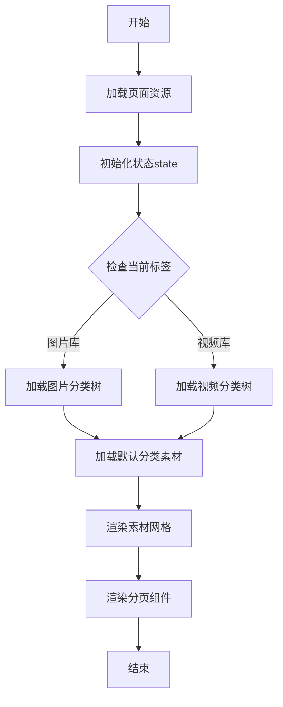
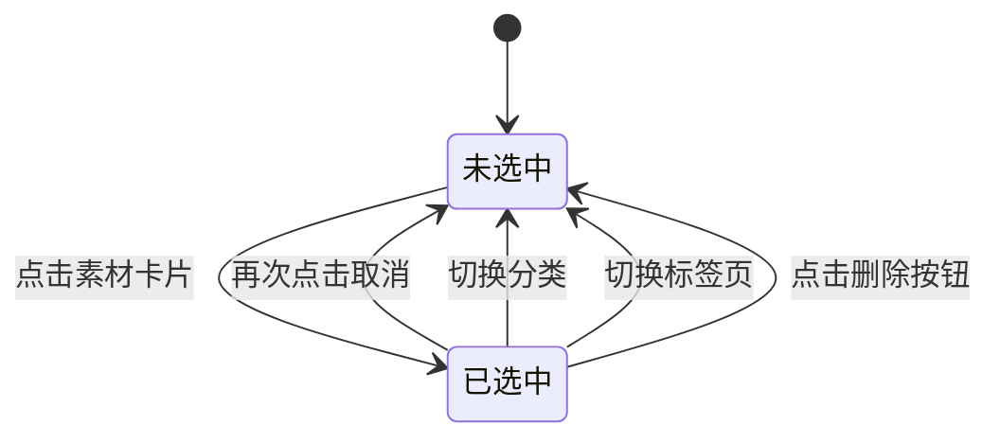
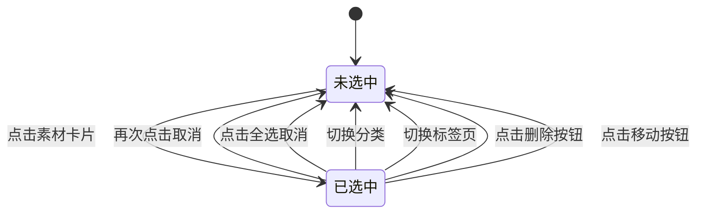

# 素材库产品需求文档

# 1. 需求背景

---

# 2. 需求分析

---

# 3. 系统流程图

---

# 4. 详细需求

## 4.1. 商城运营后台系统

### 4.1.1. 素材库模块

#### 4.1.1.1. 素材库主界面

##### 1. 功能概述

- **功能描述**：素材库提供图片和视频素材的统一管理能力，支持分类管理、素材上传、预览、搜索、删除、移动等功能，为商城运营提供素材资源池。
- **业务描述**：运营人员在配置商城页面时需要使用图片和视频素材，素材库提供统一的素材管理入口，支持按分类组织素材，方便素材的复用和管理。
- **使用角色**：运营人员、商城管理员。
- **触发条件**：从运营工作台导航菜单点击"素材库"进入。

##### 2. 界面设计

###### 2.1 页面原型

（待补充）

###### 2.2 输出项说明

| 字段名称 | 字段标识 | 数据类型 | 数据来源 | 格式说明 |
|----------|----------|----------|----------|----------|
| 分类名称 | category_name | string | 用户输入 | 文本，最多20字符 |
| 分类ID | category_id | string | 系统生成 | UUID格式 |
| 分类层级 | category_level | number | 系统生成 | 1-3 |
| 素材名称 | material_name | string | 系统生成 | 原始文件名 |
| 素材ID | material_id | string | 系统生成 | UUID格式 |
| 素材类型 | material_type | string | 系统识别 | image/video |
| 素材URL | material_url | string | 系统生成 | HTTPS URL |
| 文件大小 | file_size | number | 系统获取 | 字节数 |
| 图片尺寸 | dimensions | object | 系统获取 | {width, height} |
| 创建时间 | created_at | string | 系统生成 | ISO 8601格式 |

##### 3. 业务逻辑

###### 3.1 流程图

**素材库初始化流程**



###### 3.2 业务规则

| 规则编号 | 规则名称 | 适用场景 | 规则描述 | 错误提示 |
|----------|----------|----------|----------|----------|
| RULE-PAGE-001 | 类型隔离规则 | 素材展示 | 图片库和视频库分类独立管理，切换标签时重新加载分类树 | - |
| RULE-PAGE-002 | 分页默认值 | 分页设置 | 默认每页10条，可选10/20/50条 | - |
| RULE-PAGE-003 | 搜索范围 | 搜索操作 | 按素材名称模糊匹配，不区分大小写 | - |

###### 3.3 状态机设计

**素材选中状态**

| 状态编码 | 状态名称 | 状态描述 |
|----------|----------|----------|
| unselected | 未选中 | 素材未被选中，显示正常卡片样式 |
| selected | 已选中 | 素材已被选中，显示选中框和勾选图标 |

**状态流转规则**



**状态对应UI差异**

| 状态 | UI表现 |
|------|--------|
| 未选中 | 卡片正常显示，无选中框 |
| 已选中 | 卡片显示蓝色选中框，右上角显示勾选图标，背景色变化 |

##### 4. 交互设计

###### 4.1 输入项说明

| 字段名称 | 字段标识 | 字段类型 | 必填 | 数据类型 | 长度限制 | 校验规则 | 取值范围 | 来源 | 提示文案 | 备注 |
|----------|----------|----------|------|----------|----------|----------|----------|------|----------|------|
| 标签选择 | active_tab | Tab点击 | 否 | string | - | - | image/video | 用户点击 | - | 默认图片库 |
| 分类选择 | selected_category_id | 树节点点击 | 否 | string | - | - | 分类ID | 用户点击 | - | 默认当前分类 |
| 搜索关键词 | search_keyword | 文本输入 | 否 | string | 50 | - | - | 用户输入 | 请输入素材名称 | 支持模糊匹配 |
| 每页条数 | page_size | 下拉选择 | 否 | number | - | - | 10/20/50 | 用户选择 | - | 默认10条 |

###### 4.2 交互说明

**界面布局**

1. **头部区域**：固定高度64px，包含Logo、标题、用户信息
2. **主体区域**：Flex横向布局，左侧分类面板（220px）+ 右侧素材面板（弹性宽度）
3. **分类面板**：树形结构展示分类，支持展开/折叠
4. **操作栏**：上传、搜索、移动、删除按钮组
5. **素材网格**：Grid布局展示素材卡片，每行5个
6. **分页区**：页码跳转和每页条数选择

**操作流程**

1. 点击顶部Tab切换图片库/视频库
2. 点击左侧分类树选择目标分类
3. 在搜索框输入关键词搜索素材
4. 点击素材卡片选中/取消选中
5. 点击全选复选框选中当前筛选结果

###### 4.3 错误提示文案

**表单校验提示**

| 校验字段 | 校验场景 | 提示文案 |
|----------|----------|----------|
| 搜索关键词 | 超过50字符 | 搜索关键词不能超过50个字符 |

**业务异常提示**

| 异常场景 | 错误码 | 提示文案 |
|----------|--------|----------|
| 分类加载失败 | ERROR-CAT-001 | 分类加载失败，请刷新重试 |
| 素材加载失败 | ERROR-MAT-001 | 素材加载失败，请刷新重试 |

##### 5. 数据设计

###### 5.1 数据流转说明

| 字段/数据 | 来源 | 获取方式 | 说明 |
|-----------|------|----------|------|
| 分类数据 | 本地存储/localStorage | getCategories() | 图片库和视频库分类独立存储 |
| 素材数据 | 本地存储/localStorage | getMaterials() | 根据当前标签和分类筛选 |
| 选中状态 | 内存state | selectedMaterialIds | 页面刷新后重置 |

###### 5.2 数据权限设计

**角色数据范围**

| 角色 | 数据范围 | 说明 |
|------|----------|----------|
| 运营人员 | 所有素材 | 上传、编辑、删除、移动素材 |
| 商城管理员 | 所有素材 | 完全权限 |

**功能权限点**

| 权限标识 | 权限名称 |
|----------|----------|
| material:view | 查看素材 |
| material:upload | 上传素材 |
| material:delete | 删除素材 |
| material:move | 移动素材 |
| category:manage | 管理分类 |

##### 6. 扩展功能

###### 6.1 批量操作规则

| 操作名称 | 单次上限 | 前置条件 | 成功提示 |
|----------|----------|----------|----------|
| 批量删除 | 50个 | 至少选中1个素材 | 已删除{n}个素材 |
| 批量移动 | 50个 | 至少选中1个素材 | 已移动{n}个素材 |

###### 6.2 操作日志要求

| 操作类型 | 记录内容 | 保留时长 |
|----------|----------|----------|
| 上传素材 | 操作人、时间、文件名、大小、分类 | 3年 |
| 删除素材 | 操作人、时间、素材ID、素材名 | 3年 |
| 移动素材 | 操作人、时间、素材ID、源分类、目标分类 | 3年 |

---

#### 4.1.1.2. 图片库-分类管理

##### 1. 功能概述

- **功能描述**：提供图片库分类的树形结构管理，支持新增、编辑、删除分类，最多支持3级分类层级。
- **业务描述**：运营人员通过分类组织图片素材，便于素材的归类管理和快速查找。
- **使用角色**：运营人员、商城管理员。
- **触发条件**：在素材库页面点击左侧分类面板的操作按钮。

##### 2. 界面设计

###### 2.1 页面原型

（待补充）

###### 2.2 输出项说明

| 字段名称 | 字段标识 | 数据类型 | 数据来源 | 格式说明 |
|----------|----------|----------|----------|----------|
| 分类名称 | category_name | string | 用户输入 | 文本，最多20字符 |
| 分类ID | category_id | string | 系统生成 | UUID格式 |
| 父级ID | parent_id | string | 系统关联 | 父分类ID或null |
| 分类层级 | category_level | number | 系统计算 | 1/2/3 |
| 是否默认分类 | is_default | boolean | 系统标识 | true/false |
| 创建时间 | created_at | string | 系统生成 | ISO 8601格式 |

##### 3. 业务逻辑

###### 3.1 流程图

**新增分类流程**

```mermaid
flowchart TD
    A[开始] --> B[点击新增分类按钮]
    B --> C[打开新增分类弹窗]
    C --> D[输入分类名称]
    D --> E{名称长度校验}
    E -->|超过20字符| F[提示"分类名称不能超过20个字符"]
    F --> D
    E -->|通过| G{是否已存在同名分类}
    G -->|是| H[提示"分类名称已存在"]
    H --> D
    G -->|否| I[生成分类ID]
    I --> J[保存分类数据]
    J --> K[刷新分类树]
    K --> L[关闭弹窗]
    L --> M[结束]
```

**新增子分类流程**

```mermaid
flowchart TD
    A[开始] --> B[点击分类节点的添加子分类按钮]
    B --> C[打开新增子分类弹窗]
    C --> D[显示上级分类名称禁用]
    D --> E{层级校验}
    E -->|父级层级>=3| F[提示"已达到最大分类层级"]
    F --> G[关闭弹窗]
    G --> H[结束]
    E -->|通过| I[输入分类名称]
    I --> J{名称长度校验}
    J -->|超过20字符| K[提示"分类名称不能超过20个字符"]
    K --> I
    J -->|通过| L[生成分类ID]
    L --> M[设置父级关联]
    M --> N[保存分类数据]
    N --> O[刷新分类树]
    O --> P[关闭弹窗]
    P --> H
```

**删除分类流程**

```mermaid
flowchart TD
    A[开始] --> B[点击删除分类按钮]
    B --> C{是否默认分类}
    C -->|是| D[提示"默认分类不能删除"]
    D --> E[结束]
    C -->|否| F[打开删除确认弹窗]
    F --> G{用户确认}
    G -->|取消| E
    G -->|确认| H[删除子分类]
    H --> I[移动素材到默认分类]
    I --> J[删除当前分类]
    J --> K[刷新分类树]
    K --> L[提示"删除成功"]
    L --> E
```

###### 3.2 业务规则

| 规则编号 | 规则名称 | 适用场景 | 规则描述 | 错误提示 |
|----------|----------|----------|----------|----------|
| RULE-CAT-001 | 分类层级限制 | 新增子分类 | 最多支持3级分类，父级层级<3时才可添加子分类 | 已达到最大分类层级 |
| RULE-CAT-002 | 分类名称长度 | 新增/编辑分类 | 分类名称不超过20个字符 | 分类名称不能超过20个字符 |
| RULE-CAT-003 | 默认分类保护 | 删除分类 | 默认分类（isDefault=true）不可删除 | 默认分类不能删除 |
| RULE-CAT-004 | 删除级联规则 | 删除分类 | 删除分类时，子分类一并删除，分类下素材移至默认分类 | - |
| RULE-CAT-005 | 分类名称唯一性 | 新增分类 | 同一层级下分类名称不可重复 | 分类名称已存在 |

##### 4. 交互设计

###### 4.1 输入项说明

| 字段名称 | 字段标识 | 字段类型 | 必填 | 数据类型 | 长度限制 | 校验规则 | 取值范围 | 来源 | 提示文案 | 备注 |
|----------|----------|----------|------|----------|----------|----------|----------|------|----------|------|
| 分类名称 | category_name | 文本输入 | 是 | string | 1-20 | 非空、长度限制 | - | 用户输入 | 请输入分类名称 | - |
| 上级分类 | parent_category | 文本展示 | 否 | string | - | - | - | 系统获取 | - | 新增子分类时显示 |

###### 4.2 交互说明

**分类树操作**

1. 点击分类节点：选中分类，加载该分类下素材列表
2. 点击"+"图标：打开新增子分类弹窗
3. 点击"编辑"图标：打开编辑分类弹窗，预填当前名称
4. 点击"删除"图标：打开删除确认弹窗

**弹窗交互**

| 弹窗名称 | 触发条件 | 操作按钮 | 关闭方式 |
|----------|----------|----------|----------|
| 新增分类 | 点击顶部"新增分类"按钮 | 确认、取消 | 点击取消、点击遮罩 |
| 新增子分类 | 点击分类节点"+"图标 | 确认、取消 | 点击取消、点击遮罩 |
| 编辑分类 | 点击分类节点"编辑"图标 | 确认、取消 | 点击取消、点击遮罩 |
| 删除确认 | 点击分类节点"删除"图标 | 确认、取消 | 点击取消、点击遮罩 |

###### 4.3 错误提示文案

**表单校验提示**

| 校验字段 | 校验场景 | 提示文案 |
|----------|----------|----------|
| 分类名称 | 为空 | 请输入分类名称 |
| 分类名称 | 超过20字符 | 分类名称不能超过20个字符 |
| 分类名称 | 重复 | 分类名称已存在 |

**业务异常提示**

| 异常场景 | 错误码 | 提示文案 |
|----------|--------|----------|
| 层级超限 | ERROR-CAT-002 | 已达到最大分类层级 |
| 删除默认分类 | ERROR-CAT-003 | 默认分类不能删除 |
| 保存失败 | ERROR-CAT-004 | 分类保存失败，请重试 |

##### 5. 数据设计

###### 5.1 数据流转说明

| 字段/数据 | 来源 | 获取方式 | 说明 |
|-----------|------|----------|------|
| 分类数据 | localStorage | getCategories() | 页面加载时读取，操作后更新 |
| 默认分类ID | 系统配置 | DEFAULT_CATEGORY_ID | 常量'default' |

###### 5.2 数据权限设计

**功能权限点**

| 权限标识 | 权限名称 |
|----------|----------|
| category:create | 新增分类 |
| category:edit | 编辑分类 |
| category:delete | 删除分类 |

---

#### 4.1.1.3. 图片库-素材管理

##### 1. 功能概述

- **功能描述**：提供图片素材的上传、预览、搜索、删除、移动等管理功能，支持单选/多选素材进行批量操作。
- **业务描述**：运营人员通过素材管理功能维护商城所需的图片资源，支持按分类组织和快速检索。
- **使用角色**：运营人员、商城管理员。
- **触发条件**：在素材库页面选择图片库标签后进行相关操作。

##### 2. 界面设计

###### 2.1 页面原型

（待补充）

###### 2.2 输出项说明

| 字段名称 | 字段标识 | 数据类型 | 数据来源 | 格式说明 |
|----------|----------|----------|----------|----------|
| 素材ID | material_id | string | 系统生成 | UUID格式，mat-img-{序号} |
| 素材名称 | material_name | string | 系统获取 | 原始文件名 |
| 文件大小 | file_size | number | 系统获取 | 字节数，显示时转换为KB/MB |
| 图片尺寸 | dimensions | object | 系统获取 | {width: 800, height: 600} |
| 素材URL | material_url | string | 系统生成 | HTTPS URL |
| 缩略图URL | thumbnail_url | string | 系统生成 | 压缩后的预览图URL |
| 所属分类ID | category_id | string | 用户选择 | 分类ID |
| 创建时间 | created_at | string | 系统生成 | ISO 8601格式 |

##### 3. 业务逻辑

###### 3.1 流程图

**上传图片流程**

```mermaid
flowchart TD
    A[开始] --> B[点击上传图片按钮]
    B --> C[打开上传弹窗]
    C --> D[选择目标分类]
    D --> E[选择或拖拽文件]
    E --> F{文件格式校验}
    F -->|不通过| G[提示"只能上传JPG、PNG、GIF、WEBP格式的文件"]
    G --> E
    F -->|通过| H{文件大小校验}
    H -->|超过3MB| I[提示"文件大小不能超过3MB"]
    I --> E
    H -->|通过| J[添加到待上传列表]
    J --> K{是否继续添加}
    K -->|是| E
    K -->|否| L[点击上传按钮]
    L --> M[生成素材ID]
    M --> N[创建本地预览URL]
    N --> O[保存素材信息]
    O --> P[刷新素材列表]
    P --> Q[关闭弹窗]
    Q --> R[结束]
```

**删除素材流程**

```mermaid
flowchart TD
    A[开始] --> B{删除类型}
    B -->|单个删除| C[点击素材删除按钮]
    B -->|批量删除| D[点击顶部删除按钮]
    C --> E[打开删除确认弹窗]
    D --> E
    E --> F{用户确认}
    F -->|取消| G[关闭弹窗]
    G --> H[结束]
    F -->|确认| I[从数据中移除素材]
    I --> J[从选中列表移除]
    J --> K[刷新素材列表]
    K --> L[提示"删除成功"]
    L --> H
```

**移动素材流程**

```mermaid
flowchart TD
    A[开始] --> B[点击移动按钮]
    B --> C{是否有选中素材}
    C -->|否| D[按钮禁用状态]
    D --> E[结束]
    C -->|是| F[打开移动弹窗]
    F --> G[加载分类树]
    G --> H[选择目标分类]
    H --> I{用户确认}
    I -->|取消| J[关闭弹窗]
    J --> E
    I -->|确认| K[更新素材分类ID]
    K --> L[清空选中状态]
    L --> M[刷新素材列表]
    M --> N[提示"移动成功"]
    N --> J
```

###### 3.2 业务规则

| 规则编号 | 规则名称 | 适用场景 | 规则描述 | 错误提示 |
|----------|----------|----------|----------|----------|
| RULE-IMG-001 | 图片格式限制 | 上传图片 | 仅支持JPG、JPEG、PNG、GIF、WEBP格式 | 只能上传JPG、PNG、GIF、WEBP格式的文件 |
| RULE-IMG-002 | 图片大小限制 | 上传图片 | 单文件大小不超过3MB | 文件大小不能超过3MB |
| RULE-SEL-001 | 全选范围规则 | 全选操作 | 仅全选当前筛选结果，不是全部分类 | - |
| RULE-SEL-002 | 按钮禁用规则 | 操作控制 | selectedMaterialIds为空时，移动/删除按钮禁用 | - |
| RULE-SEL-003 | 切换重置规则 | 标签/分类切换 | 切换标签页或分类时，清空选中状态和搜索关键词 | - |

###### 3.3 状态机设计

**素材选中状态**

| 状态编码 | 状态名称 | 状态描述 |
|----------|----------|----------|
| unselected | 未选中 | 素材卡片正常显示，无选中框 |
| selected | 已选中 | 素材卡片显示选中框和勾选图标 |

**状态流转规则**



**状态对应UI差异**

| 状态 | UI表现 |
|------|--------|
| 未选中 | 卡片正常显示，无选中框 |
| 已选中 | 卡片显示蓝色选中框，右上角显示勾选图标，背景色变为#E3F2FD |

##### 4. 交互设计

###### 4.1 输入项说明

| 字段名称 | 字段标识 | 字段类型 | 必填 | 数据类型 | 长度限制 | 校验规则 | 取值范围 | 来源 | 提示文案 | 备注 |
|----------|----------|----------|------|----------|----------|----------|----------|------|----------|------|
| 目标分类 | target_category_id | 树选择 | 是 | string | - | 非空 | 分类ID | 用户选择 | 请选择目标分类 | 上传/移动时使用 |
| 文件选择 | file | 文件选择 | 是 | File | 3MB | 格式、大小限制 | JPG/PNG/GIF/WEBP | 用户选择 | - | 支持多选 |
| 搜索关键词 | search_keyword | 文本输入 | 否 | string | 50 | - | - | 用户输入 | 请输入素材名称 | 模糊匹配 |

###### 4.2 交互说明

**上传操作流程**

1. 点击"上传图片"按钮，打开上传弹窗
2. 在弹窗中选择目标分类（默认当前分类）
3. 点击或拖拽文件到上传区域
4. 系统自动校验文件格式和大小
5. 校验通过的文件显示在待上传列表
6. 点击"上传"按钮完成上传
7. 自动刷新素材列表，显示新上传的素材

**选择操作流程**

1. 点击素材卡片：切换选中/取消选中状态
2. 点击全选复选框：选中当前筛选结果所有素材
3. 取消全选：清空所有选中状态

**预览操作流程**

1. 点击素材卡片的预览图标：打开预览弹窗
2. 弹窗显示图片大图、文件名、大小、尺寸信息
3. 点击复制链接图标：复制素材URL到剪贴板

###### 4.3 错误提示文案

**表单校验提示**

| 校验字段 | 校验场景 | 提示文案 |
|----------|----------|----------|
| 目标分类 | 未选择 | 请选择目标分类 |
| 文件格式 | 不支持 | 只能上传JPG、PNG、GIF、WEBP格式的文件 |
| 文件大小 | 超限 | 文件大小不能超过3MB |
| 搜索关键词 | 超长 | 搜索关键词不能超过50个字符 |

**业务异常提示**

| 异常场景 | 错误码 | 提示文案 |
|----------|--------|----------|
| 上传失败 | ERROR-IMG-001 | 上传失败，请重试 |
| 删除失败 | ERROR-IMG-002 | 删除失败，请重试 |
| 移动失败 | ERROR-IMG-003 | 移动失败，请重试 |
| 复制链接失败 | ERROR-IMG-004 | 复制失败，请手动复制 |

##### 5. 数据设计

###### 5.1 数据流转说明

| 字段/数据 | 来源 | 获取方式 | 说明 |
|-----------|------|----------|------|
| 图片文件 | 用户上传 | File对象 | 通过input[type=file]获取 |
| 预览URL | 浏览器API | URL.createObjectURL() | 本地预览，无需上传服务器 |
| 素材数据 | localStorage | getMaterials() | 根据分类和标签筛选 |

**数据存储结构**

```javascript
// 图片素材数据结构
{
  id: 'mat-img-001',
  name: '商品图片_001.jpg',
  type: 'image',
  url: 'https://example.com/images/xxx.jpg',
  size: 123456,        // 字节数
  dimensions: {
    width: 800,
    height: 600
  },
  categoryId: 'cat-1',
  createdAt: '2026-04-04T10:00:00Z'
}
```

###### 5.2 数据权限设计

**功能权限点**

| 权限标识 | 权限名称 |
|----------|----------|
| material:upload | 上传素材 |
| material:delete | 删除素材 |
| material:move | 移动素材 |
| material:copy | 复制链接 |

##### 6. 扩展功能

###### 6.1 批量操作规则

| 操作名称 | 单次上限 | 前置条件 | 成功提示 |
|----------|----------|----------|----------|
| 批量上传 | 20个文件 | 选择文件 | 已上传{n}个素材 |
| 批量删除 | 50个 | 至少选中1个素材 | 已删除{n}个素材 |
| 批量移动 | 50个 | 至少选中1个素材 | 已移动{n}个素材到"{分类名}" |

###### 6.2 操作日志要求

| 操作类型 | 记录内容 | 保留时长 |
|----------|----------|----------|
| 上传素材 | 操作人、时间、文件名、大小、分类 | 3年 |
| 删除素材 | 操作人、时间、素材ID、素材名 | 3年 |
| 移动素材 | 操作人、时间、素材ID列表、源分类、目标分类 | 3年 |

---

#### 4.1.1.4. 视频库-分类管理

##### 1. 功能概述

- **功能描述**：提供视频库分类的树形结构管理，功能与图片库分类管理一致，但分类数据独立存储。
- **业务描述**：视频库分类与图片库分类相互独立，运营人员可为视频素材创建独立的分类体系。
- **使用角色**：运营人员、商城管理员。
- **触发条件**：在素材库页面切换到视频库标签后，点击左侧分类面板的操作按钮。

##### 2. 界面设计

###### 2.1 页面原型

（待补充）

###### 2.2 输出项说明

| 字段名称 | 字段标识 | 数据类型 | 数据来源 | 格式说明 |
|----------|----------|----------|----------|----------|
| 分类名称 | category_name | string | 用户输入 | 文本，最多20字符 |
| 分类ID | category_id | string | 系统生成 | UUID格式 |
| 父级ID | parent_id | string | 系统关联 | 父分类ID或null |
| 分类层级 | category_level | number | 系统计算 | 1/2/3 |
| 是否视频默认分类 | is_video_default | boolean | 系统标识 | true/false |

##### 3. 业务逻辑

###### 3.1 流程图

分类管理流程与图片库一致，参见 [4.1.1.2 图片库-分类管理](#4112-图片库-分类管理)。

###### 3.2 业务规则

与图片库分类管理规则一致：RULE-CAT-001至RULE-CAT-005。

##### 4. 交互设计

与图片库分类管理交互一致。

##### 5. 数据设计

###### 5.1 数据流转说明

视频库分类独立存储，通过 `isVideoDefault` 标识区分视频默认分类。

---

#### 4.1.1.5. 视频库-素材管理

##### 1. 功能概述

- **功能描述**：提供视频素材的上传、预览、搜索、删除、移动等管理功能，支持视频播放预览。
- **业务描述**：运营人员维护商城所需的视频资源，视频素材有独立的格式和大小限制。
- **使用角色**：运营人员、商城管理员。
- **触发条件**：在素材库页面选择视频库标签后进行相关操作。

##### 2. 界面设计

###### 2.1 页面原型

（待补充）

###### 2.2 输出项说明

| 字段名称 | 字段标识 | 数据类型 | 数据来源 | 格式说明 |
|----------|----------|----------|----------|----------|
| 素材ID | material_id | string | 系统生成 | UUID格式，mat-vid-{序号} |
| 素材名称 | material_name | string | 系统获取 | 原始文件名 |
| 文件大小 | file_size | number | 系统获取 | 字节数，显示时转换为MB |
| 素材URL | material_url | string | 系统生成 | HTTPS URL |
| 缩略图URL | thumbnail_url | string | 系统生成 | 视频首帧截图URL |
| 所属分类ID | category_id | string | 用户选择 | 分类ID |
| 创建时间 | created_at | string | 系统生成 | ISO 8601格式 |

##### 3. 业务逻辑

###### 3.1 流程图

**上传视频流程**

```mermaid
flowchart TD
    A[开始] --> B[点击上传视频按钮]
    B --> C[打开上传弹窗]
    C --> D[选择目标分类]
    D --> E[选择或拖拽文件]
    E --> F{文件格式校验}
    F -->|不通过| G[提示"只能上传MP4、WMV、MOV格式的文件"]
    G --> E
    F -->|通过| H{文件大小校验}
    H -->|超过500MB| I[提示"文件大小不能超过500MB"]
    I --> E
    H -->|通过| J[添加到待上传列表]
    J --> K{是否继续添加}
    K -->|是| E
    K -->|否| L[点击上传按钮]
    L --> M[生成素材ID]
    M --> N[生成视频缩略图]
    N --> O[保存素材信息]
    O --> P[刷新素材列表]
    P --> Q[关闭弹窗]
    Q --> R[结束]
```

删除、移动流程与图片库一致。

###### 3.2 业务规则

| 规则编号 | 规则名称 | 适用场景 | 规则描述 | 错误提示 |
|----------|----------|----------|----------|----------|
| RULE-VID-001 | 视频格式限制 | 上传视频 | 仅支持MP4、WMV、MOV格式 | 只能上传MP4、WMV、MOV格式的文件 |
| RULE-VID-002 | 视频大小限制 | 上传视频 | 单文件大小不超过500MB | 文件大小不能超过500MB |
| RULE-SEL-001 | 全选范围规则 | 全选操作 | 仅全选当前筛选结果 | - |
| RULE-SEL-002 | 按钮禁用规则 | 操作控制 | 无选中素材时禁用移动/删除按钮 | - |
| RULE-SEL-003 | 切换重置规则 | 标签/分类切换 | 清空选中状态和搜索关键词 | - |

##### 4. 交互设计

###### 4.1 输入项说明

| 字段名称 | 字段标识 | 字段类型 | 必填 | 数据类型 | 长度限制 | 校验规则 | 取值范围 | 来源 | 提示文案 | 备注 |
|----------|----------|----------|------|----------|----------|----------|----------|------|----------|------|
| 目标分类 | target_category_id | 树选择 | 是 | string | - | 非空 | 分类ID | 用户选择 | 请选择目标分类 | 上传/移动时使用 |
| 文件选择 | file | 文件选择 | 是 | File | 500MB | 格式、大小限制 | MP4/WMV/MOV | 用户选择 | - | 支持多选 |

###### 4.2 交互说明

**视频预览差异**

视频素材预览弹窗显示：
- 视频播放器（支持播放/暂停/进度控制）
- 文件名、大小信息
- 复制链接按钮

**卡片展示差异**

视频素材卡片显示播放图标覆盖在缩略图上，与图片素材区分。

###### 4.3 错误提示文案

**表单校验提示**

| 校验字段 | 校验场景 | 提示文案 |
|----------|----------|----------|
| 文件格式 | 不支持 | 只能上传MP4、WMV、MOV格式的文件 |
| 文件大小 | 超限 | 文件大小不能超过500MB |

**业务异常提示**

| 异常场景 | 错误码 | 提示文案 |
|----------|--------|----------|
| 上传失败 | ERROR-VID-001 | 上传失败，请重试 |
| 视频加载失败 | ERROR-VID-002 | 视频加载失败，请检查文件格式 |

##### 5. 数据设计

###### 5.1 数据流转说明

**数据存储结构**

```javascript
// 视频素材数据结构
{
  id: 'mat-vid-001',
  name: '商品视频_001.mp4',
  type: 'video',
  url: 'https://example.com/videos/xxx.mp4',
  thumbnail: 'https://example.com/thumbnails/xxx.jpg',  // 视频缩略图
  size: 12345678,      // 字节数
  categoryId: 'cat-4',
  createdAt: '2026-04-04T10:00:00Z'
}
```

##### 6. 扩展功能

###### 6.1 批量操作规则

| 操作名称 | 单次上限 | 前置条件 | 成功提示 |
|----------|----------|----------|----------|
| 批量上传 | 5个文件 | 选择文件 | 已上传{n}个视频 |
| 批量删除 | 20个 | 至少选中1个素材 | 已删除{n}个视频 |
| 批量移动 | 20个 | 至少选中1个素材 | 已移动{n}个视频到"{分类名}" |

---

# 5. 业务规则摘要

| 规则编号 | 规则名称 | 适用场景 | 规则描述 |
|----------|----------|----------|----------|
| RULE-CAT-001 | 分类层级限制 | 新增子分类 | 最多支持3级分类 |
| RULE-CAT-002 | 分类名称长度 | 新增/编辑分类 | 名称不超过20个字符 |
| RULE-CAT-003 | 默认分类保护 | 删除分类 | 默认分类不可删除 |
| RULE-CAT-004 | 删除级联规则 | 删除分类 | 子分类一并删除，素材移至默认分类 |
| RULE-CAT-005 | 分类名称唯一性 | 新增分类 | 同一层级下分类名称不可重复 |
| RULE-IMG-001 | 图片格式限制 | 上传图片 | 仅支持JPG、PNG、GIF、WEBP格式 |
| RULE-IMG-002 | 图片大小限制 | 上传图片 | 单文件不超过3MB |
| RULE-VID-001 | 视频格式限制 | 上传视频 | 仅支持MP4、WMV、MOV格式 |
| RULE-VID-002 | 视频大小限制 | 上传视频 | 单文件不超过500MB |
| RULE-MAT-001 | 类型隔离规则 | 素材展示 | 图片库/视频库分类独立管理 |
| RULE-SEL-001 | 全选范围规则 | 全选操作 | 仅全选当前筛选结果 |
| RULE-SEL-002 | 按钮禁用规则 | 操作控制 | 无选中素材时禁用移动/删除按钮 |
| RULE-SEL-003 | 切换重置规则 | 标签/分类切换 | 清空选中状态和搜索关键词 |

---

# 6. 功能确认清单

| 序号 | 功能模块 | 页面数 | 弹窗数 |
|------|----------|--------|--------|
| 1 | 素材库主界面 | 1 | 0 |
| 2 | 图片库-分类管理 | - | 3（新增/编辑/删除确认） |
| 3 | 图片库-素材管理 | - | 4（上传/预览/移动/删除确认） |
| 4 | 视频库-分类管理 | - | 3 |
| 5 | 视频库-素材管理 | - | 4 |
| **合计** | - | **1** | **14** |

---

# 7. 非功能需求

## 7.1. 性能需求

| 指标名称 | 指标要求 |
|----------|----------|
| 页面加载时间 | 首屏加载 ≤ 2秒 |
| 操作响应时间 | 普通操作 ≤ 500ms |
| 文件上传速度 | 图片上传进度实时显示 |
| 分类树渲染 | 100个节点以内渲染时间 ≤ 300ms |
| 素材网格渲染 | 50个素材渲染时间 ≤ 500ms |

## 7.2. 兼容性需求

| 类型 | 要求 |
|------|------|
| 浏览器 | Chrome 80+、Firefox 75+、Safari 13+、Edge 80+ |
| 分辨率 | 最低支持1366×768，推荐1920×1080 |
| 操作系统 | Windows 10+、macOS 10.15+ |

## 7.3. 安全需求

| 安全项 | 要求 |
|--------|------|
| 文件上传 | 校验文件类型和大小，防止恶意文件上传 |
| 权限控制 | 基于角色的访问控制（RBAC） |
| 数据隔离 | 租户数据相互隔离 |
| 日志审计 | 关键操作记录审计日志 |
| XSS防护 | 文件名、分类名等用户输入进行转义 |

---

# 8. 附录

## 8.1. 术语表

| 术语 | 说明 |
|------|------|
| 素材库 | 集中管理图片和视频素材的功能模块 |
| 分类树 | 树形结构的素材分类组织方式 |
| 素材卡片 | 素材网格中的单个素材展示单元 |
| 默认分类 | 系统自动创建的分类，不可删除，用于存放无分类素材 |
| 批量操作 | 同时对多个素材执行相同操作（删除、移动） |

## 8.2. 相关文档

| 文档名称 | 文档路径 |
|----------|----------|
| 功能大纲 | docs/功能大纲-素材库-草案.md |
| 需求文档规范 | .claude/skills/prd-auto-generator/references/prd-template-specification.md |
| 源码文件 | src/material-library.html |

---

# 9. 版本记录

| 版本号 | 修改日期 | 修改人 | 修改内容 |
|--------|----------|--------|----------|
| V1.4 | 2026-04-04 | 产品经理 | 基于V2.0技能规范重新生成：1.新增素材选中状态机设计；2.完善上传流程图；3.补充业务规则摘要和功能确认清单；4.区分图片库/视频库差异 |