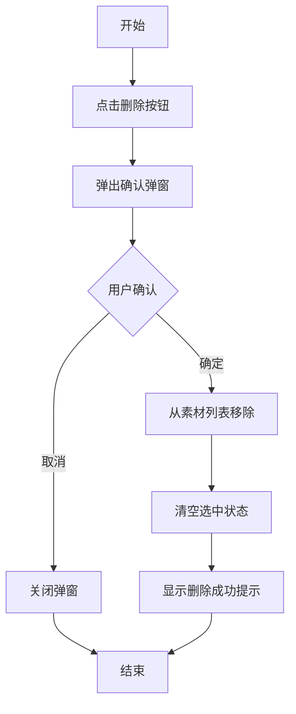
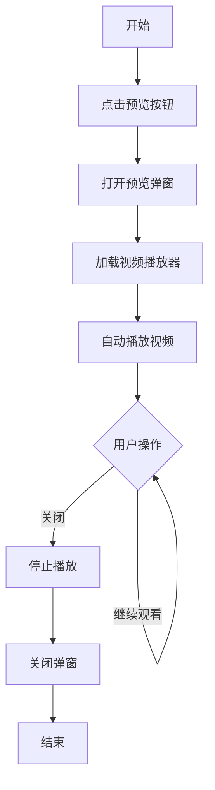
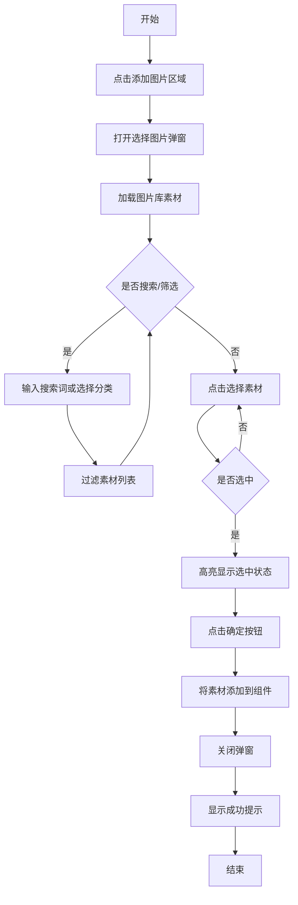
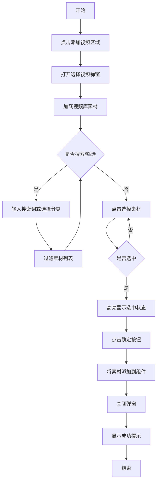

# 素材库产品需求文档

# 1. 需求背景

---

# 2. 需求分析

---

# 3. 系统流程图

---

# 4. 详细需求

## 4.1. 商城运营后台系统

### 4.1.1. 素材库模块

#### 4.1.1.1. 图片库页面

##### 1. 功能概述

- **功能描述**：图片库是商城运营后台的素材管理核心模块，提供图片素材的统一存储、分类管理和检索功能。
- **业务描述**：运营人员可通过图片库管理商品图片、营销素材等图片资源，支持分类管理、上传、预览、删除、移动和复制链接等操作。
- **使用角色**：平台运营人员、品牌商城管理员。
- **触发条件**：用户进入商城运营后台，点击素材库菜单下的图片库选项。

##### 2. 界面设计

###### 2.1 页面原型

（待补充）

###### 2.2 输出项说明

| 字段名称 | 字段标识 | 数据类型 | 数据来源 | 格式说明 |
|----------|----------|----------|----------|----------|
| 分类名称 | category_name | String | 分类管理模块 | 文本展示 |
| 素材数量 | material_count | Number | 系统计算 | 整数，如"共 10 个图片素材" |
| 素材ID | material_id | String | 系统生成 | UUID格式，唯一标识 |
| 素材名称 | material_name | String | 用户上传 | 包含扩展名，如"商品主图_001.jpg" |
| 素材缩略图 | material_thumbnail | String | 上传文件 | 图片URL |
| 文件大小 | file_size | Number | 系统计算 | 字节数，格式化显示为"KB"或"MB" |
| 图片尺寸 | dimensions | String | 系统提取 | 格式为"宽 x 高"，如"800 x 600" |
| 文件格式 | file_format | String | 系统提取 | 扩展名，如"jpg"、"png" |
| 上传时间 | created_at | DateTime | 系统生成 | 格式为"YYYY-MM-DD HH:mm:ss" |
| 分类ID | category_id | String | 分类管理模块 | 关联分类 |

##### 3. 业务逻辑

###### 3.1 流程图

**上传图片流程**

```mermaid
flowchart TD
    A[开始] --> B[点击上传图片按钮]
    B --> C[打开上传弹窗]
    C --> D[选择目标分类]
    D --> E[选择或拖拽文件]
    E --> F{文件格式校验}
    F -->|不通过| G[提示错误信息]
    G --> E
    F -->|通过| H{文件大小校验}
    H -->|超过3MB| I[提示"文件大小不能超过3MB"]
    I --> E
    H -->|通过| J[添加到上传列表]
    J --> K[点击上传按钮]
    K --> L[生成素材ID]
    L --> M[创建本地预览URL]
    M --> N[保存素材信息]
    N --> O[刷新素材列表]
    O --> P[结束]
```

**删除图片流程**



**移动图片流程**

```mermaid
flowchart TD
    A[开始] --> B[选中素材]
    B --> C[点击移动按钮]
    C --> D[打开移动弹窗]
    D --> E[选择目标分类]
    E --> F{是否选择分类}
    F -->|否| G[提示"请选择目标分类"]
    G --> E
    F -->|是| H[更新素材分类ID]
    H --> I[清空选中状态]
    I --> J[关闭弹窗]
    J --> K[显示移动成功提示]
    K --> L[结束]
```

###### 3.2 业务规则

| 规则编号 | 规则名称 | 适用场景 | 规则描述 | 错误提示 |
|----------|----------|----------|----------|----------|
| RULE-IMG-001 | 文件格式限制 | 上传图片 | 仅支持JPG、JPEG、PNG、GIF、WEBP格式 | 只能上传JPG、JPEG、PNG、GIF、WEBP格式的文件 |
| RULE-IMG-002 | 文件大小限制 | 上传图片 | 单个文件不超过3MB | 文件大小不能超过3MB |
| RULE-IMG-003 | 分类层级限制 | 新增分类 | 最多支持二级分类层级 | 无 |
| RULE-IMG-004 | 默认分类保护 | 删除分类 | 默认分类不可删除 | 默认分类不能删除 |
| RULE-IMG-005 | 分类名称长度 | 新增/编辑分类 | 分类名称不超过20个字符 | 无 |
| RULE-IMG-006 | 删除分类素材处理 | 删除分类 | 删除分类时，该分类下素材移至默认分类 | 无 |
| RULE-IMG-007 | 搜索范围 | 搜索素材 | 仅搜索当前分类下的素材名称 | 无 |
| RULE-IMG-008 | 分类选择限制 | 上传素材 | 只能选择一级或二级分类作为目标分类 | 无 |

###### 3.3 状态机设计

**素材选中状态**

| 状态值 | 状态名称 | 状态说明 | 可见角色 |
|--------|----------|----------|----------|
| unselected | 未选中 | 素材未勾选 | 所有用户 |
| selected | 已选中 | 素材已勾选，可进行批量操作 | 所有用户 |

**分类选中状态**

| 当前状态 | 触发操作 | 目标状态 | 操作角色 | 前置条件 |
|----------|----------|----------|----------|----------|
| 未选中 | 点击分类节点 | 已选中 | 所有用户 | 分类存在 |
| 已选中 | 点击另一分类节点 | 已选中（新分类） | 所有用户 | 新分类存在 |

##### 4. 交互设计

###### 4.1 输入项说明

| 字段名称 | 字段标识 | 字段类型 | 必填 | 数据类型 | 长度限制 | 校验规则 | 取值范围 | 来源 | 提示文案 | 备注 |
|----------|----------|----------|------|----------|----------|----------|----------|------|----------|------|
| 分类名称 | category_name | 文本输入 | 是 | String | 1-20 | 不能为空 | - | 用户输入 | 请输入分类名称 | 用于新增/编辑分类 |
| 搜索关键词 | search_keyword | 文本输入 | 否 | String | - | - | - | 用户输入 | 搜索素材名称 | 支持模糊搜索 |
| 目标分类 | target_category_id | 下拉选择 | 是 | String | - | 必须选择有效分类 | 一级或二级分类 | 分类树 | 请选择目标分类 | 用于移动素材 |
| 上传文件 | upload_file | 文件上传 | 是 | File | ≤3MB | 格式+大小校验 | JPG/JPEG/PNG/GIF/WEBP | 用户选择 | 支持批量上传，最多20个文件 | - |
| 上传分类 | upload_category_id | 下拉选择 | 是 | String | - | 必须选择有效分类 | 一级或二级分类 | 分类树 | 请选择分类 | 默认当前分类 |

###### 4.2 交互说明

**分类管理交互**

1. 页面加载时，默认选中"默认分类"，展示该分类下所有图片素材
2. 点击分类树节点，切换选中分类，右侧展示对应素材列表
3. 点击分类树右上角"+"按钮，打开新增一级分类弹窗
4. 右键点击分类节点，显示操作菜单（新增子分类、编辑分类名称、删除分类）
5. 点击新增子分类，打开新增分类弹窗，自动填充父级分类
6. 点击编辑分类名称，打开编辑弹窗，预填当前名称
7. 点击删除分类，弹出确认弹窗，确认后删除分类

**素材管理交互**

1. 点击"上传图片"按钮，打开上传弹窗，默认选中当前分类
2. 在上传弹窗中，可切换目标分类
3. 支持点击选择或拖拽文件上传
4. 选择文件后，显示已选文件数量
5. 点击上传按钮，完成上传，关闭弹窗
6. 点击素材卡片，勾选/取消勾选素材
7. 点击全选复选框，选中/取消选中当前页所有素材
8. 点击素材卡片上的预览按钮，打开预览弹窗
9. 点击复制链接按钮，将素材URL复制到剪贴板
10. 点击删除按钮，弹出确认弹窗
11. 选中素材后，点击顶部"移动"按钮，打开移动弹窗
12. 选中素材后，点击顶部"删除"按钮，批量删除选中素材

**搜索交互**

1. 在搜索框输入关键词，实时过滤当前分类下素材
2. 点击清空按钮，清除搜索条件，显示全部素材

**分页交互**

1. 默认每页显示10条
2. 支持切换每页显示数量（10/20/50/100）
3. 支持跳转指定页码

###### 4.3 错误提示文案

**表单校验提示**

| 校验字段 | 校验场景 | 提示文案 |
|----------|----------|----------|
| 分类名称 | 为空 | 请输入分类名称 |
| 目标分类 | 未选择 | 请选择目标分类 |
| 上传文件 | 未选择 | 请选择要上传的文件 |
| 上传分类 | 未选择 | 请选择分类 |

**业务异常提示**

| 异常场景 | 错误码 | 提示文案 |
|----------|--------|----------|
| 文件格式不支持 | MAT-001 | 只能上传JPG、JPEG、PNG、GIF、WEBP格式的文件 |
| 文件大小超限 | MAT-002 | 文件大小不能超过3MB |
| 默认分类删除 | MAT-003 | 默认分类不能删除 |
| 分类层级超限 | MAT-004 | 已达到最大分类层级 |

##### 5. 数据设计

###### 5.1 数据流转说明

| 字段/数据 | 来源 | 获取方式 | 说明 |
|-----------|------|----------|------|
| 分类树 | 分类管理模块 | API查询 | 获取完整分类树结构 |
| 素材列表 | 素材库 | API查询 | 根据分类ID和类型过滤 |
| 素材ID | 系统生成 | 自动生成 | UUID格式 |
| 素材URL | 文件服务 | 上传返回 | 本地预览URL或CDN地址 |
| 缩略图 | 文件服务 | 系统生成 | 视频素材的缩略图 |

###### 5.2 数据权限设计

**角色数据范围**

| 角色 | 数据范围 | 说明 |
|------|----------|------|
| 平台运营 | 全部数据 | 可查看和管理所有素材 |
| 品牌管理员 | 本租户数据 | 仅可管理本品牌素材 |

**功能权限点**

| 权限标识 | 权限名称 |
|----------|----------|
| material:image:view | 查看图片库 |
| material:image:upload | 上传图片 |
| material:image:delete | 删除图片 |
| material:image:move | 移动图片 |
| material:category:add | 新增分类 |
| material:category:edit | 编辑分类 |
| material:category:delete | 删除分类 |

##### 6. 扩展功能

###### 6.1 批量操作规则

| 操作名称 | 单次上限 | 前置条件 | 成功提示 |
|----------|----------|----------|----------|
| 批量上传 | 20个文件 | 存储空间充足 | 上传成功 |
| 批量删除 | 50条 | 至少选中1个素材 | 删除成功 |
| 批量移动 | 50条 | 至少选中1个素材、目标分类存在 | 移动成功 |

###### 6.2 操作日志要求

| 操作类型 | 记录内容 | 保留时长 |
|----------|----------|----------|
| 上传图片 | 操作人、时间、文件名、分类 | 3年 |
| 删除图片 | 操作人、时间、文件名 | 3年 |
| 移动图片 | 操作人、时间、文件名、源分类、目标分类 | 3年 |
| 新增分类 | 操作人、时间、分类名称 | 3年 |
| 编辑分类 | 操作人、时间、原名称、新名称 | 3年 |
| 删除分类 | 操作人、时间、分类名称 | 3年 |

---

#### 4.1.1.2. 视频库页面

##### 1. 功能概述

- **功能描述**：视频库是商城运营后台的视频素材管理模块，提供视频素材的统一存储、分类管理和检索功能。
- **业务描述**：运营人员可通过视频库管理产品宣传视频、品牌故事等视频资源，支持分类管理、上传、预览、删除、移动和复制链接等操作。
- **使用角色**：平台运营人员、品牌商城管理员。
- **触发条件**：用户进入商城运营后台，点击素材库菜单下的视频库选项。

##### 2. 界面设计

###### 2.1 页面原型

（待补充）

###### 2.2 输出项说明

| 字段名称 | 字段标识 | 数据类型 | 数据来源 | 格式说明 |
|----------|----------|----------|----------|----------|
| 分类名称 | category_name | String | 分类管理模块 | 文本展示 |
| 素材数量 | material_count | Number | 系统计算 | 整数，如"共 10 个视频素材" |
| 素材ID | material_id | String | 系统生成 | UUID格式，唯一标识 |
| 素材名称 | material_name | String | 用户上传 | 包含扩展名，如"产品宣传视频.mp4" |
| 视频缩略图 | video_thumbnail | String | 系统生成/上传文件 | 视频第一帧或指定缩略图URL |
| 文件大小 | file_size | Number | 系统计算 | 字节数，格式化显示为"MB" |
| 文件格式 | file_format | String | 系统提取 | 扩展名，如"mp4"、"mov" |
| 上传时间 | created_at | DateTime | 系统生成 | 格式为"YYYY-MM-DD HH:mm:ss" |
| 分类ID | category_id | String | 分类管理模块 | 关联分类 |

##### 3. 业务逻辑

###### 3.1 流程图

**上传视频流程**

```mermaid
flowchart TD
    A[开始] --> B[点击上传视频按钮]
    B --> C[打开上传弹窗]
    C --> D[选择目标分类]
    D --> E[选择或拖拽文件]
    E --> F{文件格式校验}
    F -->|不通过| G[提示错误信息]
    G --> E
    F -->|通过| H{文件大小校验}
    H -->|超过500MB| I[提示"文件大小不能超过500MB"]
    I --> E
    H -->|通过| J[添加到上传列表]
    J --> K[点击上传按钮]
    K --> L[生成素材ID]
    L --> M[创建本地预览URL]
    M --> N[保存素材信息]
    N --> O[刷新素材列表]
    O --> P[结束]
```

**视频预览流程**



###### 3.2 业务规则

| 规则编号 | 规则名称 | 适用场景 | 规则描述 | 错误提示 |
|----------|----------|----------|----------|----------|
| RULE-VID-001 | 文件格式限制 | 上传视频 | 仅支持MP4、WMV、MOV格式 | 只能上传MP4、WMV、MOV格式的文件 |
| RULE-VID-002 | 文件大小限制 | 上传视频 | 单个文件不超过500MB | 文件大小不能超过500MB |
| RULE-VID-003 | 分类层级限制 | 新增分类 | 最多支持二级分类层级 | 无 |
| RULE-VID-004 | 默认分类不显示 | 分类筛选 | 视频库不显示默认分类 | 无 |
| RULE-VID-005 | 分类名称长度 | 新增/编辑分类 | 分类名称不超过20个字符 | 无 |
| RULE-VID-006 | 删除分类素材处理 | 删除分类 | 删除分类时，若该分类下存在素材，需提示用户先迁移素材至其他分类 | 该分类下存在素材，请先迁移素材后再删除 |
| RULE-VID-007 | 搜索范围 | 搜索素材 | 仅搜索当前分类下的素材名称 | 无 |
| RULE-VID-008 | 分类选择限制 | 上传素材 | 只能选择一级或二级分类作为目标分类 | 无 |

###### 3.3 状态机设计

**素材选中状态**

| 状态值 | 状态名称 | 状态说明 | 可见角色 |
|--------|----------|----------|----------|
| unselected | 未选中 | 素材未勾选 | 所有用户 |
| selected | 已选中 | 素材已勾选，可进行批量操作 | 所有用户 |

**视频播放状态**

| 状态值 | 状态名称 | 状态说明 | UI差异 |
|--------|----------|----------|--------|
| loading | 加载中 | 视频正在加载 | 显示加载动画 |
| playing | 播放中 | 视频正在播放 | 显示播放器控制条 |
| paused | 已暂停 | 视频已暂停 | 显示播放按钮 |
| ended | 已结束 | 视频播放完毕 | 显示重播按钮 |

##### 4. 交互设计

###### 4.1 输入项说明

| 字段名称 | 字段标识 | 字段类型 | 必填 | 数据类型 | 长度限制 | 校验规则 | 取值范围 | 来源 | 提示文案 | 备注 |
|----------|----------|----------|------|----------|----------|----------|----------|------|----------|------|
| 分类名称 | category_name | 文本输入 | 是 | String | 1-20 | 不能为空 | - | 用户输入 | 请输入分类名称 | 用于新增/编辑分类 |
| 搜索关键词 | search_keyword | 文本输入 | 否 | String | - | - | - | 用户输入 | 搜索素材名称 | 支持模糊搜索 |
| 目标分类 | target_category_id | 下拉选择 | 是 | String | - | 必须选择有效分类 | 一级或二级分类 | 分类树 | 请选择目标分类 | 用于移动素材 |
| 上传文件 | upload_file | 文件上传 | 是 | File | ≤500MB | 格式+大小校验 | MP4/WMV/MOV | 用户选择 | 支持批量上传，最多10个文件 | - |
| 上传分类 | upload_category_id | 下拉选择 | 是 | String | - | 必须选择有效分类 | 一级或二级分类 | 分类树 | 请选择分类 | 默认当前分类 |

###### 4.2 交互说明

**页面切换交互**

1. 点击页面顶部"视频库"选项卡，切换到视频库页面
2. 切换时自动选中视频素材分类（如有）
3. 清空之前选中的素材
4. 重置分页到第一页

**分类管理交互**

1. 视频库的分类树仅显示视频相关分类
2. 默认分类在视频库中不显示
3. 其他分类管理操作与图片库一致

**素材管理交互**

1. 点击"上传视频"按钮，打开上传弹窗
2. 支持点击选择或拖拽文件上传
3. 点击素材卡片上的播放图标或预览按钮，打开视频预览弹窗
4. 预览弹窗自动播放视频，支持播放控制
5. 其他素材管理操作与图片库一致

###### 4.3 错误提示文案

**表单校验提示**

| 校验字段 | 校验场景 | 提示文案 |
|----------|----------|----------|
| 分类名称 | 为空 | 请输入分类名称 |
| 目标分类 | 未选择 | 请选择目标分类 |
| 上传文件 | 未选择 | 请选择要上传的文件 |
| 上传分类 | 未选择 | 请选择分类 |

**业务异常提示**

| 异常场景 | 错误码 | 提示文案 |
|----------|--------|----------|
| 文件格式不支持 | MAT-005 | 只能上传MP4、WMV、MOV格式的文件 |
| 文件大小超限 | MAT-006 | 文件大小不能超过500MB |
| 视频加载失败 | MAT-007 | 视频加载失败，请稍后重试 |
| 浏览器不支持 | MAT-008 | 您的浏览器不支持视频播放 |
| 分类下存在素材 | MAT-009 | 该分类下存在素材，请先迁移素材后再删除 |

##### 5. 数据设计

###### 5.1 数据流转说明

| 字段/数据 | 来源 | 获取方式 | 说明 |
|-----------|------|----------|------|
| 分类树 | 分类管理模块 | API查询 | 获取视频相关分类树结构 |
| 素材列表 | 素材库 | API查询 | 根据分类ID和类型过滤 |
| 素材ID | 系统生成 | 自动生成 | UUID格式 |
| 素材URL | 文件服务 | 上传返回 | 本地预览URL或CDN地址 |
| 缩略图 | 文件服务 | 系统生成 | 视频第一帧截图 |

###### 5.2 数据权限设计

**角色数据范围**

| 角色 | 数据范围 | 说明 |
|------|----------|------|
| 平台运营 | 全部数据 | 可查看和管理所有素材 |
| 品牌管理员 | 本租户数据 | 仅可管理本品牌素材 |

**功能权限点**

| 权限标识 | 权限名称 |
|----------|----------|
| material:video:view | 查看视频库 |
| material:video:upload | 上传视频 |
| material:video:delete | 删除视频 |
| material:video:move | 移动视频 |

##### 6. 扩展功能

###### 6.1 批量操作规则

| 操作名称 | 单次上限 | 前置条件 | 成功提示 |
|----------|----------|----------|----------|
| 批量上传 | 10个文件 | 存储空间充足 | 上传成功 |
| 批量删除 | 50条 | 至少选中1个素材 | 删除成功 |
| 批量移动 | 50条 | 至少选中1个素材、目标分类存在 | 移动成功 |

###### 6.2 操作日志要求

| 操作类型 | 记录内容 | 保留时长 |
|----------|----------|----------|
| 上传视频 | 操作人、时间、文件名、分类、文件大小 | 3年 |
| 删除视频 | 操作人、时间、文件名 | 3年 |
| 移动视频 | 操作人、时间、文件名、源分类、目标分类 | 3年 |
| 预览视频 | 操作人、时间、文件名 | 3年 |

---

### 4.1.2. 页面装修模块

#### 4.1.2.1. 配置面板页面

##### 1. 功能概述

- **功能描述**：配置面板是页面装修功能的右侧配置区域，用于编辑选中组件的属性，包括从素材库选择图片和视频。
- **业务描述**：运营人员在编辑页面组件时，可通过配置面板快速选择素材库中的图片或视频，无需切换页面。
- **使用角色**：平台运营人员、品牌商城管理员。
- **触发条件**：在页面装修页面选中需要编辑的组件，如图片广告组件。

##### 2. 界面设计

###### 2.1 页面原型

（待补充）

###### 2.2 输出项说明

| 字段名称 | 字段标识 | 数据类型 | 数据来源 | 格式说明 |
|----------|----------|----------|----------|----------|
| 组件名称 | component_name | String | 组件配置 | 文本展示 |
| 组件说明 | component_description | String | 组件配置 | 文本展示 |
| 样式选项 | style_options | Array | 组件配置 | 样式列表 |
| 素材ID | material_id | String | 素材库 | 选中素材的ID |
| 素材名称 | material_name | String | 素材库 | 选中素材的名称 |
| 素材URL | material_url | String | 素材库 | 选中素材的URL |
| 素材缩略图 | material_thumbnail | String | 素材库 | 选中素材的缩略图 |

##### 3. 业务逻辑

###### 3.1 流程图

**选择图片素材流程**



**选择视频素材流程**



###### 3.2 业务规则

| 规则编号 | 规则名称 | 适用场景 | 规则描述 | 错误提示 |
|----------|----------|----------|----------|----------|
| RULE-CONFIG-001 | 素材类型限制 | 选择素材 | 图片组件仅能选择图片素材，视频组件仅能选择视频素材 | 无 |
| RULE-CONFIG-002 | 单选限制 | 选择素材 | 每次仅能选择一个素材 | 无 |
| RULE-CONFIG-003 | 分类筛选 | 选择素材 | 支持按分类筛选素材 | 无 |
| RULE-CONFIG-004 | 搜索筛选 | 选择素材 | 支持按素材名称搜索 | 无 |
| RULE-CONFIG-005 | 图片尺寸建议 | 添加图片 | 建议图片尺寸宽度750 | 无 |
| RULE-CONFIG-006 | 视频格式建议 | 添加视频 | 支持MP4格式 | 无 |

###### 3.3 状态机设计

**素材选择状态**

| 状态值 | 状态名称 | 状态说明 | UI差异 |
|--------|----------|----------|--------|
| none | 未选择 | 未选中任何素材 | 无高亮 |
| selected | 已选择 | 已选中一个素材 | 高亮边框，显示选中标记 |

##### 4. 交互设计

###### 4.1 输入项说明

| 字段名称 | 字段标识 | 字段类型 | 必填 | 数据类型 | 长度限制 | 校验规则 | 取值范围 | 来源 | 提示文案 | 备注 |
|----------|----------|----------|------|----------|----------|----------|----------|------|----------|------|
| 搜索关键词 | search_keyword | 文本输入 | 否 | String | - | - | - | 用户输入 | 搜索素材名称 | 支持模糊搜索 |
| 分类筛选 | category_filter | 下拉选择 | 否 | String | - | - | 分类列表 | 分类数据 | 选择分类 | 为空时显示全部 |

###### 4.2 交互说明

**选择图片弹窗交互**

1. 在配置面板点击"添加图片"区域，打开选择图片弹窗
2. 弹窗标题为"选择图片素材"
3. 顶部显示搜索框和分类下拉选择器
4. 素材以网格形式展示
5. 点击素材卡片，切换选中状态
6. 选中的素材显示高亮边框
7. 点击确定按钮，将选中的素材添加到组件
8. 点击取消按钮或关闭按钮，关闭弹窗，不保存选择

**选择视频弹窗交互**

1. 在配置面板点击"添加视频"区域，打开选择视频弹窗
2. 弹窗标题为"选择视频素材"
3. 视频素材显示缩略图和播放图标
4. 其他交互与图片弹窗一致

###### 4.3 错误提示文案

**表单校验提示**

| 校验字段 | 校验场景 | 提示文案 |
|----------|----------|----------|
| 素材选择 | 未选择素材 | 请选择要添加的素材 |

**业务异常提示**

| 异常场景 | 错误码 | 提示文案 |
|----------|--------|----------|
| 素材加载失败 | CONFIG-001 | 素材加载失败，请稍后重试 |
| 素材不存在 | CONFIG-002 | 素材不存在或已被删除 |

##### 5. 数据设计

###### 5.1 数据流转说明

| 字段/数据 | 来源 | 获取方式 | 说明 |
|-----------|------|----------|------|
| 图片素材列表 | 素材库模块 | API查询 | 获取所有图片素材 |
| 视频素材列表 | 素材库模块 | API查询 | 获取所有视频素材 |
| 分类选项 | 素材库模块 | API查询 | 获取分类列表 |
| 选中素材 | 素材库模块 | 用户选择 | 返回素材ID和URL |

###### 5.2 数据权限设计

**角色数据范围**

| 角色 | 数据范围 | 说明 |
|------|----------|------|
| 平台运营 | 全部素材 | 可选择所有素材 |
| 品牌管理员 | 本租户素材 | 仅可选择本品牌素材 |

**功能权限点**

| 权限标识 | 权限名称 |
|----------|----------|
| decoration:config:edit | 编辑组件配置 |
| decoration:material:select | 选择素材 |

##### 6. 扩展功能

###### 6.1 批量操作规则

| 操作名称 | 单次上限 | 前置条件 | 成功提示 |
|----------|----------|----------|----------|
| 选择素材 | 1个 | 素材存在 | 已添加图片素材/已添加视频素材 |

###### 6.2 操作日志要求

| 操作类型 | 记录内容 | 保留时长 |
|----------|----------|----------|
| 选择图片素材 | 操作人、时间、素材名称、组件名称 | 1年 |
| 选择视频素材 | 操作人、时间、素材名称、组件名称 | 1年 |

---

# 5. 非功能需求

## 5.1. 性能需求

| 指标名称 | 指标要求 |
|----------|----------|
| 页面加载时间 | 首屏加载 ≤ 3秒 |
| 操作响应时间 | 普通操作 ≤ 500ms |
| 文件上传时间 | 单个文件上传进度可见 |
| 素材列表加载 | 100条以内素材加载 ≤ 1秒 |

## 5.2. 兼容性需求

| 类型 | 要求 |
|------|------|
| 浏览器 | Chrome 80+、Firefox 75+、Safari 13+、Edge 80+ |
| 分辨率 | 最低支持1366×768，推荐1920×1080 |
| 移动端 | 暂不支持移动端访问 |

## 5.3. 安全需求

| 安全项 | 要求 |
|--------|------|
| 文件上传 | 校验文件类型和大小，防止恶意文件上传 |
| 权限控制 | 基于角色的访问控制，不同角色具有不同操作权限 |
| 数据隔离 | 租户数据相互隔离，品牌管理员仅能访问本品牌数据 |
| 操作日志 | 关键操作记录日志，便于追溯 |

---

# 6. 附录

## 6.1. 术语表

| 术语 | 说明 |
|------|------|
| 素材库 | 用于存储和管理图片、视频等素材的系统模块 |
| 分类树 | 以树形结构展示的分类层级，支持多级嵌套 |
| 素材 | 图片、视频等媒体文件的统称 |
| 分类 | 对素材进行归类的组织方式 |
| 缩略图 | 素材的缩小预览图，用于列表展示 |
| 配置面板 | 页面装修中用于编辑组件属性的区域 |

## 6.2. 相关文档

| 文档名称 | 文档路径 |
|----------|----------|
| 功能大纲 | docs/功能大纲.md |
| 需求文档规范 | docs/需求文档规范.md |

---

# 7. 版本记录

| 版本号 | 修改日期 | 修改人 | 修改内容 |
|--------|----------|--------|----------|
| V1.0 | 2024-01-15 | 产品经理 | 初稿创建 |
| V1.1 | 2024-02-01 | 产品经理 | 新增视频库功能，优化分类管理 |
| V1.2 | 2026-03-23 | 产品经理 | 基于源码分析更新，完善业务规则和交互说明 |
| V1.3 | 2026-03-23 | 产品经理 | 统一批量操作上限规则；修正视频库分类删除逻辑；统一素材ID为UUID格式 |