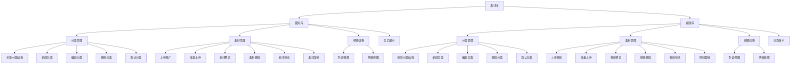
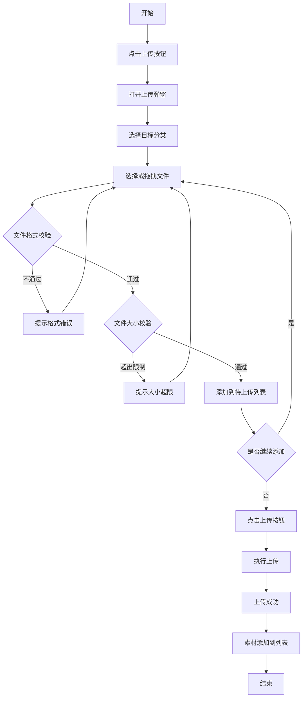
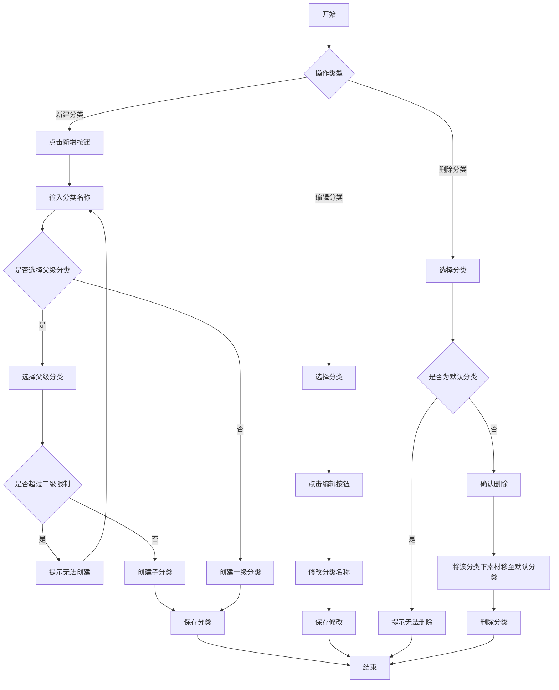

# 素材库产品需求文档

# 1. 需求背景

商城运营后台需要为运营人员提供一个集中管理图片和视频素材的功能模块。素材库作为商城运营的基础设施，支撑商品管理、营销活动、页面装修等多个业务场景的素材需求。通过统一的素材管理，提高运营效率，确保素材资源的规范化和可复用性。

产品目标：
- 提供统一的素材上传、管理、检索能力
- 支持多级分类管理，便于素材组织和查找
- 实现图片库与视频库的独立管理，满足不同业务场景需求
- 提供便捷的素材操作（预览、复制链接、移动、删除等）

用户角色：
| 角色 | 描述 | 主要职责 |
|------|------|----------|
| 运营人员 | 商城后台操作人员 | 上传素材、管理分类、素材维护 |
| 设计师 | 素材提供方 | 上传设计稿、营销图片等 |

---

# 2. 需求分析

## 2.1. 历史需求
本项目为新建系统，无历史版本。

## 2.2. 招标要求
素材库模块需满足以下核心要求：
- 支持图片和视频两种素材类型的管理
- 支持多级分类结构
- 提供素材的上传、预览、删除、移动等基本操作
- 支持批量操作

## 2.3. 竞品分析

### 2.3.1. 有赞
- 优点：分类管理直观，支持拖拽排序；素材预览体验好
- 不足：批量操作功能较弱
- 参考价值：分类树的交互设计值得借鉴

### 2.3.2. 微盟
- 优点：支持多种图片格式，上传体验流畅
- 不足：视频管理功能相对简单
- 参考价值：文件格式校验和大小限制的设计

### 2.3.3. 京东商家后台
- 优点：素材管理功能完善，支持批量操作
- 不足：分类层级限制较多
- 参考价值：批量移动、批量删除的交互流程

### 2.3.4. 淘宝卖家中心
- 优点：图片空间管理成熟，支持文件夹嵌套
- 不足：界面复杂，学习成本高
- 参考价值：文件夹结构设计

---

# 3. 系统流程图【必须】

## 3.1. 总体功能蓝图流程图

## 3.2. 素材上传流程图

## 3.3. 分类管理流程图

---

# 4. 详细需求【仅标题，标题下无内容】

## 4.1. 商城运营后台系统【系统标题下无内容】

### 4.1.1. 素材库模块【模块标题下无内容】

#### 4.1.1.1. 图片库页面【除必须外，其余按需决定是否配置】

##### 功能概述【必须】
- **功能描述**：图片库用于管理商城运营所需的各类图片素材，包括商品图片、营销素材等。提供素材的上传、分类管理、预览、复制链接、移动、删除等功能。
- **业务描述**：运营人员在商品上架、活动配置、页面装修等场景下，通过图片库管理和获取所需图片素材。支持按分类组织和检索图片，支持批量操作提高效率。
- **使用角色**：运营人员、设计师
- **触发条件**：用户进入商城运营后台 → 点击左侧菜单「素材库」→ 默认进入图片库

##### 流程图
参见 [3.2 素材上传流程图](#32-素材上传流程图) 和 [3.3 分类管理流程图](#33-分类管理流程图)

##### 页面原型【必须】
- 页面布局：左侧为分类树，右侧为素材展示区
- 顶部：选项卡切换（图片库/视频库）
- 操作栏：上传按钮、搜索框、移动按钮、删除按钮
- 素材展示：网格视图，支持分页

##### 输入项说明

| 字段名称 | 字段标识 | 字段类型 | 必填 | 数据类型 | 长度限制 | 校验规则 | 取值范围 | 来源 | 提示文案 | 备注 |
|----------|----------|----------|------|----------|----------|----------|----------|------|----------|------|
| 分类名称 | categoryName | 文本输入 | 是 | String | 1-20 | 不能为空，不能重复 | - | 用户输入 | 请输入分类名称 | 支持中文、英文、数字 |
| 素材名称 | materialName | 文本输入 | 否 | String | 1-100 | - | - | 用户输入/自动获取 | - | 默认为文件名 |
| 目标分类 | targetCategory | 下拉选择 | 是 | String | - | 必须选择 | 已有分类 | 系统数据 | 请选择目标分类 | 用于移动素材 |
| 上传文件 | uploadFile | 文件上传 | 是 | File | - | 格式、大小校验 | 见业务规则 | 用户选择 | 请选择要上传的文件 | 支持批量上传 |

##### 输出项说明

| 字段名称 | 字段标识 | 数据类型 | 数据来源 | 格式说明 |
|----------|----------|----------|----------|----------|
| 素材ID | id | String | 系统生成 | 唯一标识 |
| 素材名称 | name | String | 用户输入/文件名 | 包含扩展名 |
| 素材URL | url | String | 系统生成 | CDN地址 |
| 缩略图URL | thumbnail | String | 系统生成 | 用于列表展示 |
| 文件大小 | size | Number | 文件属性 | 字节数，格式化显示 |
| 素材尺寸 | dimensions | Object | 系统获取 | 宽×高 |
| 所属分类 | categoryId | String | 用户选择 | 分类ID |
| 创建时间 | createdAt | String | 系统生成 | YYYY-MM-DD HH:mm:ss |

##### 业务规则

| 规则编号 | 规则名称 | 适用场景 | 规则描述 | 错误提示 |
|----------|----------|----------|----------|----------|
| BR-001 | 图片格式限制 | 上传图片 | 仅支持 JPG、JPEG、PNG、GIF、WEBP 格式 | 只能上传 JPG、JPEG、PNG、GIF、WEBP 格式的文件 |
| BR-002 | 图片大小限制 | 上传图片 | 单个图片文件不超过 3MB | 文件大小不能超过 3MB |
| BR-003 | 分类层级限制 | 新建分类 | 分类最多支持二级结构 | 分类层级不能超过二级 |
| BR-004 | 默认分类不可删除 | 删除分类 | 默认分类不能被删除 | 默认分类不能删除 |
| BR-005 | 分类名称长度 | 新建/编辑分类 | 分类名称长度为1-20个字符 | 分类名称长度为1-20个字符 |
| BR-006 | 删除分类素材处理 | 删除分类 | 删除分类时，该分类下的素材自动移至默认分类 | - |
| BR-007 | 分页默认配置 | 列表展示 | 默认每页显示10条，可选10/20/50/100条 | - |

##### 交互说明

**上传图片流程**：
1. 用户点击「上传图片」按钮
2. 系统弹出上传弹窗，默认选中当前分类
3. 用户可选择其他目标分类
4. 用户点击或拖拽文件到上传区域
5. 系统校验文件格式和大小
6. 校验通过的文件显示在待上传列表
7. 用户点击「上传」按钮执行上传
8. 上传成功后关闭弹窗，素材出现在列表中

**批量删除流程**：
1. 用户勾选需要删除的素材（可多选）
2. 用户点击「删除」按钮
3. 系统弹出确认弹窗，显示删除数量
4. 用户确认后执行删除
5. 删除成功后刷新列表

**移动素材流程**：
1. 用户勾选需要移动的素材（可多选）
2. 用户点击「移动」按钮
3. 系统弹出移动弹窗，显示分类树
4. 用户选择目标分类
5. 用户点击「确定」执行移动
6. 移动成功后素材出现在目标分类下

**编辑素材名称流程**：
1. 用户点击素材名称区域
2. 名称变为可编辑输入框
3. 用户输入新名称（保留扩展名）
4. 用户按回车或点击其他区域保存
5. 系统更新素材名称

##### 数据流转说明

###### 数据来源
| 字段/数据 | 来源 | 获取方式 | 说明 |
|-----------|------|----------|------|
| 分类列表 | 分类管理模块 | API查询 | 完整分类树 |
| 素材列表 | 素材管理模块 | API查询 | 按分类和类型筛选 |
| 素材文件 | 文件服务 | CDN上传 | 图片存储 |

###### 数据去向
| 数据 | 目标系统/模块 | 同步时机 | 说明 |
|------|---------------|----------|------|
| 素材URL | 页面装修模块 | 选择素材时 | 用于配置图片组件 |
| 素材URL | 商品管理模块 | 选择商品图时 | 用于商品主图/详情图 |

##### 错误提示文案

###### 表单校验提示
| 校验字段 | 校验场景 | 提示文案 |
|----------|----------|----------|
| 分类名称 | 为空 | 请输入分类名称 |
| 分类名称 | 仅空格 | 请输入分类名称 |
| 目标分类 | 未选择 | 请选择目标分类 |
| 上传文件 | 未选择 | 请选择要上传的文件 |

###### 业务异常提示
| 异常场景 | 错误码 | 提示文案 |
|----------|--------|----------|
| 文件格式不支持 | MAT_001 | 只能上传 JPG、JPEG、PNG、GIF、WEBP 格式的文件 |
| 文件大小超限 | MAT_002 | 文件大小不能超过 3MB |
| 分类层级超限 | MAT_003 | 分类层级不能超过二级 |
| 默认分类删除 | MAT_004 | 默认分类不能删除 |
| 分类名称重复 | MAT_005 | 该分类名称已存在 |

##### 数据权限设计

###### 角色数据范围
| 角色 | 数据范围 | 说明 |
|------|----------|------|
| 运营人员 | 本租户素材 | 可上传、查看、编辑、删除 |
| 设计师 | 本租户素材 | 可上传、查看，不可删除 |

###### 功能权限点
| 权限标识 | 权限名称 |
|----------|----------|
| material:image:view | 查看图片库 |
| material:image:upload | 上传图片 |
| material:image:edit | 编辑图片信息 |
| material:image:delete | 删除图片 |
| material:category:add | 新建分类 |
| material:category:edit | 编辑分类 |
| material:category:delete | 删除分类 |

##### 模块依赖关系

###### 依赖的其他模块
| 模块名称 | 依赖场景 | 依赖数据 | 是否强依赖 |
|----------|----------|----------|------------|
| 文件服务 | 上传图片 | CDN存储、图片URL | 是 |
| 用户权限模块 | 权限校验 | 用户角色、权限列表 | 是 |

###### 被依赖场景
| 调用模块 | 调用场景 | 提供数据 |
|----------|----------|----------|
| 页面装修模块 | 选择图片素材 | 素材列表、素材URL |
| 商品管理模块 | 选择商品图片 | 素材列表、素材URL |
| 营销活动模块 | 选择活动图片 | 素材列表、素材URL |

##### 批量操作规则

| 操作名称 | 单次上限 | 前置条件 | 成功提示 |
|----------|----------|----------|----------|
| 批量上传 | 20个文件 | 文件格式和大小符合要求 | 上传成功 |
| 批量删除 | 无限制 | 至少选择1个素材 | 删除成功 |
| 批量移动 | 无限制 | 至少选择1个素材 | 移动成功 |

##### 操作日志要求

| 操作类型 | 记录内容 | 保留时长 |
|----------|----------|----------|
| 上传素材 | 操作人、时间、文件名、大小、分类 | 1年 |
| 删除素材 | 操作人、时间、素材名称、ID | 1年 |
| 移动素材 | 操作人、时间、素材ID、原分类、目标分类 | 1年 |
| 新建分类 | 操作人、时间、分类名称 | 1年 |
| 编辑分类 | 操作人、时间、原名称、新名称 | 1年 |
| 删除分类 | 操作人、时间、分类名称、素材迁移情况 | 1年 |

---

#### 4.1.1.2. 视频库页面【除必须外，其余按需决定是否配置】

##### 功能概述【必须】
- **功能描述**：视频库用于管理商城运营所需的各类视频素材，包括产品宣传视频、品牌故事视频等。提供视频的上传、分类管理、预览、复制链接、移动、删除等功能。
- **业务描述**：运营人员在商品详情、营销活动、品牌宣传等场景下，通过视频库管理和获取所需视频素材。支持按分类组织和检索视频，支持批量操作提高效率。
- **使用角色**：运营人员、设计师
- **触发条件**：用户进入商城运营后台 → 点击左侧菜单「素材库」→ 点击「视频库」选项卡

##### 流程图
参见 [3.2 素材上传流程图](#32-素材上传流程图) 和 [3.3 分类管理流程图](#33-分类管理流程图)

##### 页面原型【必须】
- 页面布局：左侧为分类树，右侧为素材展示区
- 顶部：选项卡切换（图片库/视频库）
- 操作栏：上传按钮、搜索框、移动按钮、删除按钮
- 视频展示：网格视图，显示视频缩略图和播放图标，支持分页

##### 输入项说明

| 字段名称 | 字段标识 | 字段类型 | 必填 | 数据类型 | 长度限制 | 校验规则 | 取值范围 | 来源 | 提示文案 | 备注 |
|----------|----------|----------|------|----------|----------|----------|----------|------|----------|------|
| 分类名称 | categoryName | 文本输入 | 是 | String | 1-20 | 不能为空，不能重复 | - | 用户输入 | 请输入分类名称 | 支持中文、英文、数字 |
| 素材名称 | materialName | 文本输入 | 否 | String | 1-100 | - | - | 用户输入/自动获取 | - | 默认为文件名 |
| 目标分类 | targetCategory | 下拉选择 | 是 | String | - | 必须选择 | 已有分类 | 系统数据 | 请选择目标分类 | 用于移动素材 |
| 上传文件 | uploadFile | 文件上传 | 是 | File | - | 格式、大小校验 | 见业务规则 | 用户选择 | 请选择要上传的文件 | 支持批量上传 |

##### 输出项说明

| 字段名称 | 字段标识 | 数据类型 | 数据来源 | 格式说明 |
|----------|----------|----------|----------|----------|
| 素材ID | id | String | 系统生成 | 唯一标识 |
| 素材名称 | name | String | 用户输入/文件名 | 包含扩展名 |
| 素材URL | url | String | 系统生成 | CDN地址 |
| 缩略图URL | thumbnail | String | 系统生成/自动截取 | 用于列表展示 |
| 文件大小 | size | Number | 文件属性 | 字节数，格式化显示 |
| 所属分类 | categoryId | String | 用户选择 | 分类ID |
| 创建时间 | createdAt | String | 系统生成 | YYYY-MM-DD HH:mm:ss |

##### 业务规则

| 规则编号 | 规则名称 | 适用场景 | 规则描述 | 错误提示 |
|----------|----------|----------|----------|----------|
| BR-101 | 视频格式限制 | 上传视频 | 仅支持 MP4、WMV、MOV 格式 | 只能上传 MP4、WMV、MOV 格式的文件 |
| BR-102 | 视频大小限制 | 上传视频 | 单个视频文件不超过 500MB | 文件大小不能超过 500MB |
| BR-103 | 分类层级限制 | 新建分类 | 分类最多支持二级结构 | 分类层级不能超过二级 |
| BR-104 | 默认分类不可删除 | 删除分类 | 默认分类不能被删除 | 默认分类不能删除 |
| BR-105 | 分类名称长度 | 新建/编辑分类 | 分类名称长度为1-20个字符 | 分类名称长度为1-20个字符 |
| BR-106 | 删除分类素材处理 | 删除分类 | 删除分类时，该分类下的素材自动移至默认分类 | - |
| BR-107 | 分页默认配置 | 列表展示 | 默认每页显示10条，可选10/20/50/100条 | - |

##### 交互说明

**上传视频流程**：
1. 用户切换到「视频库」选项卡
2. 用户点击「上传视频」按钮
3. 系统弹出上传弹窗，默认选中当前分类
4. 用户可选择其他目标分类
5. 用户点击或拖拽视频文件到上传区域
6. 系统校验文件格式和大小
7. 校验通过的文件显示在待上传列表
8. 用户点击「上传」按钮执行上传
9. 上传成功后关闭弹窗，视频素材出现在列表中

**视频预览流程**：
1. 用户点击视频卡片上的「预览」按钮
2. 系统弹出视频预览弹窗
3. 视频自动播放或用户点击播放
4. 用户可暂停、调整进度、调节音量
5. 用户点击关闭按钮关闭预览

**批量删除流程**：
1. 用户勾选需要删除的视频素材（可多选）
2. 用户点击「删除」按钮
3. 系统弹出确认弹窗，显示删除数量
4. 用户确认后执行删除
5. 删除成功后刷新列表

**移动素材流程**：
1. 用户勾选需要移动的视频素材（可多选）
2. 用户点击「移动」按钮
3. 系统弹出移动弹窗，显示分类树
4. 用户选择目标分类
5. 用户点击「确定」执行移动
6. 移动成功后视频素材出现在目标分类下

##### 数据流转说明

###### 数据来源
| 字段/数据 | 来源 | 获取方式 | 说明 |
|-----------|------|----------|------|
| 分类列表 | 分类管理模块 | API查询 | 完整分类树 |
| 素材列表 | 素材管理模块 | API查询 | 按分类和类型筛选 |
| 素材文件 | 文件服务 | CDN上传 | 视频存储 |
| 视频缩略图 | 文件服务 | 自动截取/用户上传 | 首帧或指定帧 |

###### 数据去向
| 数据 | 目标系统/模块 | 同步时机 | 说明 |
|------|---------------|----------|------|
| 素材URL | 页面装修模块 | 选择视频时 | 用于配置视频组件 |
| 素材URL | 商品管理模块 | 选择商品视频时 | 用于商品详情视频 |

##### 错误提示文案

###### 表单校验提示
| 校验字段 | 校验场景 | 提示文案 |
|----------|----------|----------|
| 分类名称 | 为空 | 请输入分类名称 |
| 分类名称 | 仅空格 | 请输入分类名称 |
| 目标分类 | 未选择 | 请选择目标分类 |
| 上传文件 | 未选择 | 请选择要上传的文件 |

###### 业务异常提示
| 异常场景 | 错误码 | 提示文案 |
|----------|--------|----------|
| 文件格式不支持 | MAT_101 | 只能上传 MP4、WMV、MOV 格式的文件 |
| 文件大小超限 | MAT_102 | 文件大小不能超过 500MB |
| 分类层级超限 | MAT_103 | 分类层级不能超过二级 |
| 默认分类删除 | MAT_104 | 默认分类不能删除 |
| 分类名称重复 | MAT_105 | 该分类名称已存在 |

##### 数据权限设计

###### 角色数据范围
| 角色 | 数据范围 | 说明 |
|------|----------|------|
| 运营人员 | 本租户视频素材 | 可上传、查看、编辑、删除 |
| 设计师 | 本租户视频素材 | 可上传、查看，不可删除 |

###### 功能权限点
| 权限标识 | 权限名称 |
|----------|----------|
| material:video:view | 查看视频库 |
| material:video:upload | 上传视频 |
| material:video:edit | 编辑视频信息 |
| material:video:delete | 删除视频 |
| material:category:add | 新建分类 |
| material:category:edit | 编辑分类 |
| material:category:delete | 删除分类 |

##### 模块依赖关系

###### 依赖的其他模块
| 模块名称 | 依赖场景 | 依赖数据 | 是否强依赖 |
|----------|----------|----------|------------|
| 文件服务 | 上传视频 | CDN存储、视频URL、缩略图生成 | 是 |
| 用户权限模块 | 权限校验 | 用户角色、权限列表 | 是 |

###### 被依赖场景
| 调用模块 | 调用场景 | 提供数据 |
|----------|----------|----------|
| 页面装修模块 | 选择视频素材 | 素材列表、素材URL |
| 商品管理模块 | 选择商品视频 | 素材列表、素材URL |
| 营销活动模块 | 选择活动视频 | 素材列表、素材URL |

##### 批量操作规则

| 操作名称 | 单次上限 | 前置条件 | 成功提示 |
|----------|----------|----------|----------|
| 批量上传 | 10个文件 | 文件格式和大小符合要求 | 上传成功 |
| 批量删除 | 无限制 | 至少选择1个素材 | 删除成功 |
| 批量移动 | 无限制 | 至少选择1个素材 | 移动成功 |

##### 操作日志要求

| 操作类型 | 记录内容 | 保留时长 |
|----------|----------|----------|
| 上传视频 | 操作人、时间、文件名、大小、分类、时长 | 1年 |
| 删除视频 | 操作人、时间、素材名称、ID | 1年 |
| 移动视频 | 操作人、时间、素材ID、原分类、目标分类 | 1年 |

---

#### 4.1.1.3. 上传素材弹窗【除必须外，其余按需决定是否配置】

##### 功能概述【必须】
- **功能描述**：上传素材弹窗用于上传图片或视频素材到指定分类。支持单个和批量上传，支持拖拽上传，提供文件格式和大小的实时校验。
- **业务描述**：用户在图片库或视频库点击上传按钮后，弹出此弹窗进行素材上传操作。
- **使用角色**：运营人员、设计师
- **触发条件**：点击「上传图片」或「上传视频」按钮

##### 流程图
参见 [3.2 素材上传流程图](#32-素材上传流程图)

##### 页面原型【必须】
- 弹窗标题：上传图片/上传视频
- 分类选择：下拉选择框，显示分类树
- 上传区域：拖拽上传区域，支持点击选择文件
- 文件列表：已选择的待上传文件列表
- 操作按钮：取消、上传

##### 输入项说明

| 字段名称 | 字段标识 | 字段类型 | 必填 | 数据类型 | 长度限制 | 校验规则 | 取值范围 | 来源 | 提示文案 | 备注 |
|----------|----------|----------|------|----------|----------|----------|----------|------|----------|------|
| 目标分类 | targetCategory | 下拉选择 | 是 | String | - | 必须选择 | 已有一级或二级分类 | 系统数据 | 请选择分类 | 默认为当前选中分类 |
| 上传文件 | uploadFiles | 文件上传 | 是 | File[] | - | 格式、大小校验 | 见业务规则 | 用户选择 | 点击或拖拽文件到此区域上传 | 支持多选 |

##### 输出项说明

| 字段名称 | 字段标识 | 数据类型 | 数据来源 | 格式说明 |
|----------|----------|----------|----------|----------|
| 文件列表 | files | UploadFileInfo[] | 用户选择 | 包含uid、name、size、type、url |
| 目标分类ID | categoryId | String | 用户选择 | 分类唯一标识 |

##### 业务规则

| 规则编号 | 规则名称 | 适用场景 | 规则描述 | 错误提示 |
|----------|----------|----------|----------|----------|
| BR-201 | 图片格式校验 | 上传图片 | 仅支持 JPG、JPEG、PNG、GIF、WEBP | 只能上传 JPG、JPEG、PNG、GIF、WEBP 格式的文件 |
| BR-202 | 视频格式校验 | 上传视频 | 仅支持 MP4、WMV、MOV | 只能上传 MP4、WMV、MOV 格式的文件 |
| BR-203 | 图片大小校验 | 上传图片 | 单文件不超过 3MB | 文件大小不能超过 3MB |
| BR-204 | 视频大小校验 | 上传视频 | 单文件不超过 500MB | 文件大小不能超过 500MB |
| BR-205 | 分类层级限制 | 选择分类 | 只能选择一级或二级分类作为目标 | 三级分类不可选择 |

##### 交互说明

1. 弹窗打开后，分类下拉框默认选中当前分类
2. 用户可点击或拖拽文件到上传区域
3. 文件添加后进行格式和大小校验
4. 不符合条件的文件显示错误提示，不添加到列表
5. 符合条件的文件显示在列表中，可删除
6. 用户可继续添加更多文件
7. 点击「上传」按钮执行上传
8. 上传成功后自动关闭弹窗

##### 错误提示文案

###### 表单校验提示
| 校验字段 | 校验场景 | 提示文案 |
|----------|----------|----------|
| 目标分类 | 未选择 | 请选择分类 |
| 上传文件 | 列表为空 | 请选择要上传的文件 |

###### 业务异常提示
| 异常场景 | 错误码 | 提示文案 |
|----------|--------|----------|
| 图片格式错误 | MAT_201 | 只能上传 JPG、JPEG、PNG、GIF、WEBP 格式的文件 |
| 视频格式错误 | MAT_202 | 只能上传 MP4、WMV、MOV 格式的文件 |
| 图片大小超限 | MAT_203 | 文件大小不能超过 3MB |
| 视频大小超限 | MAT_204 | 文件大小不能超过 500MB |
| 上传失败 | MAT_205 | 上传失败，请重试 |

---

#### 4.1.1.4. 移动素材弹窗【除必须外，其余按需决定是否配置】

##### 功能概述【必须】
- **功能描述**：移动素材弹窗用于将选中的素材批量移动到其他分类。
- **业务描述**：用户选中一个或多个素材后，点击「移动」按钮，弹出此弹窗选择目标分类并执行移动操作。
- **使用角色**：运营人员
- **触发条件**：选中素材后点击「移动」按钮

##### 流程图
参见分类管理流程图中的移动素材部分

##### 页面原型【必须】
- 弹窗标题：移动素材
- 移动信息：显示选中素材数量
- 分类选择：树形选择器，显示完整分类树
- 操作按钮：取消、确定

##### 输入项说明

| 字段名称 | 字段标识 | 字段类型 | 必填 | 数据类型 | 长度限制 | 校验规则 | 取值范围 | 来源 | 提示文案 | 备注 |
|----------|----------|----------|------|----------|----------|----------|----------|------|----------|------|
| 目标分类 | targetCategory | 树形选择 | 是 | String | - | 必须选择 | 所有分类 | 系统数据 | 请选择目标分类 | - |

##### 输出项说明

| 字段名称 | 字段标识 | 数据类型 | 数据来源 | 格式说明 |
|----------|----------|----------|----------|----------|
| 目标分类ID | categoryId | String | 用户选择 | 分类唯一标识 |
| 素材ID列表 | materialIds | String[] | 上一步选择 | 需要移动的素材ID |

##### 业务规则

| 规则编号 | 规则名称 | 适用场景 | 规则描述 | 错误提示 |
|----------|----------|----------|----------|----------|
| BR-301 | 必须选择分类 | 执行移动 | 必须选择一个目标分类 | 请选择目标分类 |

##### 交互说明

1. 弹窗打开，显示选中素材数量
2. 分类树默认展开，用户可浏览选择
3. 用户选择目标分类
4. 点击「确定」执行移动
5. 移动成功后自动关闭弹窗

##### 错误提示文案

###### 表单校验提示
| 校验字段 | 校验场景 | 提示文案 |
|----------|----------|----------|
| 目标分类 | 未选择 | 请选择目标分类 |

---

#### 4.1.1.5. 预览弹窗【除必须外，其余按需决定是否配置】

##### 功能概述【必须】
- **功能描述**：预览弹窗用于全屏预览图片或播放视频素材。
- **业务描述**：用户点击素材卡片上的「预览」按钮后，弹出此弹窗进行预览。
- **使用角色**：运营人员、设计师
- **触发条件**：点击素材卡片上的「预览」按钮

##### 页面原型【必须】
- 图片预览：居中显示大图，支持缩放
- 视频预览：居中显示视频播放器，支持播放控制
- 关闭按钮：右上角关闭图标

##### 输入项说明

| 字段名称 | 字段标识 | 字段类型 | 必填 | 数据类型 | 长度限制 | 校验规则 | 取值范围 | 来源 | 提示文案 | 备注 |
|----------|----------|----------|------|----------|----------|----------|----------|------|----------|------|
| 素材信息 | material | 对象 | 是 | MaterialItem | - | - | - | 列表数据 | - | 包含id、name、url等 |

##### 输出项说明

无，仅展示用途

##### 交互说明

**图片预览**：
1. 弹窗打开，图片居中显示
2. 用户可缩放查看细节
3. 点击关闭按钮或弹窗外部关闭

**视频预览**：
1. 弹窗打开，视频播放器显示
2. 用户可播放、暂停、调整进度、调节音量
3. 点击关闭按钮关闭

---

#### 4.1.1.6. 新增分类弹窗【除必须外，其余按需决定是否配置】

##### 功能概述【必须】
- **功能描述**：新增分类弹窗用于创建新的素材分类。支持创建一级分类和子分类。
- **业务描述**：用户点击「新增分类」按钮或分类树上的「新增子分类」按钮后，弹出此弹窗输入分类名称。
- **使用角色**：运营人员
- **触发条件**：点击「新增分类」或「新增子分类」按钮

##### 页面原型【必须】
- 弹窗标题：新增分类
- 父级分类：下拉选择（新增子分类时显示）
- 分类名称：文本输入框
- 操作按钮：取消、确定

##### 输入项说明

| 字段名称 | 字段标识 | 字段类型 | 必填 | 数据类型 | 长度限制 | 校验规则 | 取值范围 | 来源 | 提示文案 | 备注 |
|----------|----------|----------|------|----------|----------|----------|----------|------|----------|------|
| 父级分类 | parentCategory | 下拉选择 | 否 | String | - | - | 已有一级分类 | 系统数据 | 请选择父级分类 | 新增子分类时显示 |
| 分类名称 | categoryName | 文本输入 | 是 | String | 1-20 | 不能为空、不能重复 | - | 用户输入 | 请输入分类名称 | 支持中文、英文、数字 |

##### 输出项说明

| 字段名称 | 字段标识 | 数据类型 | 数据来源 | 格式说明 |
|----------|----------|----------|----------|----------|
| 分类名称 | name | String | 用户输入 | 1-20个字符 |
| 父级分类ID | parentId | String | 用户选择 | 为空表示一级分类 |
| 分类层级 | level | Number | 系统计算 | 1或2 |

##### 业务规则

| 规则编号 | 规则名称 | 适用场景 | 规则描述 | 错误提示 |
|----------|----------|----------|----------|----------|
| BR-401 | 分类名称不能为空 | 提交 | 分类名称不能为空或仅空格 | 请输入分类名称 |
| BR-402 | 分类名称长度限制 | 输入 | 分类名称长度1-20个字符 | 分类名称长度为1-20个字符 |
| BR-403 | 分类层级限制 | 新增子分类 | 分类最多支持二级结构 | 分类层级不能超过二级 |

##### 交互说明

1. 弹窗打开，输入框自动聚焦
2. 用户输入分类名称
3. 新增子分类时，可选择其他父级分类
4. 点击「确定」或按回车键提交
5. 创建成功后自动关闭弹窗

##### 错误提示文案

###### 表单校验提示
| 校验字段 | 校验场景 | 提示文案 |
|----------|----------|----------|
| 分类名称 | 为空 | 请输入分类名称 |
| 分类名称 | 仅空格 | 请输入分类名称 |

###### 业务异常提示
| 异常场景 | 错误码 | 提示文案 |
|----------|--------|----------|
| 分类层级超限 | MAT_401 | 分类层级不能超过二级 |
| 分类名称重复 | MAT_402 | 该分类名称已存在 |

---

#### 4.1.1.7. 编辑分类弹窗【除必须外，其余按需决定是否配置】

##### 功能概述【必须】
- **功能描述**：编辑分类弹窗用于修改已有分类的名称。
- **业务描述**：用户点击分类树上的「编辑」按钮后，弹出此弹窗修改分类名称。
- **使用角色**：运营人员
- **触发条件**：点击分类树上的「编辑」按钮

##### 页面原型【必须】
- 弹窗标题：编辑分类名称
- 分类名称：文本输入框，默认显示原名称
- 操作按钮：取消、确定

##### 输入项说明

| 字段名称 | 字段标识 | 字段类型 | 必填 | 数据类型 | 长度限制 | 校验规则 | 取值范围 | 来源 | 提示文案 | 备注 |
|----------|----------|----------|------|----------|----------|----------|----------|------|----------|------|
| 分类名称 | categoryName | 文本输入 | 是 | String | 1-20 | 不能为空、不能重复 | - | 用户输入 | 请输入分类名称 | 默认显示原名称 |

##### 输出项说明

| 字段名称 | 字段标识 | 数据类型 | 数据来源 | 格式说明 |
|----------|----------|----------|----------|----------|
| 分类ID | id | String | 系统传入 | 被编辑分类的ID |
| 新名称 | name | String | 用户输入 | 1-20个字符 |

##### 业务规则

| 规则编号 | 规则名称 | 适用场景 | 规则描述 | 错误提示 |
|----------|----------|----------|----------|----------|
| BR-501 | 分类名称不能为空 | 提交 | 分类名称不能为空或仅空格 | 请输入分类名称 |
| BR-502 | 分类名称长度限制 | 输入 | 分类名称长度1-20个字符 | 分类名称长度为1-20个字符 |

##### 交互说明

1. 弹窗打开，输入框显示原分类名称并自动选中
2. 用户修改分类名称
3. 点击「确定」或按回车键提交
4. 修改成功后自动关闭弹窗

##### 错误提示文案

###### 表单校验提示
| 校验字段 | 校验场景 | 提示文案 |
|----------|----------|----------|
| 分类名称 | 为空 | 请输入分类名称 |
| 分类名称 | 仅空格 | 请输入分类名称 |

###### 业务异常提示
| 异常场景 | 错误码 | 提示文案 |
|----------|--------|----------|
| 分类名称重复 | MAT_501 | 该分类名称已存在 |

---

# 5. 非功能需求

## 5.1. 性能需求
| 指标名称 | 指标要求 |
|----------|----------|
| 页面加载时间 | 首屏加载 ≤ 2秒 |
| 列表加载时间 | 素材列表加载 ≤ 1秒 |
| 操作响应时间 | 普通操作（删除、移动等） ≤ 500ms |
| 上传响应时间 | 图片上传进度实时反馈，视频上传支持断点续传 |
| 分页切换时间 | ≤ 300ms |

## 5.2. 兼容性需求
| 类型 | 要求 |
|------|------|
| 浏览器 | Chrome 80+、Firefox 75+、Safari 13+、Edge 80+ |
| 分辨率 | 最低支持1366×768，推荐1920×1080 |

## 5.3. 安全需求
| 安全项 | 要求 |
|--------|------|
| 文件上传 | 校验文件类型（通过扩展名和MIME类型双重校验）和大小 |
| 权限控制 | 基于角色的访问控制，未授权用户无法访问 |
| 数据隔离 | 租户数据相互隔离，不同租户无法查看对方素材 |
| 文件存储 | 文件存储使用CDN，支持防盗链 |

## 5.4. 可用性需求
| 指标名称 | 指标要求 |
|----------|----------|
| 系统可用性 | 99.9% |
| 故障恢复时间 | ≤ 30分钟 |
| 数据备份 | 每日备份，保留30天 |

---

# 6. 附录

## 6.1. 术语表
| 术语 | 说明 |
|------|------|
| 素材库 | 用于集中管理图片和视频素材的功能模块 |
| 分类树 | 按层级组织素材分类的树形结构 |
| 缩略图 | 图片或视频的预览小图 |
| CDN | 内容分发网络，用于存储和加速素材访问 |

## 6.2. 相关文档
| 文档名称 | 文档路径 |
|----------|----------|
| 功能大纲 | docs/功能大纲.md |
| 需求文档规范 | docs/需求文档规范.md |

---

# 7. 版本记录

| 版本号 | 修改日期 | 修改人 | 修改内容 |
|--------|----------|--------|----------|
| V1.0 | 2026-03-19 | 产品经理 | 初稿创建 |